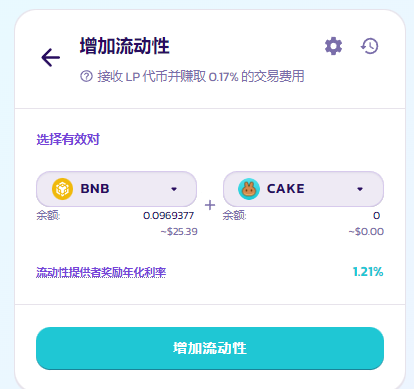
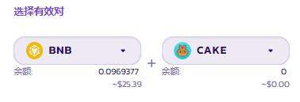
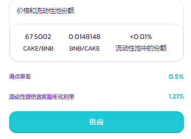
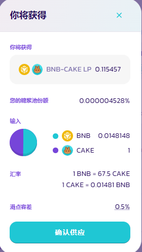
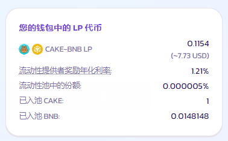
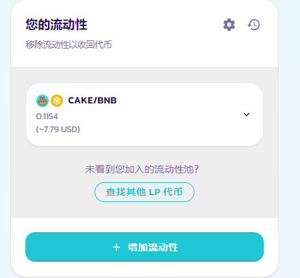
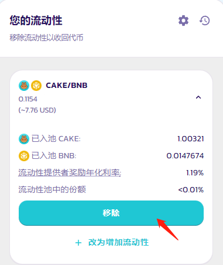
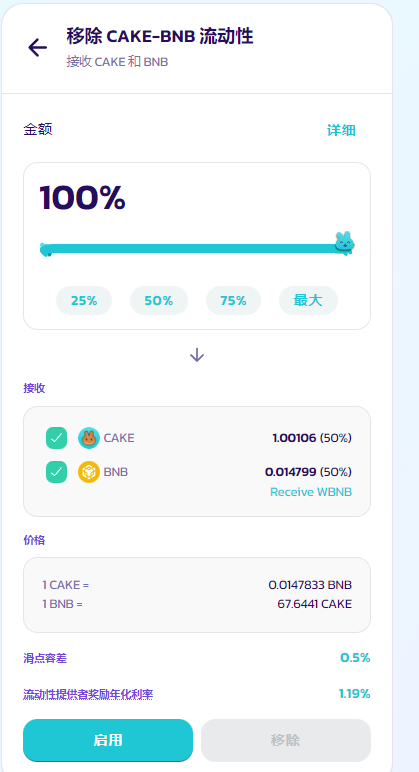
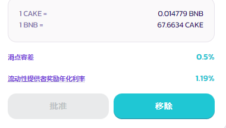
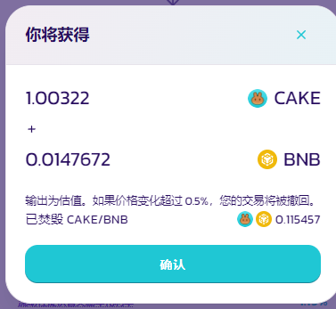

# 如何添加/移除流动性

“流动性”是 PancakeSwap 去中心化交易所的运作核心。您可以在流动性页面为任意代币对添加流动性。

作为添加流动性的回报，您将获得该交易对的交易手续费奖励，并且获得LP代币，您可以在[农场](https://pancakeswap.finance/farms)中质押 LP代币以获得CAKE奖励。

### 增加流动性

为了提供流动性，你需要保证您拥有一定数量的任何你喜欢的代币对。 两种代币总额中价值（以 USD 计）较低的那个代币数量决定了您可以提供的流动性限制。

您可以在 PancakeSwap 上轻松交易您需要的代币。如果有问题可以访问 [PanckeSwap上的交易指南](ru-he-jin-hang-jiao-yi.md)

我们举例使用 BNB 和 CAKE 添加流动性。

1. 访问[流动性页面](https://exchange.pancakeswap.finance/#/pool)

<figure><figcaption></figcaption></figure>

2.点击 “增加流动性” 按钮，可以看到选择代币对提示框。

<figure><figcaption></figcaption></figure>

3.在上面一个输入选项框中选择一个代币。然后在右边选择您想要添加流动性的交易对的两个代币中的另一个代币选择一个代币。在这里，以 BNB 和 CAKE 代币对为例，左边选择 BNB，右边选择 CAKE。

<figure><figcaption></figcaption></figure>

4\. 在任意一个 “Input” 输入下方输入其中一个代币的数量。另一个代币的数量会自动计算并填充。

<figure><figcaption></figcaption></figure>

(如果输入一个代币的金额后，其中一个代币余额不足，您将看到一个错误提示并且按钮会变灰。请输入较低的金额再继续。如果您打开了ZAP工能，合约会自动帮您把金额多的代币转换为金额小的代币，以保持两者价值相等。）

<figure><figcaption></figcaption></figure>

5\. 单击 “批准 CAKE” 按钮。如果您要针对 BNB 以外的代币添加流动性，您可能需要点击两次 "批准” 来批准添加的代币对中的两个代币。您的钱包会弹出提示来确认这个动作。

<figure><figcaption></figcaption></figure>

6\. 此时，"供应" 按钮将会亮起，点击以继续。

<figure><figcaption></figcaption></figure>

7\. 点击供应后会显示您将获得的LP代币详情，您的钱包会要求您确认，您需要从您的钱包确认这次交易。

<figure><figcaption></figcaption></figure>

8\.  一会儿后，您将在页面下方看到您的 LP 代币余额。

<figure><figcaption></figcaption></figure>

您可以重复上述步骤以添加更多的流动性，或者将流动性添加到不同的代币对。

### 移除流动性

如何移除流动性？

1.访问[流动性页面](https://pancakeswap.finance/liquidity)

2.在您的流动性下选择您想要移除的流动性代币对，点击右边小箭头可以查看细节。

<figure><figcaption></figcaption></figure>

3\. 点击 “移除”，将出现一个新的界面。

<figure><figcaption></figcaption></figure>

4\. 使用按钮或者滑块选择您想要移除的流动性百分比。选择 **MAX** 即代表移除这个您在代币对所持有的所有流动性。

<figure><figcaption></figcaption></figure>

5\. 点击**启用**，您的钱包会要求您授权这个动作。

<figure><figcaption></figcaption></figure>

6\. **移除**按钮将亮起。点击以继续。

<figure><figcaption></figcaption></figure>

7\. 将出现一个窗口，显示您将收到多少代币。点击确认。您的钱包还会要求您授权这个操作。

<figure><figcaption></figcaption></figure>

8\. 交易确认后。您将收到代币对中的两个代币。如果您尚未移除所有流动性，剩余的流动性价值将在 “我的流动性” 页面上更新。
