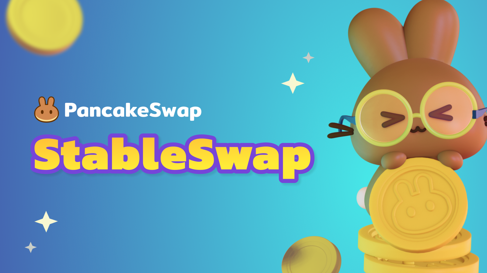

# Stableswap

<figure><figcaption></figcaption></figure>

StableSwap on PancakeSwap is a feature to trade stable pairs with a lower slippage based on an invariant curve slippage function. It is designed to swap specific assets that are priced closely – such as USD stablecoins (e.g. HAY, BUSD and USDT) or liquid staking tokens (e.g. stkBNB and BNBx).

The StableSwap is an implementation of Curve Finance’s AMM on PancakeSwap. It adds linear invariant constant sum curve (x+y=k) on top of the constant product formula (x\*y=k) to keep prices more equal as long as the liquidity pool is not extremely unbalanced. As a result, since StableSwaps are restricted to similarly priced assets, impermanent loss is not as much of a concern (except in extreme depeg cases) and the slippage is lower than normal AMM which just uses the constant product formula.

When you conduct a Swap (trade) on the StableSwap you will pay lower trading fees, than the usual 0.25% on normal PancakeSwap AMM. The fee attribution is broken down as follows:

* 50% to the LP as rewards&#x20;
* 40% to CAKE buyback and burn&#x20;
* 10% to the PancakeSwap Treasury

## Stableswap Fees

Fees for pairs are broken down in the table below:

<table><thead><tr><th width="150">Stablepair</th><th width="132">Trading Fees</th><th width="118.33333333333331">LP Rewards</th><th width="124">CAKE Buyback</th><th>PancakeSwap Treasury</th></tr></thead><tbody><tr><td>USDT-BUSD</td><td>0.01%</td><td>0.005%</td><td>0.004%</td><td>0.001%</td></tr><tr><td>USDC-BUSD</td><td>0.01%</td><td>0.005%</td><td>0.004%</td><td>0.001%</td></tr><tr><td>USDC-USDT</td><td>0.01%</td><td>0.005%</td><td>0.004%</td><td>0.001%</td></tr><tr><td>HAY-BUSD</td><td>0.04%</td><td>0.02%</td><td>0.016%</td><td>0.004%</td></tr><tr><td>HAY-USDT</td><td>0.04%</td><td>0.02%</td><td>0.016%</td><td>0.004%</td></tr><tr><td>axlUSDC-USDT</td><td>0.04%</td><td>0.02%</td><td>0.016%</td><td>0.004%</td></tr><tr><td>BNBx-WBNB</td><td>0.04%</td><td>0.02%</td><td>0.016%</td><td>0.004%</td></tr><tr><td>stkBNB-WBNB</td><td>0.04%</td><td>0.02%</td><td>0.016%</td><td>0.004%</td></tr></tbody></table>

The Kitchen will gradually roll out StableSwap pairs and revise the fees to test and improve the product further.

## Why should I use the StableSwap instead of the normal AMM Swap?

* Swap your stablecoins or other pairs with similar asset prices more efficiently with the same trade steps&#x20;
* With the StableSwap function, the trading slippage is lower than normal AMM&#x20;
* The StableSwap trading fees are lower compared to the normal AMM

