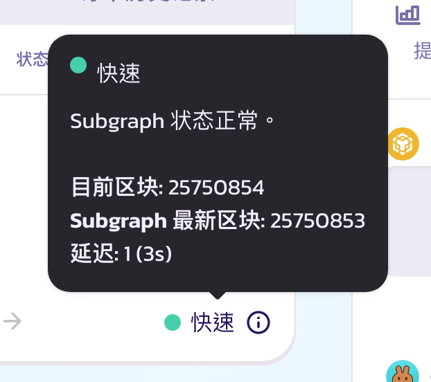

# 限价单 FAQ


使用侧边导航栏快速找到问题的答案


## 常见问题

### 为什么我的订单没有被执行？

限价单在达到所需价格时执行，但是由于 gas 波动，最终执行价格可能与您在界面上指定的价格又所不同。通常，执行价格和期望价格应该极为接近，但是如果您提交了一个特别小的订单（小于 1000 美金），执行价格因为需扣除 gas 费用，导致可能会提高一些。

因此，您的大订单没有被执行的可能原因有：

* 价格波动可能不足以使整个限价订单在期望的价格成交。
* 限价单中的一种代币合约设置了转账收取费用（见下文）

**在提交限价订单之前，注意查看页面显示的 “执行价格”。**


请注意：历史订单表从 subgraph 获取数据，可能会有轻微的信息延迟。


### 我可以将限价单使用在 “在转账时收取费用（抽税）” 的代币吗？

不可以，那些代币合约设置转账收取费用的代币不建议使用限价单功能。如要使用，请自行承担风险。

### 使用限价单时如何设置滑点？

滑点与限价单无关。您输入指定的金额（例如 1000 CAKE）和输出金额（例如 20 BNB) ，如果该货币对的价格达到期望价格，限价单能保证您将收到不少于输入金额（1000 CAKE）的指定输出金额（20 BNB）。请注意对于代币合约设置转账收取费用（抽税）的代币不要用限价单（请阅读上述相关问题）。

### 为什么执行价格显示 “Never Executes”?

这基本上意味着您正在尝试交换非常少量的代币，因此没有足够的代币来支付燃料费。一般来说，您需要增加“Input”输入那一栏的数量才能消除此错误。

### 我下的限价单有到期日吗？

未完成订单将无限期保持有效状态，直到它们被执行或者被用户取消。CAKE 团队计划在不久的将来提供可自定义设置到期日的限价单功能。

### 为什么我不能创建低于市价的限价单？

要低于市价卖出，您需要设置止损限价单，而不是限价单，止损限价单功能将会很快在未来推出。

### 我下了一个订单，但它没有显示在订单列表中或者停留在 “Pending（待处理）” 状态?

订单历史记录数据取自于subgraph，因此可能存在信息延迟的情况。通常情况下，延迟最多不会超过几分钟。请参考历史订单表右下角的 subgraph 小工具。

<figure><figcaption>
限价单页面：subgraph 小工具。
</figcaption></figure>

