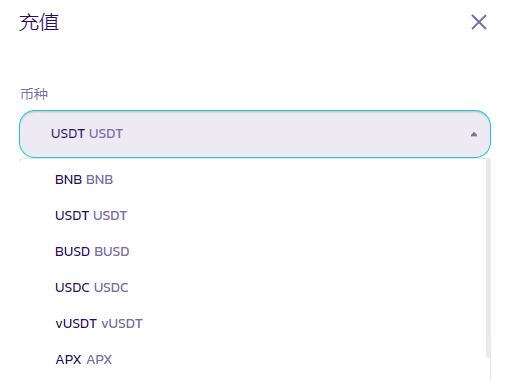
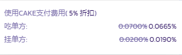
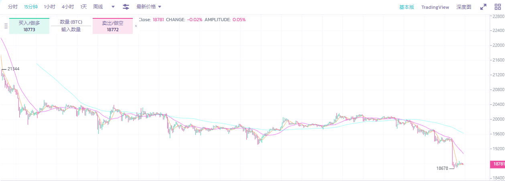
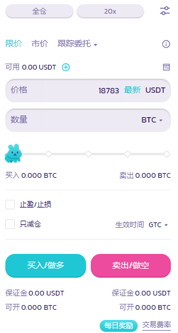
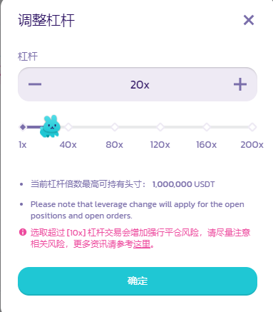
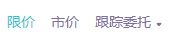
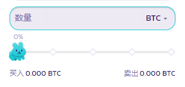
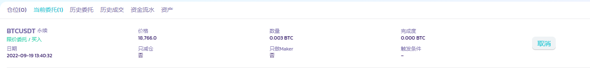
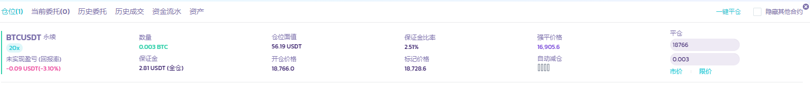

# 我应该如何使用它？

<figure><figcaption></figcaption></figure>

功能使用起来很简单（难的是做出优秀的交易）。我们只需要遵循一系列步骤即可完成我们的首次体验。

### 打开永续合约交易界面

您可以从[官方网站](https://pancakeswap.finance/)→顶部导航栏→交易→永续合约，或通过此 [链接](https://perp.pancakeswap.finance/zh-CN/futures/BTCUSDT?theme=light) 进入。

### 存入资金

您需要先将资金充值进合约账户。在屏幕右下角的资产框中点击「充值」。

<figure><figcaption></figcaption></figure>

USDT、BUSD、APX 或 CAKE（有优惠！）可用作交易抵押品。

<figure><figcaption></figcaption></figure>

如前所述，使用 CAKE 支付费用可享受 5% 的折扣！ 那么，何乐而不为呢？

<figure><figcaption></figcaption></figure>


注意：交易费用为挂单名义价值的 0.02% 和吃单的 0.07%。 CAKE 将是交易费用的默认支付选项，其次是 APX（ApolloX 的代币）和 USDT。 任何使用 CAKE 支付交易费用的用户将享受 5% 的交易费用折扣。


### 选择交易对

您可以通过单击页面顶部该代币对旁边的箭头来选择一个可交易的代币对。

更多的可交易代币对会显示出来！

<figure><figcaption></figcaption></figure>

### 分析图表并制定您的交易策略

交易时间到了！！ 让我们认真起来。 您可以使用所有可用工具以自己的方式分析图表。

<figure><figcaption></figcaption></figure>

**您知道怎么进行分析，或者想改进您的分析结果吗？**

以下是图表分析领域的入门指南：&#x20;

* [如何在币安网站上使用 TradingView](https://www.binance.com/zh-CN/support/faq/8419126024404348a1c6e4039fbed3fe)
* [K 线图](https://academy.binance.com/zh/articles/a-beginners-guide-to-candlestick-charts)
* [趋势线详解](https://academy.binance.com/zh/articles/trend-lines-explained)

### 做好下单前的设置

然后，在右上方，您可以在界面上设置您的订单。

<figure><figcaption></figcaption></figure>

在这里您必须设置几个参数，例如：&#x20;

_以下步骤不按特定顺序排列_

1. 保证金模式：逐仓或者全仓

<figure><figcaption></figcaption></figure>

2. 杠杆的倍数

<figure><figcaption></figcaption></figure>

免责声明：请记住，高倍数的杠杆会带来非常高的风险，请谨慎明智地使用它。&#x20;

3. 选择订单类型

<figure><figcaption></figcaption></figure>

4. 为您的订单设定价格

<figure><figcaption></figcaption></figure>

注意：您可以点击价格栏右边的“最新“” 自动填充最新的市场价格。

5. 设置订单大小

<figure><figcaption></figcaption></figure>

您也可以选择参考代币查看您的可用仓位。


注意：还有更多要点需要考虑，您可以在[永续合约术语表](yong-xu-he-yue-shu-yu-biao.md)中看到


### 发送您的订单&#x20;

设置好所有参数后，如果是多头订单，您可以点击买入/做多发送订单，如果是空头订单，则点击卖出/做空。

<figure><figcaption></figcaption></figure>

### 检查您的订单状态

订单发送后，将显示在 “当前委托” 中，直到成交完毕。

<figure><figcaption></figcaption></figure>

### 实时的！

当它被成交完成时，你的订单状态显示将是实时的。 您可以在订单面板 “仓位” 中看到它。 您也可以查看、修改或关闭它。

<figure><figcaption></figcaption></figure>

### 交易手续费、资金费率是多少？ 

默认使用 CAKE 来支付交易手续费，其次是 APX（ApolloX 的代币）和 USDT及BUSD。

根据所开的合约种类收取对应币种的交易手续费（目前只有USDT 和BUSD 合约两种），在此强烈建议您用 CAKE 支付交易手续费以享受手续费优惠。

交易手续费以合约总价值为基础：&#x20;

* 挂单（maker）0.02%
* 吃单（taker）0.07%

使用 CAKE 来支付交易手续费，将在此之上享受 5% 的折扣。即费率是：

* 挂单（maker）0.019%
* 吃单（taker）0.0665%。

所以，请记得先将 CAKE 存入你的 PancakeSwap 永续合约交易账户，用于支付交易手续费并享受折扣！


请注意，想要使用 CAKE 支付手续费并享受折扣需要切换资产模式为联合保证金模式。

点开合约下单界面杠杆倍数右侧功能键，选择偏好设置-资产模式-选择联合保证金模式即可。


在实际持仓永续合约过程中，还会产生**资金费率**，此费用在持仓用户之间互相支付，平台不会从中收任何手续费，详细了解资金费率请查看[**永续合约术语**](yong-xu-he-yue-shu-yu-biao.md#ding-dan-you-guan-de-shu-yu)。

**以下是关于手续费及资金费率收取币种的说明：**

<table><thead><tr><th width="168">合约交易对种类</th><th width="380.3333333333333">合约交易手续费收取币种</th><th>资金费率收取币种</th></tr></thead><tbody><tr><td>

USDT 交易对
</td><td>
USDT 

(单一保证金模式，或账户中无 CAKE 时） 

CAKE

(联合保证金模式，且账户中有 CAKE 时，<strong>优先</strong>收取 CAKE，并享有折扣）
</td><td>

USDT 
</td></tr><tr><td>

BUSD 交易对
</td><td>
BUSD

(联合保证金模式下，<strong>暂时不会</strong>收取 CAKE，也无折扣优惠）

修复中 2022/12/5 
</td><td>

BUSD 
</td></tr></tbody></table>

您也可以前往 [这里](https://www.apollox.finance/zh-CN/futures/info/realTimeFundingRate)，查看永续合约 V1 各交易对资金费率实时数据及图表等资讯。

### 目前支援那些链？

目前支援 BNB 智能链、以太坊。在页面上方找到显示当前链的按钮如下图，点击，可以打开下拉选单，再单击目标链即可切换。

<figure><figcaption>
左图：手机版；右图：PC 版
</figcaption></figure>

祝您交易顺利！
