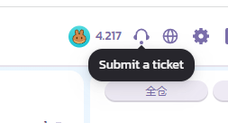

# 永续合约 V1 常见问题

<figure><figcaption></figcaption></figure>

### 这新功能对 CAKE 持有者的价值贡献是什么？&#x20;

我们预计这一新功能将带来大量新用户、交易者和交易量。 除了提供交易费用折扣外，我们还希望确保价值返回到我们的 CAKE 代币。PancakeSwap 永续合约用户的所有交易费用的 20% 将转成 CAKE 并烧毁。&#x20;

**剩下的那部分呢？**&#x20;

其余部分目前留作团队金库，用于此功能的持续扩展和开发，以及用于意外市场事件的保险基金。 随着产品功能的渐趋成熟，我们有望根据社区反馈和治理逐步增加销毁比例。&#x20;

### **我看不到我的资金！ 发生了什么？**&#x20;

您必须先将资金从存链上钱包打入合约账户！

### 交易手续费是多少？ 

默认使用 CAKE 来支付交易手续费，其次是 APX（ApolloX 的代币）和 USDT及BUSD。

根据所开的合约种类收取对应币种的交易手续费（目前只有USDT 和BUSD 合约两种），在此强烈建议您用 CAKE 支付交易手续费以享受手续费优惠。

交易手续费以合约总价值为基础：&#x20;

* 挂单（maker）0.02%
* 吃单（taker）0.07%

使用 CAKE 来支付交易手续费，将在此之上享受 5% 的折扣。即费率是：

* 挂单（maker）0.019%
* 吃单（taker）0.0665%。

所以，请记得先将 CAKE 存入你的 PancakeSwap 永续合约交易账户，用于支付交易手续费并享受折扣！


请注意，想要使用 CAKE 支付手续费并享受折扣需要切换资产模式为联合保证金模式。

点开合约下单界面杠杆倍数右侧功能键，选择偏好设置-资产模式-选择联合保证金模式即可。


在实际持仓永续合约过程中，还会产生**资金费率**，此费用在持仓用户之间互相支付，平台不会从中收任何手续费，详细了解资金费率请查看[**永续合约术语**](yong-xu-he-yue-shu-yu-biao.md#ding-dan-you-guan-de-shu-yu)。

**以下是关于手续费及资金费率收取币种的说明：**

| 合约交易对种类                | 合约交易手续费收取的币种                                                                                                        | 资金费率收取的币种           |
| ---------------------- | ------------------------------------------------------------------------------------------------------------------- | ------------------- |
| 

USDT 交易对
 | 
USDT 

(单一保证金模式，或账户中无 CAKE 时） 

CAKE

(联合保证金模式，且账户中有 CAKE 时，<strong>优先</strong>收取 CAKE，并享有折扣）
 | 

USDT 
 |
| 

BUSD 交易对
 | 
BUSD

(联合保证金模式下，<strong>暂时不会</strong>收取 CAKE，也无折扣优惠）

修复中 2022/12/5 
                               | 

BUSD 
 |

### 为什么合约无法下单？

进行合约交易时，会出现下单失败或者订单无法成交的问题，以下是一些相关原因汇总。

**合约无法下单的原因：**

* **保证金不足**：当前有其他委托订单占用可用保证金或者下单数量超过持仓数量，需要额外保证金进行开仓操作。杠杆倍数越低，所需保证金越高，调高杠杆倍数可解决保证金不足问题。
* **仓位受限**：只涉及止盈止损单，反向开仓的数量过大，导致净敞口需要的保证金不够。不同的杠杆，可建立的最大头寸也不同。
* **不符合最小下单合约单位**：根据不同合约类型，最小合约单位也不同。
* **只减仓-没有反向仓位不能下单**

**合约下单无法成交的原因：**

* **价格无法匹配**：市场价格未达到设置的价格。止盈止损单下单之后，市价达到触发价时，订单被加入到市场深度池，但是需要达到委托价时订单才会成交。市价止盈止损单中，可以根据不同需要设置根据标记价格或最新价格触发。
* **偏离市场价越大越不易成交**：设置的价格在市场深度池中没有匹配订单。仓位大时也可能只有部分成交。
* **保证金审核未通过（针对于止盈止损单）**：止盈止损单中需要设置触发价和成交价（市价止盈止损单中，可以根据不同需要设置根据标记价格或最新价格触发），系统会进行两次保证金审核，分别在下单前和成交前。订单触发之后，系统会立即进行第二次保证金审核，如果当前发生了亏损或划转出了保证金，导致可用保证金不足，此时订单状态会提示已过期。

### 存入金额有限制吗?

| 资产类别 | 限制       | 保证金价值  |
| ---- | -------- | ------ |
| USDT | 没有限制     | 99.99% |
| BUSD | 没有限制     | 100%   |
| CAKE | 5000CAKE | 90%    |

### 我已经存入资金到合约账户，但仍然看不到它们！发生了什么？&#x20;

请按照以下步骤查询：

1. 区块到帐后合约平台需要足够确认数才会显示，请先耐心等待几分钟；&#x20;
2. 在 [bscscan](https://bscscan.com/) 上输入您的地址，查询您的币种充值记录。
3. 使用[工单提交系统](https://apolloxbroker.zendesk.com/hc/en-us/requests/new)！此功能由ApolloX 提供。单击永续合约页面右上角的耳机图标提交工单！&#x20;

<figure><figcaption></figcaption></figure>

### 提现未到帐，发生了什么？

一般情况下，ApolloX 平台会在 30-60 分钟内生成提交上链。

链上拥堵时，您的提现申请可能需要花费较多时间处理。

若 6 小时后您的链上钱包仍然没有到帐，请单击 “耳机图标” 提交客服 “[工单](https://apolloxbroker.zendesk.com/hc/en-us/requests/new)”，并附上： “资金流水” 中 “**该笔转账的截图**” ，提交供应商方处理，注意，没有截图的工单处理优先级很低。

若您在支付 gas 那步骤点击了拒绝，请等待 ApolloX 方退回款项，期间前端有可能看不到您的该笔提现资产，如有任何疑问，请提交客服[工单](https://apolloxbroker.zendesk.com/hc/en-us/requests/new)。

<figure><figcaption>
资产提现之画面提醒
</figcaption></figure>

### ApolloX 如何确定哪些用户来自 PCS，哪些用户来自他们自己的网站？

以首次注册的是 PCS 域名还是 APX 域名为基础判定，若钱包地址已注册 ApolloX，则视为 APX 用户进行收益分享计算。&#x20;

### 请问我们未来能看到 PCS 永续合约介面只显示来自 PCS 的交易量吗？&#x20;

在前端介面目前显示的交易量为来自 ApolloX 与来自 PCS 的交易量总和，因交易深度是叠加，前端这样的显示设计能提供使用者更准确的交易深度资讯，并加深双方平台的合作关系。
