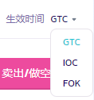

# 永续合约术语表

**在这里，您将找到合约交易中所有固有术语的含义。**

### 永续合约交易

&#x20;永续合约, 期货交易, 或者perps是一种没有到期交割日的特殊期货合约。

### **杠杆功能**

杠杆是一种交易机制。 交易者可以通过支付低于全部投资金额的钱来增加他们在市场上的仓位。 简而言之，就是您借钱来增加您的投资额。

<figure><figcaption></figcaption></figure>

### 保证金

是您为您的杠杆仓位提供的保证。 它有两种使用模式：&#x20;

* 全仓模式：同一保证金资产下的所有合约仓位共享同一资产全仓余额。 如果发生清算，您的资产全额保证金余额以及该资产下的任何剩余未平仓仓位可能会被没收。&#x20;
* 逐仓模式：通过限制分配给每个仓位的保证金数量来管理您在各个仓位上的风险。 如果仓位的保证金比例达到100%，该仓位将被平仓。 使用此模式可以为单个仓位添加或减少保证金。

<figure><figcaption></figcaption></figure>

**保证金比率**：保证金比率=维持保证金/保证金余额。 一旦保证金比率达到 100%，您的仓位将被清算。&#x20;

**维持保证金**：维持未平仓仓位所需的最低保证金余额。&#x20;

**保证金余额** = 合约钱包余额 + 未实现盈亏。 一旦保证金余额 <= 维持比率，您的仓位将被清算。

<figure><figcaption></figcaption></figure>

### 资产：&#x20;

**充值**：将您的资金存入您的合约账户&#x20;

**提现**：将资金从您的合约账户提取到您的钱包&#x20;

**钱包余额** ＝ 总共净划入 + 总共已实现盈亏 + 总共净资金费用 - 总共手续费

**未实现盈亏**：根据标记价格和净资产收益率计算的该仓位的未实现盈亏。

**资金模式**：

**单一保证金模式**：支持USDⓈ-M合约交易，仅使用该品种的单一保证金资产。 相同保证金资产仓位的盈亏可以抵消。 支持全仓模式和逐仓模式。&#x20;

**联合保证金模式**：USDⓈ-M跨多种保证金资产的合约交易。盈亏可以在不同的保证金资产仓位之间进行抵消。 仅支持全仓模式。&#x20;


注意：如果USDⓈ-M合约有未平仓单或挂单，则无法开启联合保证金模式。联合保证金模式仅适用于USDⓈ-M合约。 在启用联合保证金模式之前，请详细阅读指南，以便在使用联合保证金模式时更好地管理USDⓈ-M合约账户风险


<figure><figcaption></figcaption></figure>

**持仓模式：**

**单向持仓模式**：单向持仓模式下，一个合约只允许持有一个方向的仓位。&#x20;

**双向持仓模式**：双向持仓模式下，一个合约可允许同时持有多空两个方向的仓位，并且同一个合约下不同方向仓位的风险对冲。

### 订单有关的术语

**买入/做多**：合约开多。在此订单中，您购买资产并等待价格上涨时出售。 “买入”和“做多”可以互换使用。&#x20;

**卖出/做空**：合约开空。在这个订单中，您借入资产，将其出售，并希望在价格下跌时将其买回。 “卖出”和“卖空”可以互换使用。&#x20;

**限价单**：限价单是让用户以特定价格或优于特定价格下单。但限价单不保证一定会执行。如果价格符合或低于您的限价，则会执行限价买单；如果价格符合或高于您的限价，则会执行限价卖单。&#x20;

**市价单**：市价单是指以目前市场可获得的最优价格进行快速买入或卖出的订单。市价单需要流动性来成交，这意味着该订单是基于之前订单中心里的限价单来执行的。

**止盈止损单**：限价止盈止损单。限价止盈止损是指在设定时间范围内的条件订单，在达到指定的止损价格后以指定的价格执行。一旦达到止损价格，该订单将以符合限价或优于您设定的限价价格买入或卖出。

**市价止盈止损单**：与限价止盈止损单类似，市价止损单使用止损价作为触发。但是，当达到止盈止损价格时，它会触发市价单。&#x20;

**跟踪委托**：跟踪委托是一种订单类型。当价格走势有利时，跟踪委托单才会移动。 一旦它移动以锁定利润或减少损失，它就会停止往另一个方向移动。它可以帮助交易者锁定利润、降低损失。

跟踪委托允许用户在市场价格特定百分比的价格区间内，设置委托订单。当价格走势有利时，跟踪委托将同时以特定百分比移动，期间订单保持开启，帮助交易者能持续获利并锁定收益。&#x20;

当价格沿相反方向移动，且最新价格达到用户所设定该委托单最高（最低）市场价格的（1±回调幅度）后，即会触发委托条件，订单将以市场价格平仓。&#x20;

**只做Maker (Post only)**：即只做挂单（Post only）。订单不会立刻成交，保证用户始终为Maker，如果委托单会立即与已有委托成交，那么该委托会被取消。该订单类型，可帮助用户节约交易手续费。

<figure><figcaption></figcaption></figure>

**只减仓（Reduce Only）**：只减仓订单只会减少您的仓位，不会增加仓位。

<figure><figcaption></figcaption></figure>

**TIF 指令**：准许给订单设置一个期限。在指定时间段内，订单保持开启，直到被执行或者过期。您可以从以下TIF指令中择一：

<figure><figcaption></figcaption></figure>

* GTC（取消前有效）：订单将保持有效，直到它被执行或取消。
* IOC（立即执行或取消）：订单将立即执行（全部或部分）。 如果仅部分执行，订单的未成交部分将被取消。&#x20;
* FOK（立即全部执行或取消）：订单必须立即全部成交。 如果没有全部成交，则根本不会执行。

**资金费率**：资金费率是指基于永续合约市场价格与现货价格之间的价差，向多头或空头交易者支付的定期费用。当市场趋势看涨时，资金费率为正，此时多头将向空头支付资金费率。相反，当市场看跌时，资金费率为负，此时是空头交易者向多头支付费用。

平台不会从资金费率中收取任何手续费，该资金会直接在用户之间转移。资金费用每8小时计算一次，计算时间为UTC时间00:00、08:00和16:00。只有当交易者在收取时刻是在任意方向拥有持仓的情况下，才会被收取或被支付相应的资金费用。如果交易者在当时无任何仓位，将不会被收取或支付任何资金费用。

请注意：资金费用实际收费时间存在15秒偏差。比如说，用户在16:00:05 UTC开仓，用户依然或被收取资金费用，请留意您的开仓时间。

**资金费结算公式**：结算资金=持仓名义价值 x 资金费率      仓位名义价值=标记价格 x 持有合约数量

**强行平仓**：当标记价格达到头寸的强平价格时，就会发生强行平仓。交易者应密切关注标记价格和强平价格的变动，以免被强行平仓。

在双向持仓模式下，同一合约的多头和空头头寸在交叉保证金模式下使用相同的强平价格。如果同一合约的多头和空头头寸处于逐仓模式，则根据分配给仓位的保证金，对应仓位将有两种不同的强平价格。

用户可以通过点击合约下单界面的**计算器图标**来计算对应的强平价格。
