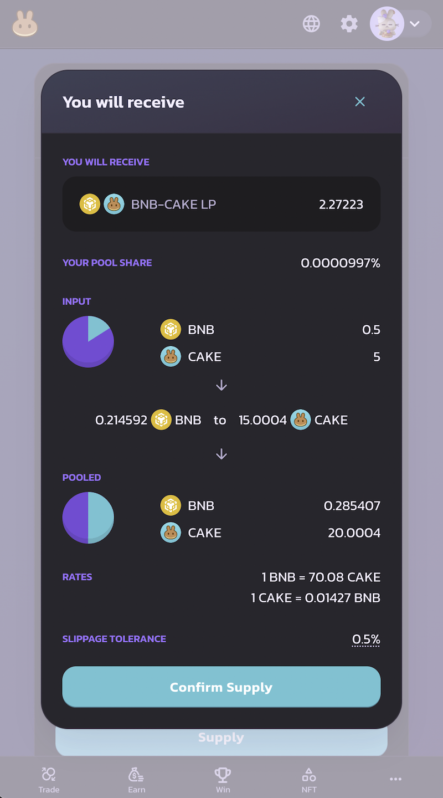
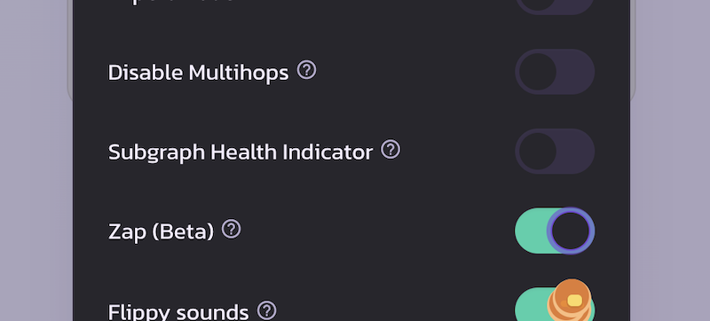
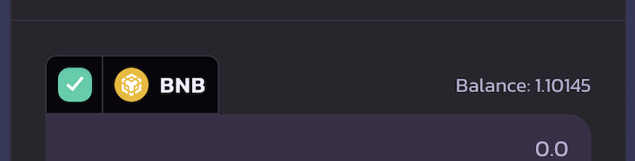
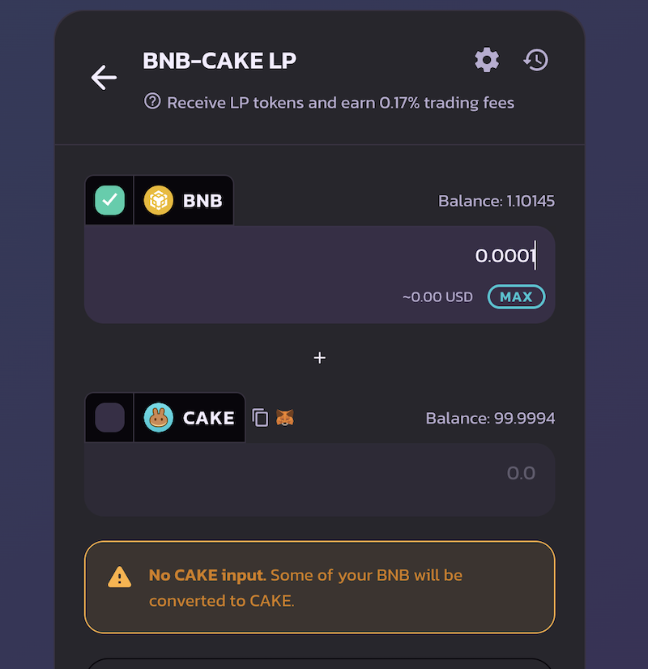
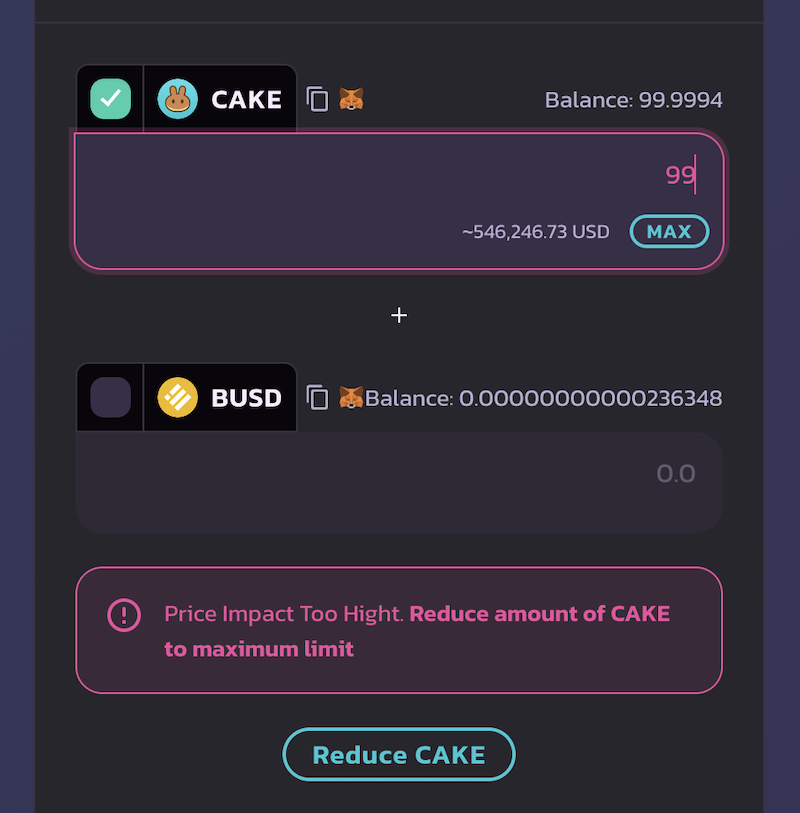
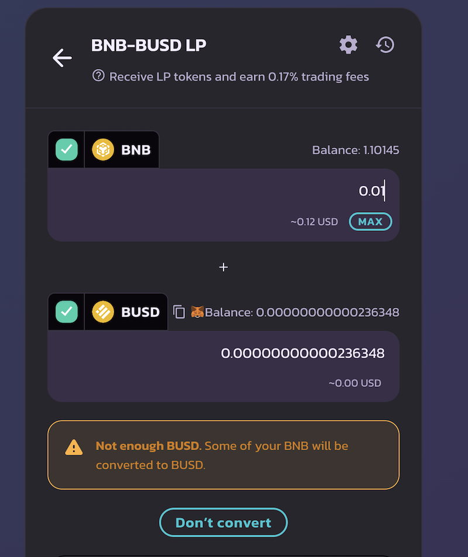
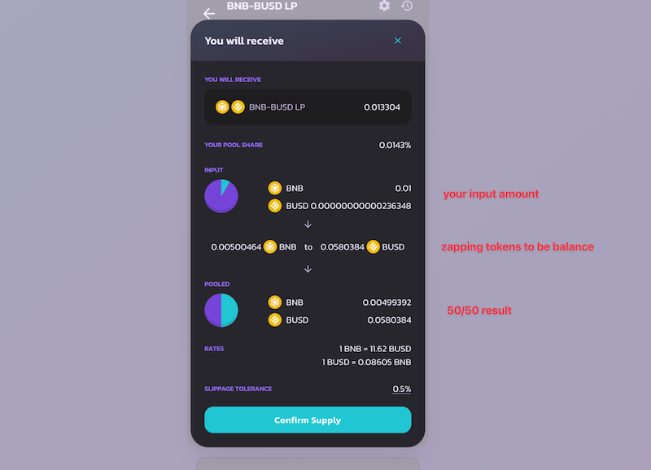
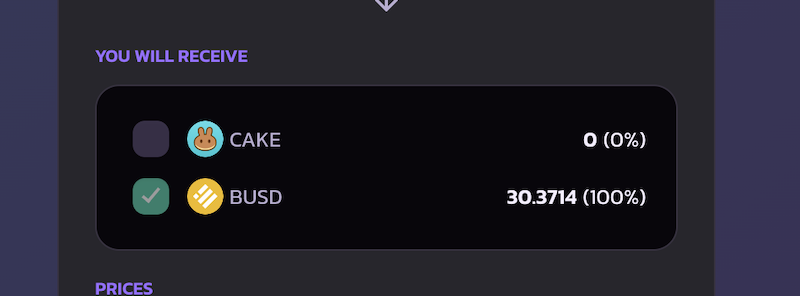

# Zap (V2)

### What is Zap? 

Zap enables simple liquidity provision. Add liquidity with only one token and one single click, without manual swapping or token balancing.

* Add liquidity with only one token: You can add liquidity using only one token in the trading pair. Zap will automatically perform swaps using the one token you provide and automatically balance the trading pair to a 50/50 split before adding liquidity.
* Add liquidity with an imbalanced number of tokens in the trading pair: You can add liquidity even if the number of the tokens you provide in the trading pair is not perfectly balanced with the current pool. For example 30:70, which differs from the default pool weight of 50:50. Zap will automatically rebalance the tokens into a 50/50 split before adding liquidity.
* Remove liquidity and choose what token(s) you want to receive: When removing liquidity, Zap allows you to receive only one token in the trading pair. Zap will automatically perform swaps before returning your tokens.

### Enable Zap 

By default, the Zap feature is turned on for every user. If you don’t see the new Zap UI when adding or removing liquidity, please enable it in the settings panel. You can bring up the settings panel by clicking the cog icon.


Note: Currently, the Zap feature is in beta. Please note that It does not support some tokens, such as tokens with fees on transfers. If you experience any issue while adding or removing liquidity, please disable it in the settings panel.


### Zap In (Add Liquidity) 

Visit the [Liquidity page](https://pancakeswap.finance/liquidity), and choose “Add Liquidity”.

Pick the trading pair you want to provide liquidity to by selecting two input tokens, checkout [Liquidity guide](https://docs.pancakeswap.finance/products/pancakeswap-exchange/liquidity-guide) to learn more.

.png>)

Click the “Add Liquidity” button to proceed.

If the token in the trading pair you are adding liquidity to has a balance in your wallet. The checkbox for that token will be automatically checked. If you have both the tokens have a balance in your wallet, both checkboxes will be checked.

### Zap using one token 

You can add liquidity using only one token in the trading pair. Simple check only one checkbox for the token you wish to use. Zap will automatically swap half of the checked tokens into another token in the trading pair before adding liquidity. You will see a warning message indicating which token will be converted.


If the price impact is too high, Zap will protect you by slippage. Click “Reduce TOKEN” to reduce it to the preferred limit.


### Zap using two tokens with imbalanced amounts 

If both tokens are checked, the amounts of the input tokens don't match a 50/50 split. Zap balancing will be introduced. You will see a message of “Some of your Token A will be converted to Token B”.


If you don’t want Zap to balance the number of tokens before adding liquidity, simply click “Don’t Convert”. In this case, Zap will adjust the number of input tokens to match a 50/50 split instead of trying to swap and rebalance.


### Proceed with Zap 

When you click “Supply”, the details of the Zap will be shown and await you to confirm.

You will see:

1. How many LP tokens you will receive.
2. What are the input tokens, and the number of tokens you are committing.
3. How the input tokens are traded in order to match a 50/50 split.
4. The slippage tolerance you are using.

### Zap out (Remove Liquidity) 

Zap also enables you to receive one single token in the trading pair when removing liquidity.

1. Visit the[Liquidity page](https://pancakeswap.finance/swap#/pool).
2. Click on the pair you want to remove liquidity under “Your Liquidity".
3. Click “Remove”. A new pop-up will appear.

Under the “You Will Receive” section, you can uncheck the token you don’t want to receive. Zap will automatically swap and convert 100% of the returns into the checked token when removing liquidity.

