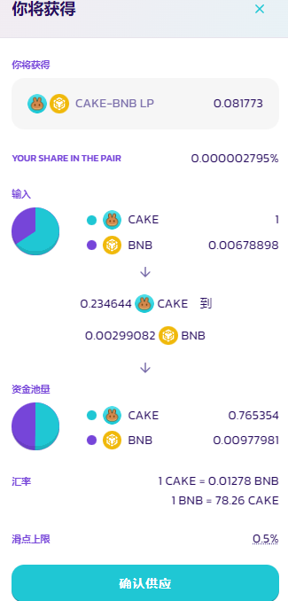
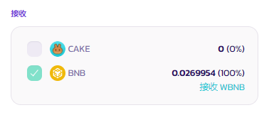

# Zap- 一键添加流动性 (V2)

<figure><figcaption></figcaption></figure>

## 什么是 Zap?&#x20;

Zap 是一个简易添加流动性的方式。使用一种代币、一键即可添加流动性，无需事先持有等值的两种代币。

* 只需一种代币即可添加流动性：您可以只使用交易对中的其中一种代币来添加流动性。Zap 将自动使用您提供的单一种代币进行代币兑换，并在添加流动性之前自动平衡交易对价值，使其达到 50/50 的比例。
* 在交易对中的两种代币数量不平衡的情况下添加流动性：即使您提供的交易对中的代币数量与当前的资金池不完全平衡，您依然可以添加流动性。例如 30:70 的比例，这与默认的资金池比例 50:50 不同。但是在添加流动性之前，Zap 会自动通过兑换将代币重新平衡为 50/50 的比例。&#x20;
* 移除流动性时只接收单一代币：当移除流动性时，Zap 功能提供您一个选择，可以将拆开后的两种代币自动兑换成单一一种代币并且转帐到您的钱包。

## 启用 Zap 功能

默认情况下，每个用户的 Zap 功能都是打开的。如果你在添加或移除流动性时，没有跳转到带有 Zap 功能的页面，您可以手动在设置面板中启用它。你可以通过点击齿轮图标来调出设置面板。

<figure><figcaption></figcaption></figure>


温馨提示：目前，Zap 功能还处于测试阶段。请注意，它不支援某些代币，例如对转账收费（抽税）的代币等。如果你在添加或移除流动性时遇到狀況，请在设置面板中禁用 Zap。


### 启用 Zap 的情况下添加流动性&#x20;

访问[流动性页面](https://pancakeswap.finance/liquidity)，并选择 "**添加流动性**"。

选择两个输入代币来挑选你想提供流动性的交易对，查看[流动性指南](../../chan-pin/pancakeswap-exchange/tian-jia-yi-chu-liu-dong-xing.md)以了解更多。

<figure><figcaption></figcaption></figure>

点击 "**添加流动性**" 按钮以开始。&#x20;

如果您在钱包中已经持有预计添加流动性的两种代币，该代币的复选框系统将帮您自动勾选好。持有一种代币，一个复选框将自动勾选好，持有两种代币，两个将自动勾选。
您可以手动取消勾选。

<figure><figcaption></figcaption></figure>

### 通过 Zap 功能，使用单一一种代币添加流动性&#x20;

您可以只使用一种代币来添加流动性。只需勾选您想使用的代币左边的复选框，在添加流动性之前，Zap 会自动将选中的一半代币转换为交易对中的另一种代币。您会在下方看到一个黄色警示信息，说明哪种代币将被兑换。

<figure><figcaption>
、
</figcaption></figure>


如果兑换时的价格影响太高，Zap 会通过调整滑点来保护你。点击 "**减少代币**"，将其减少到建议的数量上限。


<figure><figcaption></figcaption></figure>

### 通过 Zap 功能，可使用两种输入价值不等的代币来添加流动性

如果页面中两种代币的复选框都被勾选，但输入代币的价值不符合 50/50 的比例，此时 Zap 平衡功能将被执行。您将会看到 “您的一些代币A将被兑换成代币B "的警示信息。

<figure><figcaption></figcaption></figure>


如果您不希望 Zap 在添加流动性之前平衡代币的数量，只需点击 "**不兑换**"。在这种情况下，Zap 将调整输入代币的数量，使其符合 50/50 的比例，而不是试图通过兑换来重新平衡。


### 开启 Zap 来添加流动性&#x20;

当您点击 "**供应** "时，将显示通过  Zap 添加流动性的供应细节并等待您确认。&#x20;

您将会看到：&#x20;

1. 你将收到多少个 LP 代币。&#x20;
2. 输入代币的情况，以及您所提供的代币数量。&#x20;
3. 为了满足 50/50 的比例，输入代币被自动兑换的情况。
4. 您所设定的滑点上限。

<figure><figcaption></figcaption></figure>

### 启用 Zap 的情况下移除流动性

Zap 也能让您在移除流动性时只接收交易对中的其中一种代币。&#x20;

1. 访问[流动性页面](https://pancakeswap.finance/liquidity)。&#x20;
2. 点击 "**您的流动性**" 下您想移除流动性的交易对。&#x20;
3. 点击 "**移除**"，一个新的窗口将出现。&#x20;
4. 在 "**接收** "部分，您可以取消勾选您不想收到的代币。这样在移除流动性时，Zap 会将移除流动性收到的 100% 的代币自动兑换为被勾选的代币。

<figure><figcaption></figcaption></figure>

