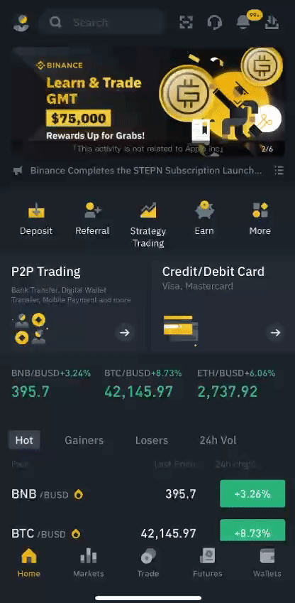
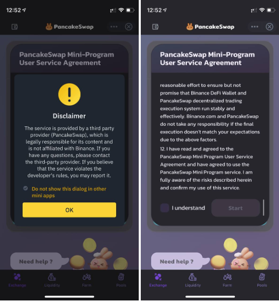
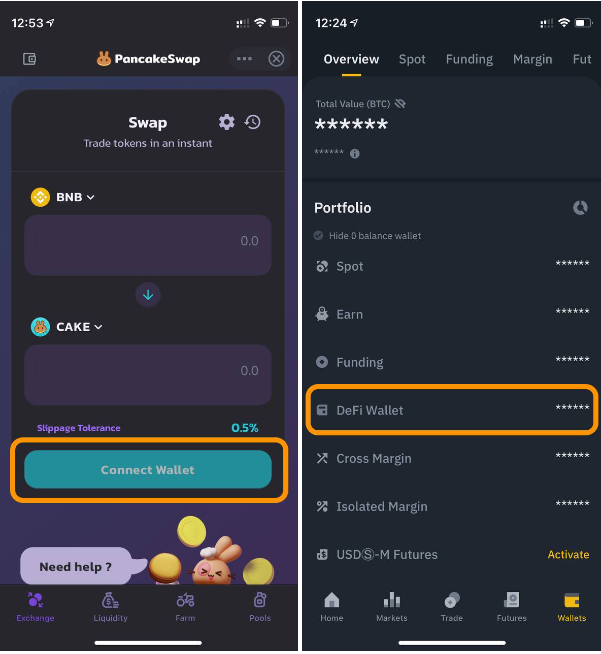
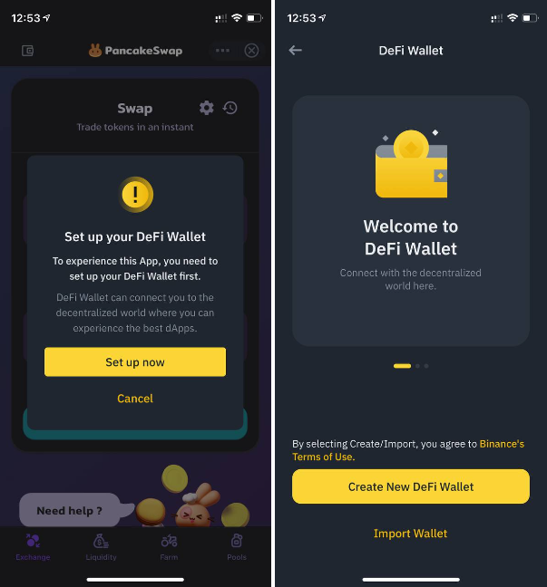
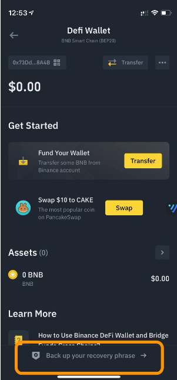
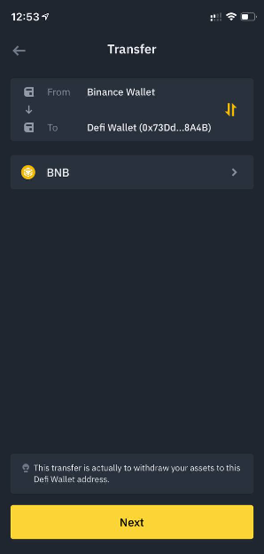
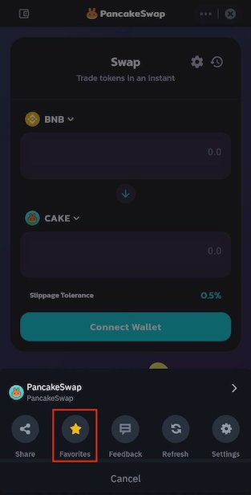
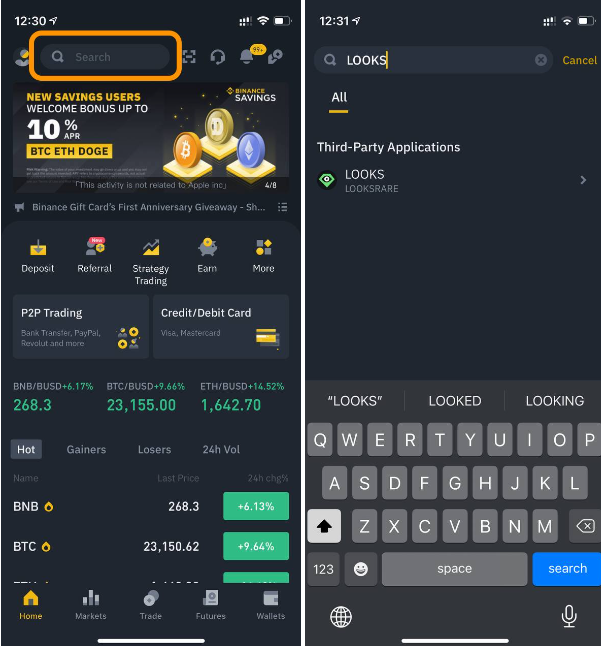
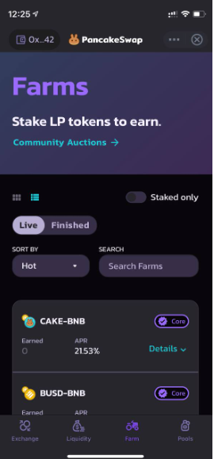
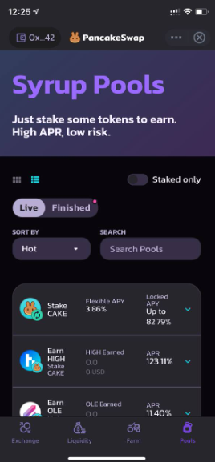

# How to Use PancakeSwap Mini-Program?

## Finding the PancakeSwap Mini-Program

If you’re using the PancakeSwap Mini-Program for the first time, you can simply go to your Binance application and simply swipe down 👆⬇️ from the top in the homepage to find the Mini-Program Marketplace:

Once you’re in the Marketplace, you can easily find the PancakeSwap Mini-Program within the Popular list, or alternatively, you can also search for it.

<figure><figcaption></figcaption></figure>

## Setting up in the PancakeSwap Mini-Program

Before entering the PancakeSwap Mini-Program, there are a disclaimer from Binance as well as a user service agreement which you have to read and agree to before you can access the functions.

After you read them, be sure to scroll to the bottom to click on “I understand” to start!

<figure><figcaption></figcaption></figure>

## Setting up the Binance DeFi Wallet

If it’s your first time using the PancakeSwap Mini-Program, and probably any Mini-Program in the Binance application, you’ll likely have to set up your Binance DeFi Wallet first.

The Binance DeFi Wallet is a non-custodial decentralized Web3 wallet within the Binance application. Currently, the wallet limits transfers only to and from the Binance CEX spot wallet — it eliminates the need to copy, paste and check the wallet address for withdrawal from Binance CEX spot wallet and depositing back into it. At least for now, no more double, triple, quadruple address checking, sweaty hands and anxiousness for new users dipping a toe into DeFi waters!

To set it up, you can just click on Connect Wallet in the PancakeSwap homepage, alternatively, you can go to the Wallet tab in the application and click on DeFi Wallet to set it up!

<figure><figcaption></figcaption></figure>

The setup process is designed for CEX users and simplified – users can create a new DeFi Wallet with one button or to import their existing wallet with seed phrases. Once a new wallet is created, you can find the option to back up your recovery phrases, be sure to do that!

<figure><figcaption></figcaption></figure>

<figure><figcaption></figcaption></figure>

Then, you can click on the transfer button in the DeFi Wallet to transfer funds from your Binance spot wallet. Please note that a transfer from the spot wallet is counted as a withdrawal on Binance’s end so there may be withdrawal fees but not gas fees.

<figure><figcaption></figcaption></figure>

## Important! Make Sure there are some BNB in the DeFi Wallet

It is very important to note that assets that have transferred from spot wallet to the DeFi wallet are now out of the Binance centralized, custodial system, hence, all transactions such as transfer, swap, staking would require BNB for the gas fees to complete the transactions on BNB Smart Chain. Without BNB in your DeFi Wallet, none of the functions in the Mini-Programs would work, so be sure to have some BNB in your DeFi Wallet!

Once you have set up the wallet with assets in it – most importantly BNB, you’re good to try out the PancakeSwap Mini-Program!

## Other Entrances to the Mini-Program

There are also other entrances to our Mini-Program and we are working with the Binance team to add more!

**1 - Marketplace favorite** – click on the three dots on the top-right corner of the Mini-Program and mark it as favorite, then next time in the Marketplace it will be at the top!

<figure><figcaption></figcaption></figure>

**2 - DeFi Wallet** – PancakeSwap is on the landing page of the DeFi Wallet, so as you access the DeFi Wallet from the wallet tab, you can also go in from there.&#x20;

**3 - Search bar** – from the Binance application homepage, in the search bar at the top, you can search for certain tokens that are not listed by Binance yet but are included in the PancakeSwap list, from there it will direct you to the PancakeSwap Mini-Program for trading! In this example, we searched for LOOKS:

<figure><figcaption></figcaption></figure>

## Features Available in the Mini-Program

Currently, four core features have been implemented into the Mini-Program, including:

**1 - AMM Swap** – lets users trade without the need to go through a centralized exchange, trades are routed directly through your own wallet. Liquidity pools can be created for all assets on BNB Smart Chain, a much wider variety of tokens to trade.

<figure><figcaption></figcaption></figure>

**2 - Liquidity Provision** – providing liquidity will get you LP Tokens, which will earn you rewards in the form of trading fees for making sure there's always liquidity for the exchange to use.

<figure><figcaption></figcaption></figure>

**3 - Yield Farming** – lets users that are providing liquidity earn CAKE rewards by locking their LP tokens into a smart contract. This is to balance out the risk of impermanent loss that comes along with locking in your liquidity.

<figure><figcaption></figcaption></figure>

**4 - Syrup Pool** – Syrup Pools are the simplest way to earn free tokens on PancakeSwap. Stake CAKE, earn free tokens. It’s really that easy.

<figure><figcaption></figcaption></figure>

