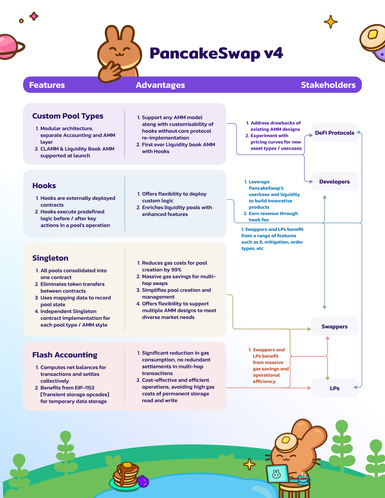

# PancakeSwap v4

_If you're a developer or looking for detailed technical documentation, please refer to this doc_ [_https://developer.pancakeswap.finance/_](https://developer.pancakeswap.finance/)

**1. What is PancakeSwap v4?**

PancakeSwap v4 is the latest iteration of the PancakeSwap protocol, featuring a modular Automated Market Maker (AMM) architecture. This version introduces enhanced pool capabilities via hooks, supports a diverse array of pricing curves, and prioritizes gas efficiency for users. The aim is to offer a seamless DeFi experience for users and provide a platform where developers can innovate freely.

**2. What are the features of PancakeSwap v4?**

**i) Hooks**

Hooks in PancakeSwap v4 are externally deployed contracts that act as customizable add-ons to enhance the functionality of liquidity pools. Developers and protocols can deploy these contracts to execute predefined logic during key actions in a pool's operation. Hooks brings a new level of customization to liquidity pools, allowing for dynamic fees, custom oracles, active liquidity management, and more.

**How Hooks Benefit:**

* **Dynamic Fees:** Traders can experience more dynamic fee structures, starting as low as 0%.
* **Advanced Trading Tools:** The introduction of hooks enables advanced trading tools like limit orders, take-profit orders, and TWAMM (Time-Weighted Average Market Making) and other reward programs such as trading fee rebate
* **Revenue Stream for Developers:** Developers can generate a consistent revenue stream through hook fees, incentivising innovation.

<figure><figcaption></figcaption></figure>

Read our [detailed blog ](https://blog.pancakeswap.finance/articles/everything-you-need-to-know-about-pancake-swap-v4-what-s-in-it-for-developers-traders-liquidity-providers-and-defi-protocols)about its benefits to developers, traders, Liquidity providers, and Defi Protocols.

**ii) Multiple Pool Types**

PancakeSwap v4 supports multiple pool types, including:

**a) CLAMM (Concentrated Liquidity Automated Market Maker) with Hooks:** PancakeSwap v4 supports the Concentrated Liquidity Automated Market Maker (CLAMM) model with hooks, which allows liquidity providers to supply assets within specific price ranges. Hooks integration provides customization options for CLAMM pools.

**b) LBAMM (Liquidity Book AMM) with Hooks:** The first-ever Liquidity Book AMM model with hooks operates on a constant sum formula within each bin. This model eliminates impermanent loss for LPs within individual bins and enables zero price impact trades. Hooks bring customization possibilities to Liquidity Book AMM pools.

**c) Any other future pool type with Hooks:** PancakeSwap v4 is designed to be flexible and future-proof, allowing for the implementation of new AMM designs with hooks. Developers can explore innovative pool types to address evolving market demands. Each pool type offers unique advantages and allows for diverse trading strategies and liquidity provisioning options.

**iii) Donate**

The Donate feature empowers stakeholders to directly incentivize in-range liquidity providers, improving LP returns and participation.

i**v) Singleton**

The Singleton contract design consolidates all pools into a single contract. This significantly reduces pool creation cost (up to 99%) and minimizes gas costs for multi-hop swaps.&#x20;

**v) Flash Accounting**

Flash Accounting is a gas optimization technique that simplifies the accounting process by computing net balances for a batch of transactions and settling them collectively. This approach reduces gas consumption compared to previous models, where assets were transferred in and out of pools after every user action.

**vi) ERC6909**

PancakeSwap v4 adopts the ERC-6909 multi-token standard for accounting purposes. This standard allows for the creation and management of both fungible and non-fungible tokens within a single smart contract. ERC-6909 enhances efficiency, lowers costs for frequent users, and provides a streamlined alternative to other token standards.\

**vii) Support for Native Gas token**

PancakeSwap v4 supports native gas tokens, allowing for direct trading pairs with native gas tokens and reducing gas costs for users.

**Open-licensing:** PancakeSwap v4 code will be released under an open-source license, encouraging developers to innovate, customize, and collaborate freely.

**Developer Program:** PancakeSwap is launching a $500,000 USD Developer Program to support and incentivize developers. This includes Growth Campaigns, Hackathons, a Developer Ambassador Program, and a CAKE Emissions Grants Program. Read more about the developer program [here](https://blog.pancakeswap.finance/articles/introducing-pancake-swap-s-500-k-developer-program-and-cake-emissions-grant-program).\

PancakeSwap v4 represents a significant milestone in the evolution of DeFi protocols. Its modular architecture, customizable features, and gas optimization techniques offer users a more efficient, flexible, and rewarding experience.

Whether you're a developer looking to build custom features, a trader seeking advanced tools, or a liquidity provider aiming for optimal returns, PancakeSwap v4 caters to your unique needs. Join us as we set to launch on Ethereum and BNB Chain in the 3rd quarter of this year.

\
The codebase is open-sourced for developers [here](https://github.com/pancakeswap/pancake-v4-core), with detailed technical documentation available [here](https://developer.pancakeswap.finance/).\

\
\
