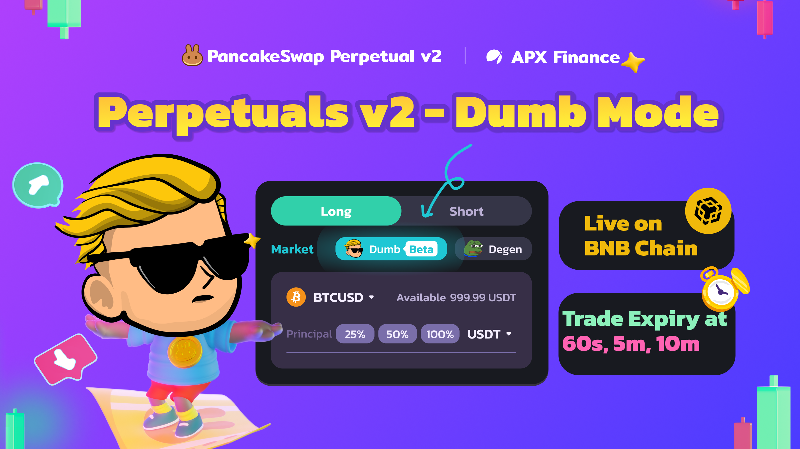

# Dumb Mode

<figure><figcaption></figcaption></figure>

### Overview

[**Dumb Mode**](https://perp.pancakeswap.finance/en/futures/v2/BTCUSD?theme=light\&chain=bsc) on PancakeSwap Perpetuals offers a simplified trading experience, ideal for traders who prefer to trade on the minute-by-minute fluctuations of an underlying asset’s value. Dumb Mode simplifies trading by reducing the noise, allowing users to enter and exit short-term positions easily.

### How It Works

Users are given a selection of 60-second, 5-minute or 10-minute expiration windows with different return-on-investment ratios. Users can choose to long or short an underlying asset.&#x20;

At the end of the expiration period, if the underlying asset is in a winning position (price greater than open price for long, price lower than open price for short), users will stand to profit.

Each expiration period has a different return-on-investment (ROI). The longer the expiration period, the higher the ROI. Percentages and fees are as follows:\

| Expiration Period | Winning ROI (Net of fees)\* | Losing ROI | Fees (on Winning) |
| ----------------- | --------------------------- | ---------- | ----------------- |
| 60 seconds        | 75%                         | -100%      | 6% on collateral  |
| 5 minutes         | 85%                         | -100%      | 6% on collateral  |
| 10 minutes        | 88%                         | -100%      | 6% on collateral  |

\*Winning ROI may be adjusted occasionally depending on market conditions. Please check this page for any updates

For example, in the following scenario:

* Position Selected: Long
* Collateral Placed: 100 USDT
* Expiration Period: 60 seconds
* BTCUSD price at open: $50,000
* BTCUSD price after 60s: $50,001

User will profit **100USDT \* 75%= 75USDT**&#x20;

For more information on how to open a Dumb Mode position, click [here](dumb-mode-guide.md).

### Markets and Margin Assets

Dumb Mode supports trading in the following markets and margin assets on **BNB Chain**:

<table data-header-hidden><thead><tr><th width="330"></th><th></th></tr></thead><tbody><tr><td>Market</td><td>Margin Assets</td></tr><tr><td>
BTCUSD

ETHUSD

CAKEUSD

BNBUSD

SOLUSD
</td><td>
USDC

USDT

CAKE

ETH

BTC

HAY
</td></tr></tbody></table>

Dumb Mode supports trading in the following markets and margin assets on **Arbitrum, opBNB and Base Chains**:

<table data-header-hidden><thead><tr><th width="330"></th><th></th></tr></thead><tbody><tr><td>Market</td><td>Margin Assets</td></tr><tr><td>
BTCUSD

ETHUSD
</td><td>
USDC

USDT

ETH

BTC
</td></tr></tbody></table>

Support for more assets/chains is in development.

### Fees

A fee of **6%** of the principal or collateral is charged in case of a winning trade. This is already calculated before ROI.

\
