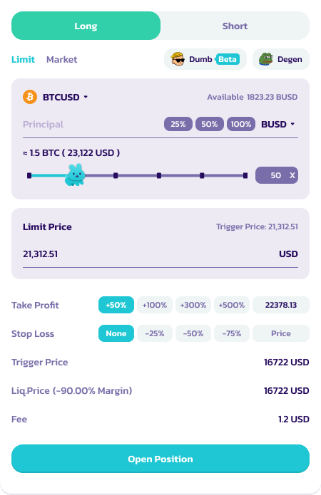
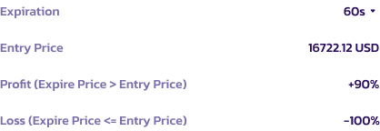
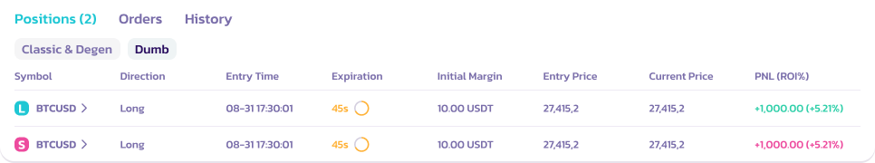

# Dumb Mode Guide

### How to Place Orders in Dumb Mode

To place an order in Dumb Mode on PancakeSwap, follow these steps:

1. Select a Market: Go to [**Pancakeswap Perpertuals**](https://perp.pancakeswap.finance/en/futures/v2/BTCUSD?theme=light\&chain=bsc) on BSC. Choose from the available markets like BTCUSD, ETHUSD, etc.

<figure><figcaption></figcaption></figure>

2. Click on **Dumb (Beta) Icon.** The position interface will change to Dumb mode.

<figure><figcaption></figcaption></figure>

2. Select Position: Choose to long or short the underlying asset\*
   1. For long positions: If the expiry price is greater than the entry price, user will win the trade and make profit.&#x20;
   2. For short positions: If the expiry price is less than the entry price, users will win the trade and make profit.
   3. Otherwise, user will lose the entire collateral.
   4. Refer to notes for more details on position
3.  Set Margin and Amount: Select your margin asset (USDC, USDT, CAKE, etc.) and specify the amount for collateral.

    <figure><figcaption></figcaption></figure>
4. Choose Duration: Decide on the expiration of your trade - 60s, 5m, or 10m.

<figure><figcaption></figcaption></figure>

5. Place Order: Review the ROI, confirm details and place your trade by clicking **Open Position**\*

<figure><figcaption></figcaption></figure>

5. Monitor Trade: Once the trade is placed, monitor its progress until completion via the “Position” tab. **Users cannot close trades before expiration**

<figure><figcaption></figcaption></figure>

7. Settlement: Upon the trade's conclusion, if successful, your ROI will be credited minus the 6% fee. If the trade is not successful, the loss will be 100%.

<figure><figcaption></figcaption></figure>

### Extra Note on Position

* Please note that the expiration timer doesn't start when you click on the 'OpenPosition' button; instead, the 60-second / selected duration countdown commences from the instant the transaction gets confirmed on the blockchain
* The price you see displayed serves only as a reference. The final entry price will be determined by the price point at the exact moment the transaction is confirmed on the blockchain. This will be updated on the “position” tab

### Tips for Using Dumb Mode

* Understand the Risks: Be aware of the high risks involved, especially with the -100% ROI on losses.
* Manage Your Collateral: Only invest what you can afford to lose.
* Stay Informed: Keep up to date with market trends for the assets you're trading.
