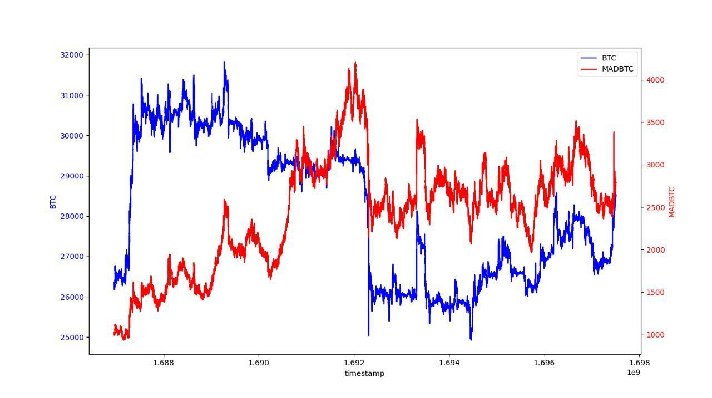

# MADBTCUSD FAQ

### How is MADBTCUSD Index Calculated?

MADBTCUSD is calculated based on the following formula:

**MADBTCUSD Index**

$$
\begin{align*}
\text{drift} &= \left( \frac{\text{btcCurrentPrice} - 1}{\text{btcLastSecondPrice}} \right) \times 5 \\
\\
\sigma &= \frac{\text{expectedvol}}{\sqrt{3600 \times 24 \times 365}} \\
\\
norm &= \text{norminv}(\text{Random}, 0, 1) \\
\\
S_{n+1} &= S_{n} \times e^{\left[\left(\text{drift} - \frac{\sigma^2}{2}\right) \times \text{dt} + \sigma \times \sqrt{\text{dt}} \times norm\right]}
\end{align*}
$$


where:

* Initial Sn=1000 &#x20;
* dt=1
* expected vol：100%(expected vol is the expected time volatility of the MADBTC)
* the "**Random number**" is calculated based on the current **BTC price with 8 decimal places of precision**

**Calculation of Random Number:**

```python
import hashlib
from decimal import Decimal

# Assume the current price of Bitcoin is 48923.56789101
bitcoin_price = Decimal("48923.56789101")

# Calculate the SHA-256 hash of the Bitcoin price
price_hash = hashlib.sha256(str(bitcoin_price).encode('utf-8')).hexdigest()

# Extract the first 8 hexadecimal numbers from the hash
hash_substring = price_hash[:8]

# Converts a hexadecimal string to an integer
hash_integer = int(hash_substring, 16)

# Divide the integer by 4294967296 (the decimal number corresponding to the hexadecimal number FFFFFFFF) to get a num
random_number = hash_integer / 4294967296
# Print the random number
print(random_number)
```

If the random number determined is 0, it will be recalculated again

### Where can I cross-verify the BTC and MADBTCUSD historical price?

The BTC and MADBTCUSD price feed can be found here:

[BTCUSD](https://www.apollox.finance/bapi/futures/v1/public/future/apx/V2MarkPriceKline?symbol=BTCUSD\&limit=1800)

[MADBTCUSD](https://www.apollox.finance/bapi/futures/v1/public/future/apx/V2MarkPriceKline?symbol=MADBTCUSD\&limit=1800)

### Historical backtest data of BTC & MADBTC

To cross-verify the BTC & MADBTC historical prices, we've provided a backtest graph below.&#x20;

<figure><figcaption></figcaption></figure>
