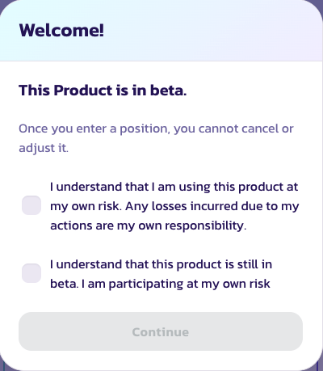

# How to Use Prediction

Playing PancakeSwap’s Prediction lets you test your foresight to earn rewards. Use your market knowledge or gut feeling to predict if the BNBUSD or CAKEUSD price will go up or down in the near future. Get it right and you’ll collect a share of the round’s prize pool!


PancakeSwap’s Prediction is a new product that we still consider to be in beta. We may make changes in the future to improve Prediction. As always, the PancakeSwap team will inform users of any changes that will impact how the product works.


## Accepting terms of the beta

Before you can use Prediction, you’ll need to review and accept the terms.

Visit the [PancakeSwap Prediction page](https://pancakeswap.finance/prediction). You will see a “Welcome!” window explaining that the Prediction product is still in beta.

Read and accept the conditions then click **Continue**.

## Switch between two prediction markets

PancakeSwap offers two separate prediction markets for every player to choose from. You can play based on the CAKE USD price, betting with CAKE. Alternatively, you can play based on BNB USD price, betting with BNB.

To switch between two prediction markets, simply click or tap the currency switcher on the top left corner.

## Making a prediction for the next round

The Prediction page shows quite a bit of information. Predictions operate in 5 minute rounds. Make your prediction before a round goes live to join in.

### Checking the timer

To enter a round of Prediction, you'll want to check how long is left in the current round. You'll find the timer in the top-right area.

.png>)

If the timer is too low your prediction may not confirm in time, so check there's still plenty of time left before you make a prediction (30 seconds should be plenty, but give yourself more time if you're following along with this guide).

### Predicting the next round

When you're sure you have enough time, you can place your prediction for the next round.

1\. In the "Next" section you'll see a green **Enter UP** button and a red **Enter DOWN** button. Click **Enter UP** if you want to predict a rise in price, and click **Enter DOWN** if you want to predict a drop in price.

.png>)

Each will have a different reward multiplier. The multiplier will change over time as the "Prize Pool" increases depending on people's predictions. The Prize Pool is shown just above the buttons.

.png>)

We'll choose **Enter UP** for this example.

2\. A new window will open. In the window, you'll see "Commit" to commit BNB or CAKE for your prediction. Type the number of tokens you would like to commit to your prediction for this round in the field. You can also use the bunny slider or click the percent buttons if you prefer.

If you are playing CAKE USD prediction market, at the first game, you will have to click "Enable" to enable the smart contract.

.png>)

3\. Once you've decided the amount to commit, click **Confirm** and confirm your action in your wallet.

.png>)

The confirm button will fade out as your transaction confirms. This short wait is why we checked the round timer earlier to make sure we would have time to make our prediction.

4\. After your transaction confirms, an "ENTERED" message will appear.

.png>)

There's nothing left to do now but wait for your Prediction round to go live.

## While your entered round is live

A live round will last for 5 minutes. You can watch the price update during the 5 minutes if you'd like.&#x20;

.png>)

You cannot change your prediction during a live round, however. You are locked into your prediction from earlier.

## Once your entered round finishes

After 5 minutes as the live round, your entered round will finish. Everything is automatic, so there's nothing you need to do to end the round.

### Seeing the results

1\. As the 5 minutes finish, the "LIVE" section will change to "Calculating". Calculating the results only takes a moment.

.png>)

2\. After a short wait, the finished round will move left and say "Expired". The result of the round will display with either UP colored in green, or DOWN colored in red.

.png>)

3\. If you've been busy and missed the results, you can scroll back a few rounds by clicking the **left arrow** on the purple bunny cards.

.png>)

### Seeing results for older rounds

If you want to see the results for rounds you've entered that are older than a few rounds, you'll need to follow the steps below to find the results.

1\. Click on the **reversing clock icon** next to the round timer.

.png>)

2\. A "History" panel will open. By default, you should see your most recent round at the top of the list. Click anywhere on the round to see more information.

.png>)

.png>)

### Collecting any winnings

1\. If you won your entered round, a **Collect Winnings** button will appear next to a gold trophy. Click the button.

.png>)

2\. A new window will appear showing the amount of winnings you can collect with a **Confirm** button. Click the button and confirm the action in your wallet.

.png>)

Your token winnings will now be in your wallet.

### Collecting winnings from older rounds

Sometimes you may be away from PancakeSwap's Prediction page for a while or may have forgotten to collect winnings from older rounds. You can still collect winnings owed to you from older rounds at any time.

1\. Find more information on past rounds you've entered by clicking on the **reversing clock icon** next to the round timer.

.png>)

2\. A "History" panel will open. You can click "Uncollected" to view all rounds you've not collected the winnings for yet (click a the transaction if you want to see more details). Click the **Collect** button.

.png>)

3\. A new window will appear showing the amount of winnings you can collect with a **Confirm** button. Click the button and confirm the action in your wallet.

.png>)

Your winnings will now be in your wallet.

## Viewing historic profit and loss data

If you'd like to see how you've done overall in Prediction, you can view PNL (Profit and Loss) data whenever you'd like.

1\. On the Prediction page, click the **reversing clock icon** next to the round timer. A "History" panel will open.

.png>)

2\. On the history panel, click the **PNL** tab.

.png>)

The tab will open with stats for your historic performance in Prediction, including your net results, average return, best round, and other information.

.png>)

3\. You can click the **View Reclaimed & Won** button at the bottom of the PNL tab to view those transactions on the BscScan explorer.

.png>)

That's all there is to using Prediction. Good luck making the right calls!

&#x20;
