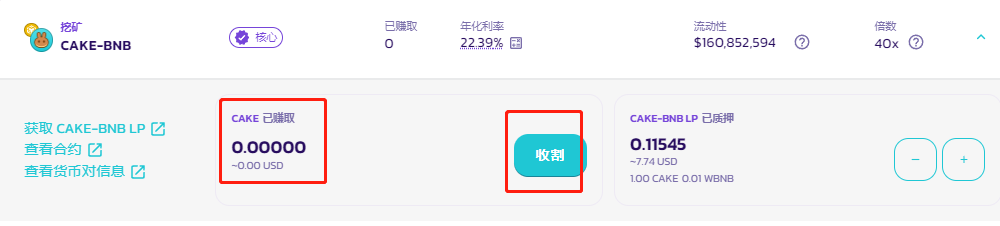

# 其他糖浆池

.png?alt=media\&token=c0992701-1038-4bb8-a3c8-9f783d32ed64)

在 [糖浆池](../) 中质押，让你在睡觉时亦可赚取 CAKE 或其他代币！&#x20;

这比在 PancakeSwap 农场中进行流动性挖矿要简单。有别于农场，你只需要质押**一种代币**即可开始赚取：通常是 CAKE！

## **开始进行糖浆池质押**

1. [ 点击此处](https://pancakeswap.finance/pools)，前往糖浆池页面。

<figure><figcaption></figcaption></figure>

&#x20;  2.通过右上角的「连接钱包」按钮，连接您的BNB智能链兼容钱包。

<figure><figcaption></figcaption></figure>

&#x20;  3.选择您的钱包并连接。

<figure><figcaption></figcaption></figure>

&#x20; 4.选择一个您希望质押的糖浆池。

<figure><figcaption></figcaption></figure>

**CAKE 新版糖浆池**分为灵活质押和锁仓质押两种方式，详情请阅读[此处](../xin-ban-cake-tang-jiang-chi/)。

其他糖浆池通过让您质押 CAKE ，来赚取一系列非常有意思的其他项目代币。请务必了解他们。

&#x20; 5.选择好您希望质押的糖浆池后，点击**启用**按钮，并在钱包弹出的消息中确认。

<figure><figcaption></figcaption></figure>

&#x20; 6.稍等片刻，**启用**按钮将变成**质押**。点击它来打开质押菜单。

<figure><figcaption></figcaption></figure>

&#x20; 7.输入您要质押的数量，或直接拖动兔子滑块来选择。

<figure><figcaption></figcaption></figure>

&#x20; 8.点击**确认，**并在钱包弹出的消息中确认。

<figure><figcaption></figcaption></figure>

&#x20; 9.**确认**按钮将变为「确认中」。当上链操作完成时，你会看到按钮再次变化，并显示您正在质押的数目。

&#x20; 10.现在您应该能看到糖浆池的详细质押信息。其他糖浆池将显示**收割**按钮，用于将赚取到的奖励收割至钱包内。

<figure><figcaption></figcaption></figure>

### **在糖浆池中添加或移除 CAKE** 

无论是在糖浆池中添加更多的 CAKE ，还是将 CAKE 提取并重新质押至更高利润的糖浆池池中，都非常容易。以下是操作指南：

1. 点击 **-** （减号）来从池中提取 CAKE，点击 **+** （加号）来添加更多的 CAKE：\
   \
   **请注意：**若您质押的是 CAKE 灵活质押糖浆池，在质押操作后的 72 小时内提取，需要收取 0.1% 的手续费。
2. 页面会弹出一个窗口，若您点击的是 **+** （加号），请在窗口中选择您要添加的 CAKE 数量。若您点击的是 **-** （减号） ，则选择您要提取的 CAKE 数量。

<figure><figcaption></figcaption></figure>

 

<figure><figcaption></figcaption></figure>

&#x20; 3.点击**确认。**

&#x20; 4.稍等片刻，您可以看到新的质押代币的详情。\
\
**请注意：**无论是添加还是提取 CAKE操作，都会自动将待收割收益，收割至您的钱包中。
