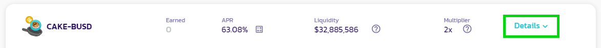

# 如何使用锁仓质押糖浆池

1.跳转到糖浆池页面，点击[此处](https://pancakeswap.finance/pools)。

2.单击**连接钱包**按钮（右上角）连接到您的 BNB 智能链兼容钱包。

<figure><figcaption></figcaption></figure>

3.选择您相应的钱包并连接。

<figure><figcaption></figcaption></figure>

4.选择 CAKE糖浆池并单击**启用**按钮。 您的钱包会要求您确认操作。

<figure><figcaption></figcaption></figure>

5.**启用**按钮现在应该替换为**灵活**和**锁定**。单击按钮以调出质押菜单。

<figure><figcaption></figcaption></figure>

6.对于锁仓质押，只需按下 **Locked（已锁定）**，这将显示一个新窗口，输入您想要质押的 CAKE 数量以及您想要锁定 CAKE 多长时间。

在此下方，您将找到您的质押细节，包括收益率、锁定持续时间以及解锁日期和时间。 仔细检查以确保您对锁定持续时间和质押金额没有问题，单击**确认**并确认您钱包中的交易。

<figure><figcaption></figcaption></figure>

请注意，我们仍在完善我们的前端显示界面，包括更精确的解锁持续时间和可能的倒计时。

## 延长您的锁仓质押时间&#x20;

在锁仓质押期间改变了主意？ 没问题。 您可以随时通过单击 “**Eetend（延长）**” 来延长锁定 CAKE 的时间，然后选择要在初始锁仓持续时间之上延长多少时间。 请记住，您锁仓的时间越长，您的收益就会越高。 最长锁仓期限为 52 周。&#x20;

用户延长时间后新的锁仓时长 = 初始锁仓时长 + 新增时长&#x20;

#### 举例说明：

&#x20;一位用户在 2022 年 5 月 7 日用 10 CAKE 质押在锁仓质押糖浆池，初始锁仓持续时间为1周。 2022 年 5月 8日（1天后，到用户的 CAKE 解锁还剩6天），用户决定他们想要增加 5 周的锁仓持续时间。

1.导航到蛋糕糖浆池并单击**延长**。

<figure><figcaption></figcaption></figure>

2.选择您要增加的持续时长（本例中为 5 周）。

<figure><figcaption></figcaption></figure>

请注意，您新的锁仓持续时间 6 周将等于 1 周的初始锁仓持续时间，加上增加的 5 周新锁仓时间。也就是，您现在锁仓到期时间为 2022 年 6 月 12 日。

3.仔细检查以确保您对延长的锁仓持续时间没有问题，然后单击**确认**。

请注意，您不能缩短锁仓时间，也不能提前取回您的 CAKE。

## 为您的锁仓添加更多 CAKE&#x20;

您可以通过更新您的锁仓仓位轻松做到这一点。 只需单击 “Add CAKE（增加 CAKE)” 并选择您要存入多少 CAKE。&#x20;

请注意，向现有锁仓添加更多 CAKE ，会根据剩余锁仓持续时间重置您的质押期限，本质上是“更新”您的锁仓质押头寸。 这会导致收益加成倍数 (boost 倍数) 较原先为小，并进而影响您的收益率倍增，因为您新锁定那部分的 CAKE，锁仓剩余持续时间低于您的初始锁定持续时间。&#x20;

#### 举例说明：

&#x20;一位用户在 2022 年 5 月 7 日用 10 CAKE 质押在锁仓质押糖浆池，初始锁仓持续时间为 1 周。。

2022年5月8日（1 天后，到用户的 CAKE 解锁还剩6天），用户决定新添加 10 个 CAKE 到锁仓余额。

1. 导航到 CAKE糖浆池并单击 **Add CAKE（增加CAKE)**。

<figure><figcaption></figcaption></figure>

&#x20;2.选择您想添加到锁定余额中的 CAKE 数量（在本例中，我们添加 10 CAKE）。 请注意，您的收益提升倍数（boost 倍数）低于初始收益提升倍数，因为它是使用 6 天锁仓持续时间而不是初始 1 周锁仓持续时间计算的。&#x20;

<figure><figcaption></figcaption></figure>

2.1. 或者，用户可以选中“更新并延长您的锁定以继续类似福利”旁边的框。为了保持类似的收益率提升倍数，将锁仓持续时间设置为等于初始锁仓持续时间（在本例中为 1周）。

<figure><figcaption></figcaption></figure>

3\. 仔细检查以确保您增加的 CAKE 数量和锁仓持续时间没有问题，然后单击**确认**。
