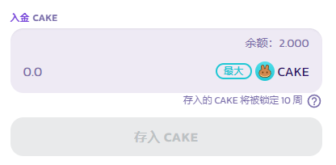
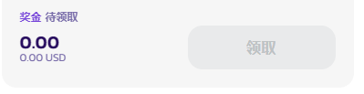

# 如何玩转糖浆彩票

<figure><figcaption></figcaption></figure>

​对比仅仅将 CAKE 锁定和质押在质押池中，PancakeSwap 的糖浆彩票是另一种增加您 CAKE 数量的可选替代方式，本指南将引导您了解如何在 PancakeSwap 官网界面中导航并参与糖浆彩票。

在此处了解有关 [PancakeSwap 糖浆彩票的产品结构、风险和费用的更多信息](https://app.gitbook.com/o/-MHRKTpKSfYQBsO7YgOo/s/-MHREX7DHcljbY5IkjgJ-3369173170/\~/changes/DhnYvzxHLGMTcuoqPPV8/products/tang-jiang-cai-piao)。

## 决定您是否想要参与到一个糖浆彩票组中 

每个月的第一个星期一会创建一个新的糖浆彩票组。每个组可能有不同数量的 CAKE 存款，这会影响每周的奖池和您的获胜几率。锁定在该组中的 CAKE 总价值越大，每周的奖池就越大，但在相同的 CAKE 存款规模下，您可能获得较低的获胜几率。您可以在“存款”面板中查看已存入多少 CAKE 以及您的中奖几率：​

<figure><figcaption>
<strong>由于前端显示设定，只能显示最多两位小数，实际中奖几率可能是0.002%之类</strong>
</figcaption></figure>

## 在糖浆彩彩票组开放时存入CAKE 

每个糖浆彩票组的存入每月开放一次。存款在每月的第一个星期一 23:59 UTC 关闭并锁定蛋糕，并从之前的星期五 10:00 UTC 开始。这是为了将所有存款合并起来，一次将它们转移到锁定质押糖浆池，以实现高效的质押奖励管理和分配。在除此以外的时间里，你会看到：​

<figure><figcaption></figcaption></figure>

– 这意味着存款操作目前关闭到下一个月第一个星期一之前的星期五。如果存款已开放，您将看到以下内容：​

<figure><figcaption></figcaption></figure>

&#x20;– 在这种情况下，如果您可以接受 APY、锁定的总价值和获奖的几率，您可以存入您的 CAKE 以参与糖浆彩票。在您存款之前，请确保您完全了解参与的风险及费用！所有存款将被锁定 10 周，在任何情况下均不得提前提取。请在此处了解[有关风险和费用的更多信息](./)。

## 查看您的存款

存入 CAKE 后，您可以在领取面板中查看您的存款金额和该糖浆彩票组的总存款：

<figure><figcaption></figcaption></figure>

​​由于 Subgraph 读数有时可能会出现一些延迟，当有延迟时会有一个提示 - 通常如果您在 15 分钟内再次检查，它将会显示正确的数量。请注意，仅在锁定日期的 10 周后，**提取**按钮才会亮起并可用。

## 查看每周抽奖结果

在UTC时间周五中午左右的每次抽奖之后，您可以在已完成的界面中查看抽奖结果和获奖者：

<figure><figcaption></figcaption></figure>

​​根据抽奖日期，找到您想要查看的糖浆彩票组的对应轮次 - 每个星期五，可能会有不止一次抽奖，因为有不同的糖浆彩票组，请确保您查看的是您参与的糖浆彩票组抽奖。请在此处阅读以了解有关[糖浆彩票组](./#tang-jiang-cai-piao-zu)构造的更多信息。

## 领取奖励

检查您是否在任何一次每周抽奖中获奖的另一种方法是在“**领取**”面板中查看是否有任何奖励可在此处领取：​

<figure><figcaption>
<strong>如果中奖了会在待领取字段下面显示中奖金额， 领取按钮也会亮起</strong>
</figcaption></figure>

如果中奖了，您可以通过点击**领取**按钮来领取奖励，您将需要在钱包中批准这次交易。

请注意，您必须在 BNB 智能链上支付 Gas 费才能领奖。

## 在10周后提取您的 CAKE

糖浆彩票组存款和锁定日期后 10 周，您将能够在领取界面中领取您的存款，并且您可以在此处单击**提取**按钮：

<figure><figcaption></figcaption></figure>

​​您可以通过点击**提取**按钮来提取质押奖励，您将需要在钱包中批准这次交易。

请注意，您必须在 BNB Smart Chain 上支付 Gas 费才能提取奖励。

翻译中，请暂时先使用[英文版](https://docs.pancakeswap.finance/products/pottery/how-to-play-pottery)。

##

