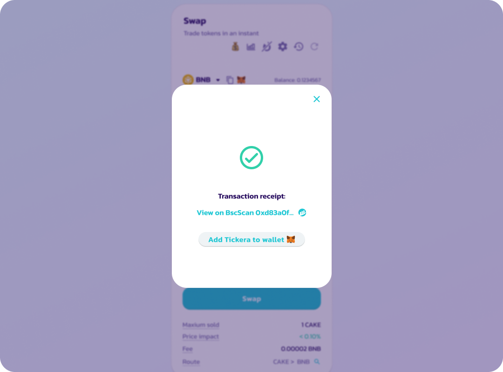
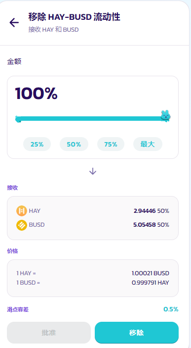
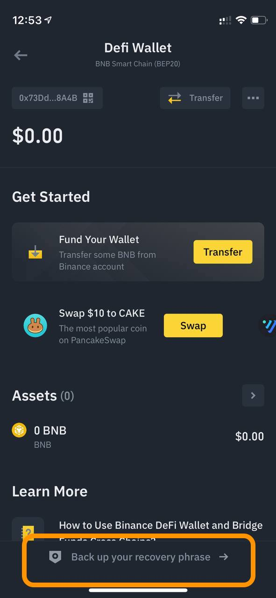

# 如何使用StableSwap

<figure><figcaption></figcaption></figure>

## 在 StableSwap 上交易&#x20;

在 StableSwap 上进行交易与使用现有的 PancakeSwap AMM 非常相似。 在我们开始之前，它还需要一个兼容 BNB 智能链的钱包和 BNB 来支付 gas 费用。 请查看我们的[钱包指南](../../get-started/wallet-guide.md)了解更多详情。

1.跳转到[兑换界面](https://pancakeswap.finance/swap)

2\. 点击“StableSwap”选项

<figure><figcaption></figcaption></figure>

3.选择您想要交易的代币对。 初上线时，仅添加一个交易对（HAY-BUSD），更多稳定币对将逐步添加。

<figure><figcaption></figcaption></figure>

4\. 从这一步开始，交换步骤与 Pancakeswap 上普通的代币兑换相同！ 请从第 4 步开始查看[此处的指南](../pancakeswap-exchange/ru-he-jin-hang-jiao-yi.md)

## 添加&移除流动性

为 StableSwap 添加和移除流动性也非常重要，并且类似于普通的 PancakeSwap AMM。 请参阅此[处的指南](../pancakeswap-exchange/ru-he-tian-jia-yi-chu-liu-dong-xing.md)以获取更详细的说明。&#x20;

StableSwap 的流动性有一些不同之处：

&#x20;1.当您选择启用了 StableSwap 的资产对时（例如 HAY-BUSD），前端会提示您提供“Stable LP”

<figure><figcaption></figcaption></figure>

&#x20;2\. 两种资产的供应数量可能在供应阶段是不平衡的，会有一个确认页面显示您的供应比例。

<figure><figcaption></figcaption></figure>

3\. 您将收到一个 Stable-LP 代币作为流动性凭证，以供将来提取和移除您的流动性。

<figure><figcaption></figcaption></figure>

4\. 但是，请注意，当您移除流动性时，无论您添加供应时的比率如何，您始终会获得资产的 50%/50%。 举个简单的例子，如果您提供了 199 HAY 和 1 BUSD，当您移除流动性时，假设滑点为 0 和价格稳定在 1:1 ，您将收到 100 HAY 和 100 BUSD。

<figure><figcaption></figcaption></figure>

## 迁移您的 HAY-BUSD 农场质押&#x20;

在 StableSwap 推出之前，HAY-BUSD 流动性和 LP 农场已经在 PancakeSwap 的普通 AMM v2 兑换中启用了。但是，由于我们将 HAY-BUSD 作为我们 StableSwap 上的第一个交易对推出，大多数想要交易该代币对的人最终可能会转向 StableSwap，而不是继续使用 AMM v2 兑换，原因如下：&#x20;

* 您可以用（与普通 AMM ）相同的交易步骤，兑换更有效率地
* 使用 StableSwap 功能，交易滑点低于仅使用恒定乘积公式的普通 AMM&#x20;
* 与普通 AMM 相比，交易费用较低&#x20;

**请注意：如果您目前没有在 HAY-BUSD LP 的农场进行质押，则无需进行迁移。**&#x20;

**为什么农场质押的LP需要要迁移？**&#x20;

由于 HAY-BUSD 的大部分交易活动将在 StableSwap 上使用 Stable LP 进行，因此 CAKE 奖励应直接奖励 Stable LP 的质押者鼓励他们提供流动性。原始 HAY-BUSD LP（使用 v2 AMM）的交易将会减少。

## 如何迁移 LP

从 StableSwap 启动开始，到 CAKE 激励重新定向和 HAY-BUSD Stable LP 的新农场启动之前，将有一个 24 小时的窗口期。 如果您目前在原来的农场里质押了 HAY-BUSD LP，您应该这样做：

&#x20;1\. 从[农场页面](https://pancakeswap.finance/farms)取消质押HAY-BUSD  LP&#x20;

<figure><figcaption></figcaption></figure>

&#x20;2.在[流动性页面](https://pancakeswap.finance/liquidity)移除您的 HAY-BUSD LP 的流动性&#x20;

&#x20;3\. 再次为 HAY-BUSD 添加流动性（这次您应该到 StableSwap 部分添加，您可以看到上方显示 stable LP）

<figure><figcaption></figcaption></figure>

4\. 重新质押您的HAY-BUSD LP  到[农场页面](https://pancakeswap.finance/farms)（等到9月23日新农场发射后，请根据stable LP 标签查找相应的农场）

<figure><figcaption></figcaption></figure>

## 时间线：

* StableSwap 启动和 HAY-BUSD 流动性供应启用：2022 年 9 月 22 日 11:00 UTC&#x20;
* 农场迁移（CAKE 奖励从 HAY-BUSD LP Farm 重新定向到 HAY-BUSD Stable LP 农场）：2022 年 9 月 23 日 11:00 UTC
