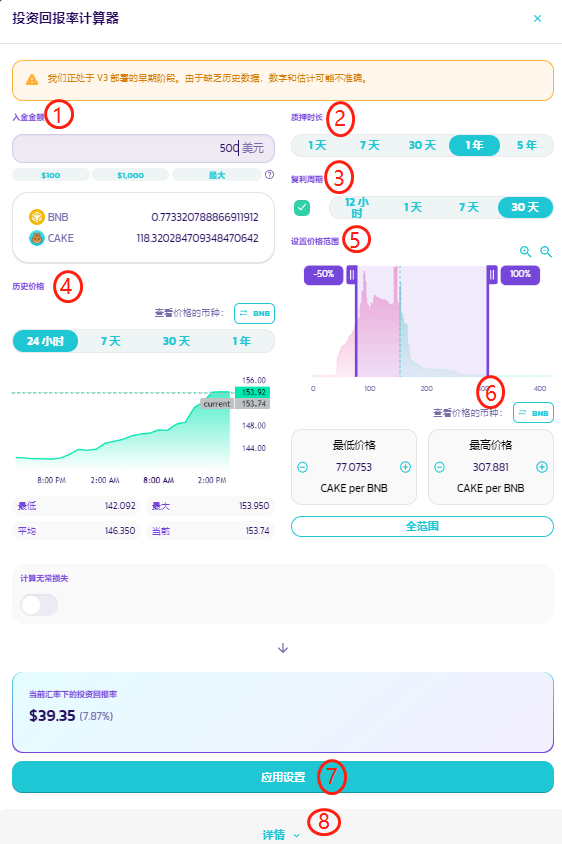
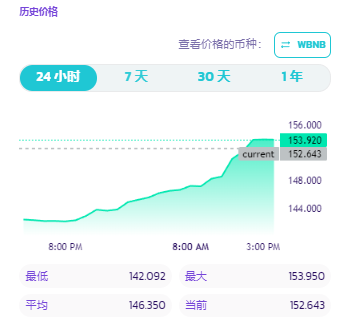
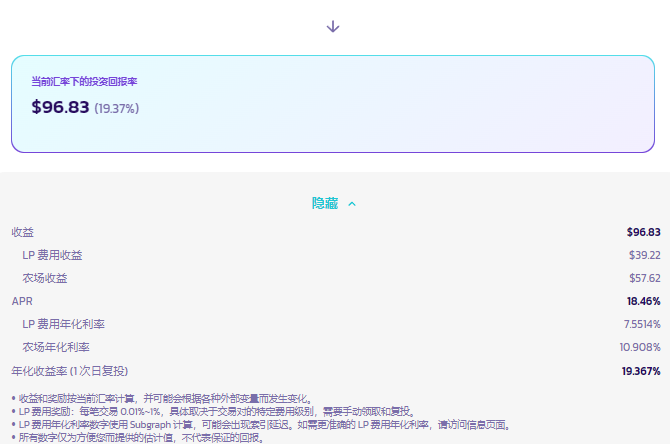

# APR/ROI/IL 计算器

&#x20;在 V3 流动性和农场中，拥有新的非同质化的流动性仓位特性和可设置价格区间的功能。每个 LP 仓位都会有自己的 LP 费用和 CAKE 奖励 APR。&#x20;

为了使组建流动性更加简便、轻松，现在提供流动性或参与农场挖矿时，有两个新功能供您使用，自动 APR 显示，与新上线的投资回报率计算器（ROI calculator）。

## APR 自动计算和显示

<figure><figcaption></figcaption></figure>

当您提供流动资金时，自动 APR 显示会对你的配置变化做出反应，并根据你的设置计算 APR。&#x20;

例如，在大多数情况下，如果你缩小你的价格区间设置，APR 就会上升。&#x20;

请注意，对于 LP 费用 APR：&#x20;

* LP 费用奖励的估计金额根据所选的费用级别而异，费用奖励需要手动领取并复投。
* APR 数字是用历史交易量计算的，这取决于子图（Subgraph），并可能受到索引（indexing）延迟的影响。&#x20;

农场显示的 APR：&#x20;

* CAKE 奖励部分，奖励的估计金额是基于该农场的实时 CAKE 分配量而计算的。它可能会随着未来分配的调整而改变。\


这些 APR 数字是按照目前的费率和池子情况计算的，并可能根据各种外部变量而改变。这只是为您提供的一个估计的数值，绝不代表收益保证。


你可以在以下这几个位置找到 APR 显示：&#x20;

* "添加流动资金（Add Liquidity）" 页面--显示 LP 费用 APR&#x20;
* 现有流动资金仓位的详情页--显示 LP 费用 APR

.png>)

* 农场页面，每个质押中的仓位内--显示与 LP 费用加上 CAKE 奖励的总和 APR

.png>)

## 重新设计后的 ROI 计算器

<figure><figcaption></figcaption></figure>

每当您看到自动 APR 显示时，您可以点击计算器图标并调出新的投资回报率计算器。新的投资回报率计算器经过重新设计，增加了许多功能以适应 V3 集中提供流动资金和农场质押的需要。&#x20;

让我们一起来看看新的计算器的布局：&#x20;

### "入金金额"，"质押时长" 和 "复利周期"。&#x20;

这三个是基本输入信息，在之前的投资回报率计算器中也有介绍。它们是用来定义：&#x20;

1. 为流动性仓位提供多少以美元计的资产。&#x20;
2. 这些资产将质押多长时间。&#x20;
3. 复利的周期是多少。

#### ⓵ 入金金额

<figure><figcaption></figcaption></figure>

您可以手动输入美元金额，或使用快捷按钮快速输入100美元、1000美元或由您钱包中的代币余额决定的最大金额。

#### ⓶ 质押时长

<figure><figcaption></figcaption></figure>

您可以选择资产在流动性仓位中的质押时间，可以选择： 1 天、7 天、30 天、1 年和 5 年。 回报的数额将根据您的质押时长计算。

#### ⓷ 复利周期

<figure><figcaption></figcaption></figure>

您可以选择多长时间收割一次仓位产生的利润，并将其复投到仓位中。您可以选择 12 小时，1 天，7 天和30 天。&#x20;

回报的数额和 APY 将根据您的选择来计算。如果您没有计划对您的仓位进行复利，请取消勾选左边的复选框。


在 V3 中，LP 费用和赚取的 CAKE 必须手动领取以及复投。


#### ⓸ 历史价格 

<figure><figcaption></figcaption></figure>

此部分无法点击仅供阅览，用于查看所选代币对的历史价格走势。&#x20;

您可以参考不同时间段的历史价格走势，比如价格通常会有多大的波动，然后得出一个合适的价格区间进行设置，在较高的 APR 和较低的无常损失风险之间取得平衡。&#x20;

* MIN - 最低价格&#x20;
* MAX - 最高价格&#x20;
* AVG - 平均价格&#x20;
* CURRENT - 当前价格


价格图表只引用实际 V3 交易对的数据。因此 V3 部署前的价格数据是不可用的。四个价格指标代表当前选择的时间框架的价格，并将根据选择不同而改变。


#### ⓹ 价格范围 

<figure><figcaption></figcaption></figure>

利用这部分，您可以检查有多少流动性被存入不同的价格区间，并得出并设置你希望提供流动性的价格区间。&#x20;

您可以在标题下面找到分布图。流动性的数量越多，图表柱就会越高。&#x20;

您可以通过以下方式改变你的价格范围设置：

* 拖动图表上的两个光标来设置最低和最高价格。&#x20;
* 点击两个光标之间的空间来移动选定的范围。&#x20;
* 点击最低和最高价格字段上的+和-按钮。&#x20;
* 点击价格字段中的数字并手动输入。&#x20;

如果您想更仔细地浏览分布图：&#x20;

1. 使用带加号和减号的放大镜按钮来放大和缩小&#x20;
2. 拖动 X轴（底部）来左右移动&#x20;

如果您想为整个价格范围提供流动性，点击 "全范围"。

#### ⓺ 切换基础计价代币，查看基于不同代币的价格

<figure><figcaption></figcaption></figure>

对于一些代币对来说，用某些基础代币来查看价格更容易、更直观。例如，对于 BNB/USDT 对，大多数人喜欢以 "每 BNB 值多少 USDT" 来查看价格，而不是 “每 USDT 值多少 BNB"。&#x20;

您可以轻松地转换价格显示。只需点击 "查看价格的币种：" 后面的按钮，就可以在该对代币中的两个代币之间切换基础计价代币。

#### ⓻ 导入和导出（应用）您的设置

<figure><figcaption></figcaption></figure>

当您在 "添加流动性" 窗口中打开投资回报率计算器，或通过现有仓位打开，以下设置将被自动导入，所以您不需要再次设置：&#x20;

1. 你所存入的资产数额&#x20;
2. 价格区间&#x20;
3. 所选的费用级别&#x20;

当您在投资回报率计算器中完成配置后，您可以点击 "应用设置"，将计算器中的设置快速应用到 "添加流动性 "窗口的设置中，这样您就不需要再手动匹配它们。

#### ⓼ 计算当前汇率下的投资回报率

如果您在 "农场" 页面下打开投资回报率计算器，农场的 CAKE 奖励将包括在计算中。&#x20;

您可以展开详情部分，查看投资回报率的详情。

<figure><figcaption></figcaption></figure>
