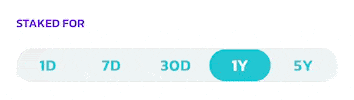
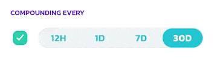
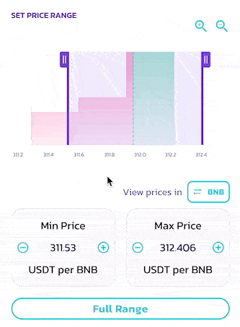
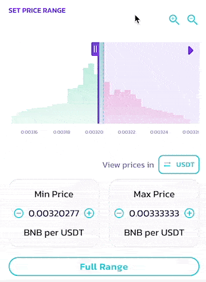
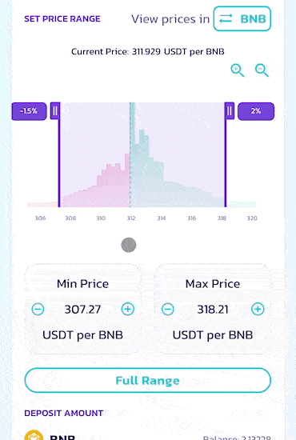

# APR/ROI/IL Calculator

In V3 Liquidity and Farms, with the new non-fungible liquidity and customizable price range ability. Each LP position will have its own LP fee and CAKE farming APR.

To make liquidity provisioning smoother and less challenging, the new automatic APR displays with a brand new ROI calculator are available to use whenever you are providing liquidity or farming.

## Automatic APR calculation and displays 

<figure><figcaption></figcaption></figure>

When you are providing liquidity, the automatic APR display reacts to your configuration changes and calculates the APR based on your settings.

For example, in most cases, if you tighten your price range settings, the APR goes up.

Please note for LP fee APRs:

* The estimated amount of LP fee rewards vary based on the selected fee tier, fee rewards require manual claiming and compounding.
* APR figures are calculated using historical trading volume, which is dependent on Subgraph and may be subject to indexing delays.

For farming APRs:

* The estimated amount of CAKE rewards is based on the live CAKE emissions to the farms. They are subject to change based on future emission adjustments.


Numbers are calculated at the current rates and pool conditions and are subject to change based on various external variables. They are estimations provided for your convenience only, and by no means represent guaranteed returns.


You may find this APR display under:

* “Add Liquidity” page - showing LP fee APR
* Detail page of each of the existing liquidity position - showing LP fee APR\
  .png>)
* Farm page, within the position under each farm - showing combined APR with LP fee and CAKE rewards\
   (1).png>)\

## Improved ROI calculator 

<figure><figcaption></figcaption></figure>

Whenever you see the automatic APR displays, you can click and bring up the new ROI calculator. The new ROI calculator has been redesigned with serval added features to fit the needs for V3 concentrated liquidity providing and farming.

Let’s go through each of the sections together:

### Deposit Amount, “Staked For” and “Compounding Every” 

These three are the basic inputs, which are also presented in the previous ROI calculator. They are there to define:

1. How many assets are provided to the liquidity position, in USD.
2. For how long those assets will be staked in the position.
3. How often you will be compounding rewards back to the position.

⓵ **Deposit Amount**

You may manually input the amount in USD, or use the quick action buttons to quickly fill in $100, $1000 or the maximum amount allowed based on the token balance in your wallet.

⓶ **Stake Duration**

You can select how long the assets are staked in the liquidity position by choosing between: 1 day, 7 days, 30 days, 1 year, and 5 years.

The number of return will be calculated based on your staking duration.

⓷ **Compounding**

You can select how often you will be harvesting the rewards generated by the position, and compounding them back to the position. You may choose a number between: 12 hours, 1 day, 7 days, and 30 days.

The number of returns and APY will be calculated based on your choice. If you have no plan to compound your position, uncheck the checkbox on the left.


In V3, LP fees and earned CAKE has to be manually harvested and compounded.


### &#x20;⓸ History Price 

.png>)

This is a view-only section to reference the historical price movement of the selected pair.

You may reference the historical price movements in different timeframes, such as how much the price usually fluctuates and then come up with a suitable price range settings to balance between higher APR and lower risk of impermanent loss

* MIN - minimum price
* MAX - maximum price
* AVG - average price
* CURRENT - current price


The price chart is only using data from the actual V3 pair. Therefore price data before V3 deployment is not available. The four price metrics represent the currently selected timeframe and will change based on the selection.


### ⓹ Price Range 

Using this section, you may check how much liquidity has been deposited to different price ranges, and come up with and set the price range you are providing liquidity to.

You may find the distribution chart below the title. The larger the amount of liquidity, the higher the chart will be.

You can change your price range settings by:

* Dragging the two handles on the chart to increase or describes the minimum and maximum price limit.
* Using the space between two handles to shift the selected range.
* Clicking the + and - button on the min and max price fields.
* Clicking the numbers in the price fields and entering them manually.

If you want to navigate the distribution chart:

1. Use the plus and minus magnifier buttons to zoom in and out
2. Drag the X (bottom) axis to shift left and right

If you want to provide liquidity to the entire price range, click “Full Range”

### ⓺ Flip the price direction to view prices with different base 

For some token pairs, it is easier and more intuitive to view prices with certain base tokens. For example, for BNB/USDT pair, most people will prefer to view prices in “how many USDT per BNB” instead of the other way around.

You can easily flip the price displays. Simply click the button following the “View prices in:” to switch the base between two tokens in the pair.

### ⓻ Import and export (apply) your settings 

When you open the ROI calculator in the “Add Liquidity” window, or by viewing an existing position, the following settings will be automatically imported so you don’t need to set them again:

1. The amount of assets you are depositing
2. The price range
3. The selected fee tier

When you finish configuring in the ROI calculator, you can click “Apply Settings” to quickly apply the settings from the calculator back to the “Add Liquidity” window so you don’t need to match them manually.

### ⓼ Calculate farming rewards and APR 

Farming rewards will be included in the calculations if you bring up the ROI calculator under the “Farm” page.

You can expand the detail sections to see the rewards breakdown.

<figure><figcaption></figcaption></figure>
