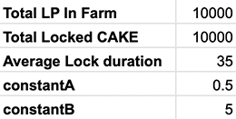
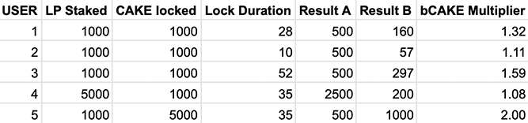

# FAQ

### How are the bCAKE multipliers calculated?

You may notice that you get different bCAKE boost multipliers when staking in different farms.

That's because bCAKE - Farm Boosters multipliers are calculated using the following metrics upon activation or refresh:

* `userLpStakedAmount` : The number of LP tokens you are staking in the farm
* `totalLpStakedAmount` : The total number of LP tokens in the farm
* `userLockedAmount` : The number of CAKE you are staking in the fixed-term staking CAKE pool
* `userLockedDuration` : The staking duration of your fixed-term staking position
* `totalLockedAmount` : The total number of locked CAKE in the fixed-term staking CAKE pool
* `averageLockedDuration` : The average staking duration of the fixed-term staking CAKE pool

The multiplier is calculated using the following method:

1. `resultA = constantA * userLpStakedAmount`
2. `resultB = (totalLpStakedAmount * userLockedAmount * userLockedDuration / constantB) / (totalLockedAmount * averageLockedDuration)`
3. `boostMultiplier = min(userLpStakedAmount, (resultA + resultB)) / resultA`

`constantA` and `constantB` are set by the kitchen and subject to future adjustments based on community feedback and market condition.

Here are some examples of the calculation:


**TL;DR**

The more LP you want to boost

The more CAKE you need to lock for longer durations


### Why do my multipliers change even after activation?

Please note that any user actions to the farms or CAKE staking pool will automatically update your boost multiplier based on the latest data and statistics from farms and the CAKE staking pool, including but not limited to:

* Stake/Unstake LP tokens to/from Farm
* Harvest CAKE rewards from Farm
* Extend your CAKE staking duration
* Add more CAKE into your fixed-term staking position
* Convert your CAKE staking position to flexible


Please note:&#x20;

In order to ensure fairness and prevent potential abuse and cheating using out-of-date data. Farm booster is designed to be community governance. Therefore, anyone can call `refresh(address _user, uint256 _pid)` function on the farm booster contract (link) to refresh anyone's boost multipliers using the latest data.


### Where are my CAKE rewards after activating or unsetting the booster?

While farming with bCAKE - Farm Boosters, some of your harvested CAKE rewards may be temporally stored in the farm booster contract. Whenever this happens, you will see a dotted line under your "CAKE EARNED", indicating that apart from the number shown, you have more CAKE rewards in the farm booster contract.

**This part of the CAKE rewards will be automatically sent to your wallet upon the next harvest, deposit or withdrawal.**

To harvest them right now, simply click the "Harvest" button.

To check the number of extra rewards in the farm booster contract, hover or long-press the number with the dotted line.

### Why I'm not able to boost a farm

1. Farm booster is only available for selected farms. More farms will be made available in the future. For now, look for the "Boosted" tag on the UI.\
   .png>)
2. There is a limit to the number of farms that are able to boost simultaneously. To check the number of remaining boosters, refer to the panel on top. \
   .png>)\
   You will need to unset an active booster in order to activate boosters on other farms.
3. Make sure you've completed the one-time setup.
4. Due to the involvement of multiple contracts, some of the contract interactions require slightly more gas tokens (BNB). So please make sure you have enough BNB in your wallet.

### What is the maximum bCAKE Boost Multiplier I can get?

Currently, the maximum boost a user can get for a farm booster is 2x. Which offers them double the baseline APRs.

### How can I increase my bCAKE Boost Multipliers?

* Add more CAKE into the fixed-term staking position
* Extend the duration of your fixed-term staking position

Simply put:

> Stake more CAKE, stake for longer

[Learn more about how the bCAKE boost multipliers are calculated](faq.md#how-are-the-bcake-multipliers-calculated).

### Where are the extra boosted CAKE rewards coming from?

**Relax, no extra emissions are allocated in order to make bCAKE possible.**

Similar to fixed-term CAKE staking. bCAKE boosts individual users' share against the others.

Even though the baseline APR may drop after the deployment of bCAKE. Chefs believe it is a good tradeoff as it not only benefits loyal CAKE lovers by boosting their farming yield, but also creates more demand for CAKE and serves as a great incentive for CAKE staking.

### Is bCAKE audited?

bCAKE has been audited by both internal and external auditors.&#x20;

Check out PeckSheild's audit report [here](https://github.com/peckshield/publications/tree/master/audit\_reports/PeckShield-Audit-Report-PancakeSwap-FarmBooster-v1.0.pdf).

