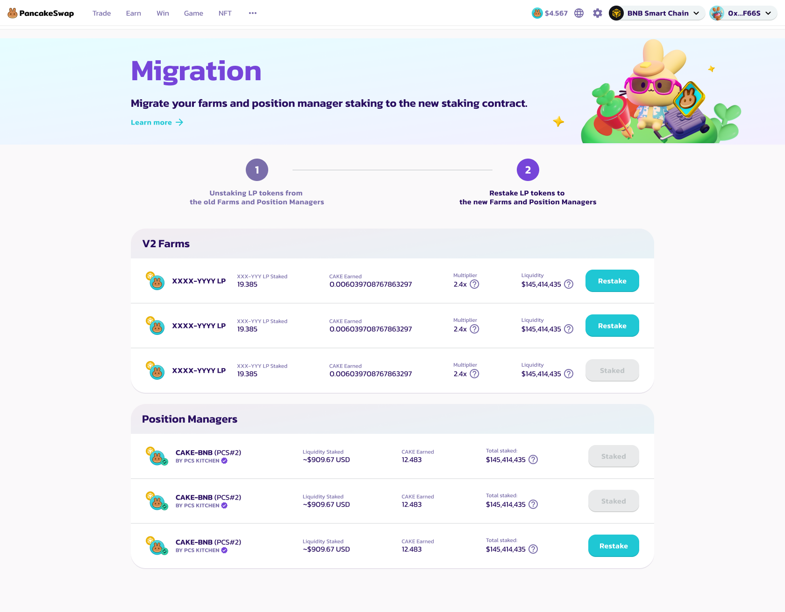

# Migration Guide

<figure><figcaption></figcaption></figure>

To start boosting your V2, StableSwap or Position Manager liquidity via bCAKE, you need to perform a migration by unstaking your LP from the old contract, and restake them into the new one.

### Navigate to the migration wizard

<figure><figcaption></figcaption></figure>

Locate the banner at the top of the Farm or Position Manager page, click “Proceed” to start the migration process.

[Go to Farm](https://pancakeswap.finance/farms)

[Go to Position Manager](https://pancakeswap.finance/position-managers)

### Unstake your LP tokens from the old contracts

<figure><figcaption></figcaption></figure>

In the first step, you will see a full list of V2, StableSwap farms, and position managers that require migration to enjoy bCAKE boosting.

Click the “Unstake All” buttons on the right, and confirm the tx in your wallet app, to unstake ALL LP tokens from the old contracts.

You will need to unstake each of them individually.

After unstaking all the LPs, click “Go to Stake” to proceed to the next step.

### Restake your LP tokens into the new contracts

<figure><figcaption></figcaption></figure>

In the second step, you will see a full list of V2, StableSwap farms, and position managers that are available to restake.

First, click the “Enable” buttons to enable deposits.

Then, click “Restake” buttons to restake the LP tokens into the new contract.

*   For V2 and StableSwap farms, you need to define the number of LP tokens you want to restake in the new pop-up modal. \

    We recommend to restake all of your LP tokens to ensure you are earning the maximum yield available.
*   For Position Managers, simply confirm the tx in your wallet, all of your Position Managers LPs will be restaked into the new contracts. \

    Since Position Manager LPs can not be processed separately, we strongly recommend to restake ALL position managers LP into the new contracts.

After restaking, the buttons will turn to “Staked”

You will need to restake each of them individually.

After restaking all LPs, click “Finish”, to go back to the Farm page.
