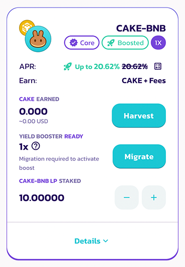
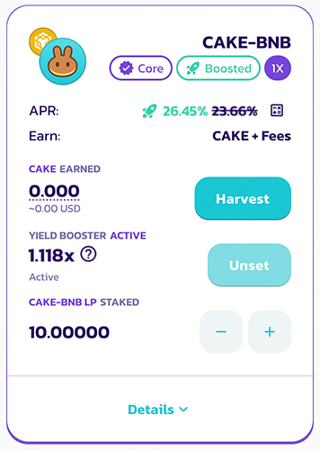

# 如何使用 bCAKE?

<figure><figcaption></figcaption></figure>

与 iCAKE 和 vCAKE 类似，bCAKE 也是锁仓质押 CAKE 糖浆池用户的专属福利。提升倍数根据您锁仓 CAKE 数量、锁仓的时长以及您想要助推质押在农场的流动性 LP 的数量来计算。

## 准备工作

### 锁仓 CAKE

<figure><figcaption></figcaption></figure>

如果您尚未在 CAKE 锁仓质押池中锁定任何 CAKE，请单击 “**前往糖浆池（Go to Pool）**” 并按照说明进行 CAKE 锁仓质押。

了解有关如何进行 CAKE 锁仓质押的更多信息，请阅读[此处](../../syrup-pools/cake-tang-jiang-chi/ru-he-shi-yong-suo-cang-zhi-ya-tang-jiang-chi.md)。

### 启用农场收益助推器

<figure><figcaption></figcaption></figure>

要启用农场收益助推器（以下简称助推器），您必须进行设置。此步骤为一次性，无需重复设置。

要继续，只需单击 “启用” 并在您的钱包中确认此链上操作。

### 迁移已质押的流动性凭证


在已激活 bCAKE （助推器）的农场中，如果您并不持有这些农场中的仓位，可以直接跳过迁移步骤，直接开始使用农场。


<figure><figcaption></figcaption></figure>

迁移适用对象：在激活助推器以前，已经在欲激活助推器之农场里质押了 LP 代币的用户。这些用户们需要进行一次迁移。

点击 “迁移（Migrate）”，前端指南将一步步引导您操作，直至走完整个迁移步骤。您之前的 CAKE 奖励将自动收割并且发送到您的钱包。

<figure><figcaption></figcaption></figure>

## 激活助推器

<figure><figcaption></figcaption></figure>

准备就绪后，您会看到您当前质押的农场的可用提升倍数和提升后的 APR。 要了解有关如何计算 bCAKE 倍数的更多信息，请阅读[此处](chang-jian-wen-ti-jie-da.md)。 要激活农场助推，请单击“Boost提升”按钮，然后在您的钱包确认交易。


请注意，用户进行农场、 CAKE 锁仓调整操作后，您的倍数将自动更新，因前两者的统计及数据更新了。

点击[这里](chang-jian-wen-ti-jie-da.md)了解更多。


<figure><figcaption></figcaption></figure>

同时运转的农场助推器有数量限制，在置顶显示区中可以看见您剩余可用的助推器额度。

当启用数量已到上限，您需要取消一个目前正在运转的助推器，将额度让给其他助推器，才可以启用新的。

## 解除助推器

<figure><figcaption></figcaption></figure>

要取消设置农场助推器，只需单击 “Unset取消设置” 按钮，然后在您的钱包中确认上链。&#x20;

请注意，在取消设置时，获得的 CAKE 将被收割到农场助推器合约中，并在下一次收割、存款或取款时自动发送到您的钱包。点击[这里](chang-jian-wen-ti-jie-da.md)了解更多。
