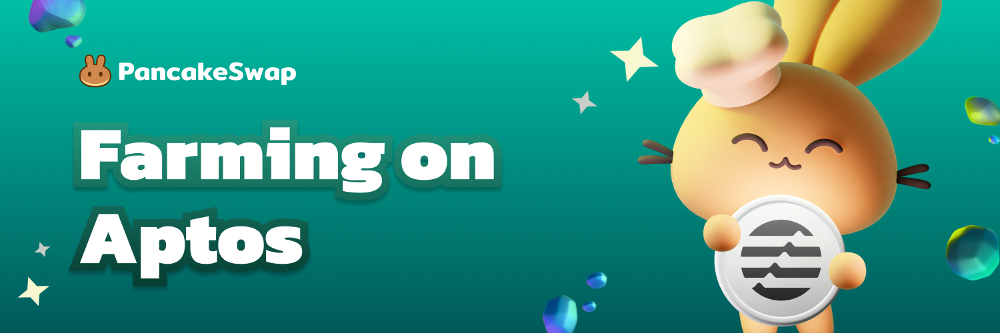

# 在 Aptos 链上参与农场

<figure><figcaption></figcaption></figure>

通过我们的多链部署，PancakeSwap 现在为 Aptos 上的流动性提供者带来了标志性的农场挖矿体验。农场允许用户在支持 PancakeSwap 的同时通过质押 LP 代币赚取 CAKE。

查看[此章节](../../yield-farming.md)以了解更多关于农场的信息。

我们设计的产品在不同的区块链上用户的体验是一致的。因此，如果你是 BSC上的忠实农场用户，在 Aptos 上参与农场时，你会有轻车熟路的感觉。如果你是流动性挖矿的新手，请查看我们的[如何使用农场](../ru-he-shi-yong-nong-chang.md)指南以学习如何使用。

要了解更多，关于如何在 BSC 和 Aptos 之间将你的资产和 CAKE 进行跨链。请查看[ CAKE 跨链指南](../../../chan-pin/kua-lian/evm-lian-yu-aptos-zhi-jian-kua-lian.md)。


农场与糖浆池相比，农场拥有更高的收益，但同时它们有**无常损失**带来的风险。别担心，它并没有听起来那么可怕，但是在开始进行流动性挖矿前，值得您花些时间适当地了解它。

查看这一篇来自币安的 [关于无常损失的文章](https://academy.binance.com/en/articles/impermanent-loss-explained) 以了解更多。

