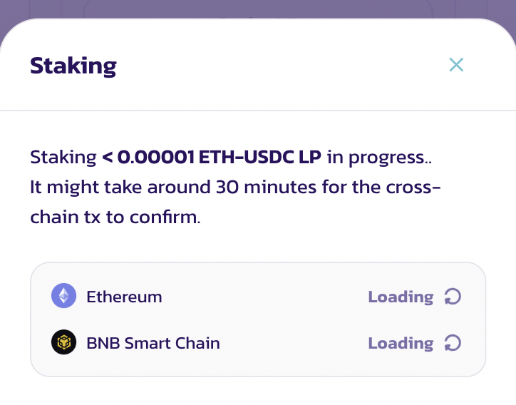

# How to Use Farms

Yield Farming in Farms is a great way to earn CAKE rewards on PancakeSwap.

Unlike Syrup Pools, Farms require you to stake **two tokens** to provide liquidity and receive either a liquidity position NFT or LP Tokens, which you then stake in the Farm to earn rewards. This lets you earn CAKE while still keeping a position in your other tokens!


Yield farming can give better rewards than Syrup Pools, but it comes with a risk of **Impermanent Loss**. It’s not as scary as it sounds, but it is worth learning about the concept before you get started.

Check out this great [article about Impermanent Loss ](https://academy.binance.com/en/articles/impermanent-loss-explained)from Binance Academy to learn more.


## Farm V3

### **Get prepared**

 (3).png>)

You’re going to need a liquidity position to enter into a Farm with. Farms can only accept liquidity positions from their own exact trading pair with the exact fee tier of choice; for example, the CAKE-BNB 0.25% Farm will only accept CAKE-BNB liquidity positions with the 0.25% fee tier selected. It will not accept:

* Other pairs, like CAKE-BUSD
* Same pair but with other fee tiers: like CAKE-BNB with a 0.05% fee rate

To create the exact LP position, you'll need to provide liquidity for that trading pair with the correct fee rate selected. So to get CAKE-BNB 0.25% LP positions, you'll first have to provide liquidity for the CAKE-BNB pair with the 0.25% fee tier selected.

It may sound intimidating, but it's not too complicated. Let's go through it step by step.

### **Locate your Farm**

.png>)

Before you proceed, you'll want to choose a Farm that's right for you. [Visit the Farms page](https://pancakeswap.finance/farms) to see a list of available Farms.

You can choose another sorting option, such as by APR, for the Farms with the highest reward rate currently. Please note that the APRs are calculated globally for individual positions; it may vary depending on their price range settings.

When you find a Farm you'd like to use, note down the trading pair and its fee rate, e.g. BNB-CAKE and 0.25%, in case you need them later.

### **Provide liquidity to create a position**

Now that you've found a Farm to stake in, you will need to provide liquidity:

1 - If you don’t have any position available, you will see a “Add Liquidity” button, simply click it to open up the “Add Liquidity” window without leaving the Farm page.

 (4).png>)

2 - Alternatively, you can click on the row of the Farm you've chosen from the list. It will open to show more details. Or with card view, click “Details” to expand for more details. Click the “Add XXX-YYY LP” link within the detail section to add liquidity.

.png>)

### **Stake your positions into a farm**

.png>)

After finishing adding liquidity. You should see your position listed under the farm you want to use.

If you have multiple positions, you may click “View All” to view them in a new pop-up window.

.png>).png>)

Click “Stake” on the position listed, and your wallet will ask for confirmation.

.png>)

After a short wait, the window will close, and you will see your staked position in the details.

You can repeat the above steps to quickly stake multiple positions with different price range configurations. Each position will earn CAKE and need to be harvested separately.

### **Harvest farming rewards**

In Farm V3, you can stake multiple positions on the same farm. Each staked position will earn CAKE and need to be harvested separately.

 (1).png>)

To harvest CAKE rewards from a staked position, simply return to the Farm page, and locate the farm and position you want to harvest. You can use the “Staked Only” toggle to quickly filter the farms you are currently staking.

If you have multiple staked positions, you may click “View All” to view them in a new pop-up window.

.png>)

Click “Harvest” on the position, and your wallet will ask for confirmation. After a short wait, the CAKE rewards will be sent to your wallet.

### **Add or remove liquidity while staking in a farm**

When staking in a farm, you can still add or remove liquidity without unstaking from the farm.

.png>)

To do so, simply return to the Farm page, and locate the farm and position you want to adjust. You can use the “Staked Only” toggle to quickly filter the farms you are currently staking.

.png>)

Click on the position title with the token pair, fee rate, position ID and the “>” arrow. You will be taken to the position detail page.

Simply use the “Add” or “Remove” button to adjust the liquidity in the staked position.

Please note that all the unclaimed CAKE rewards will be harvested and sent to your wallet while adjusting your position.

### **Unstake your positions from a farm**

You can unstake a position at any time.

To unstake, simply return to the Farm page, and locate the farm and position you want to unstake. You can use the “Staked Only” toggle to quickly filter the farms you are currently staking.

If you have multiple staked positions, you may click “View All” to view them in a new pop-up window.

Click “Unstake” on the position, and your wallet will ask for confirmation. After a short wait, your position NFT will be returned to your wallet, along with all the pending CAKE rewards.

## Farm V2

### Get prepped

Yield farming takes a little work to get set up.

You’re going to need some "LP Tokens" to enter into a Farm with. Farms can only accept their own exact LP Token; for example, the CAKE-BNB Farm will only accept CAKE-BNB LP Tokens.

To get the exact LP Token, you'll need to provide liquidity for that trading pair. So to get CAKE-BNB LP Tokens, you'll first have to provide liquidity for the CAKE-BNB pair.

It may sound intimidating, but it's not too complicated. Let's go through step by step.

### Finding your Farm

Before you proceed, you'll want to choose a Farm that's right for you. [Visit the Farms page](https://pancakeswap.finance/farms) and you’ll see a list of available Farms.

 (1) (2) (1).png>)

You can choose another sorting option if you like, such as by **APR** for the Farms with the highest reward rate currently.

When you find a Farm that you'd like to use, note down the trading pair, e.g. BNB-CAKE in case you need it later.

### Providing liquidity to get LP Tokens

Now that you've found a Farm to stake in, you will need to add liquidity to get your LP Tokens.

1. Click on the row of the Farm you've chosen from the list. It will open to show more details.
2. On the left, you'll see some links. Click the **Get (your pair) LP** link.

 (2).png>)

### Putting your LP Tokens into a farm

Now that you have your LP Tokens, you’re ready to start staking them in a Farm and earning rewards!

1 - Go back to the [Farms page](https://pancakeswap.finance/farms) and locate your Farm. Click anywhere on the row showing your pair. It will expand to show more details.

 (2).png>)

When you’re ready, click the **Enable** button and confirm your action in your wallet.

2 - After a short wait, the Enable button will change to **Stake LP**. Click it and a new window will appear.

 (1) (2).png>)

3 - Type the amount of LP Tokens you would like to farm with into the field, or just click **Max** to use all of your LP Tokens.

 (1).png>)

4 - When you have the amount entered, the **Confirm** button will light up. Click it. Your wallet will ask you to confirm your action.

5 - After a short wait, the window will close, and you will see your new staked LP Token balance in the details.

.png>)


When you are performing crosschain farming on an EVM blockchain other than the BNB chain. You will need to wait approximately 30 minutes for the cross-chain transactions to confirm.

To track the progress of a crosschain farming transaction. Click the circular icon on the side of your staked balance, or check out the "Recent Transaction" section in the top right-hand corner.



When you are performing crosschain farming on an EVM blockchain other than the BNB chain for the first time. A small amount of native token (for example, ETH for Ethereum) is required for the first-time setup. So the first transaction will be slightly costly.


### Adding or removing LP Tokens from a Farm

You may decide you would like to add more LP Tokens to a Farm at a later date, or to take some out of a Farm. You can do this very easily whenever you'd like.

1. Return to the [Yield Farms page](https://pancakeswap.finance/farms). At the top of the page you'll see a **Staked only** toggle. Click the toggle.

 (1).png>)

You should now only see the pairs you have LP Tokens in on the list, making it easier to find your Farm.

1. Find the Farm you have LP Tokens in, and click the row to view details. You will see a **-** and **+** button on the right-hand side. Click **-** to remove LP Tokens, or **+** to add more LP Tokens.

 (2) (2) (1) (1) (1) (1) (1) (1).png>)

1. A window will open that looks like the one you used earlier to first stake your LP Tokens. Like last time, type the amount you would like to unstake/stake, or click **Max** to remove/add all available LP Tokens.

 (1).png>)

1. Make sure your information is correct. When you are ready, click the **Confirm** button and confirm the action in your wallet.
2. After a short wait, your new balance will show in the details section of your LP Token pair. If you've unstaked your LP Tokens, any unharvested rewards you had will automatically have been collected.

### Collecting your farming rewards

Farming will bring you CAKE rewards over time. You can collect these rewards and use them to get more LP Tokens, stake them in Syrup Pools, use them to play Lottery, or anything else you’d like.

### Returning to your Farm to Harvest

You can harvest your Farm and Syrup Pool rewards together from the Home page. If you'd like to collect your farming rewards only, follow along.

To collect your rewards, you’ll need to visit your chosen Farm and collect the CAKE waiting for you.

1 - Return to the Farms page [here](https://pancakeswap.finance/farms).

2 - Find the Farm you staked your LP Tokens in, and click the row to view details. You should see an estimate of your rewards under “CAKE earned”.

.png>)

3 - Click the **Harvest** button and confirm the action in your wallet. After a short wait, the CAKE will be claimed to your wallet for you to use as you like.


When you are performing crosschain farming on an EVM blockchain other than the BNB chain. You will need to always switch to BNB Smart Chain to harvest your farming rewards.

If your wallet doesn't support chain switching. Staking or unstaking LP tokens will always harvest your CAKE. Please note the harvested CAKE will be distributed on BNB Smart Chain.

.png>)


## How often should I harvest my rewards?

How often you harvest your rewards is up to you, but it does help to remember that there is a small fee involved in harvesting.

You can see this fee in your wallet when confirming after clicking **Harvest**.

 (1).png>)

This shows the fee for harvesting as it appears in the MetaMask wallet. Different wallets will show the information a little differently. Consider leaving your rewards to grow for a while so you pay fees less often.

And that's all there is to it! You may also want to look at [how to use PancakeSwap Syrup Pools](https://docs.pancakeswap.finance/get-started/syrup-pool-guide) to earn rewards.

Happy farming!
