# 如何使用预测功能

<figure><figcaption></figcaption></figure>

使用 PancakeSwap 的预测功能可以让您测试您的预测能力而且可以获得奖金。利用您对市场的认知或凭直觉来预测 BNB/USD 或 CAKE/USD 价格在未来会上涨还是下跌。如果预测成功，您将获得该轮奖池的一部分！


PancakeSwap 的预测是一款新产品，我们认为它仍处于测试阶段。我们可能会在未来做一些改变来改进预测功能。如果会有任何影响产品功能方面的更改，PancakeSwap 团队将一如既往地提前通知用户。


## 接受 beta 测试条款

您需要审阅并接受这些条款才能够使用预测产品。

访问 [PancakeSwap 预测页面](https://pancakeswap.finance/prediction)，您将会看到一个欢迎界面，上面会显示并告知预测功能处于测试阶段。

<figure><figcaption></figcaption></figure>

阅读并接受条款然后点击**继续**。

## 在两个预测市场中切换

<figure><figcaption></figcaption></figure>

PancakeSwap 提供两个独立的预测市场供每个玩家选择。您可以依据 CAKE/USD 的价格参与预测，并用 CAKE 下注。 您也可以依据 BNB/USD的价格参与预测，并用 BNB 下注。

如果要在两个预测市场之间切换，只需点击左上角的货币切换按钮（如上图）。

## 预测下一回合的价格走势

预测页面显示了很多信息。预测每回合 5 分钟，参与者需要在新一回合开始前做出预测。

### 查看计时器

准备参与时，您需要查看当前回合的预测还剩多长时间。在右上角可以找到计时器。

<figure>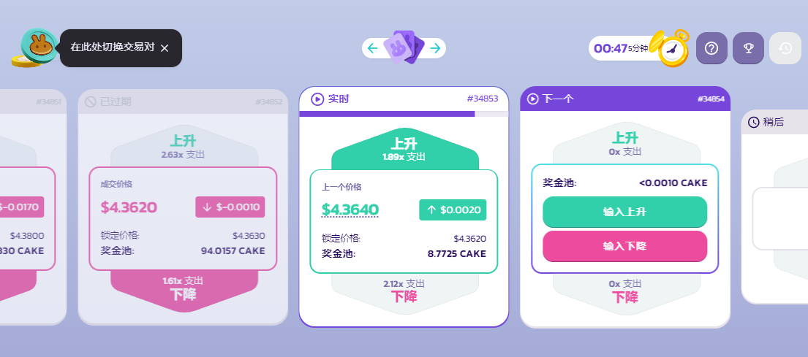<figcaption></figcaption></figure>

如果计时器所剩时间太少，您的预测可能无法及时确认，因此请确保在您做出预测之前还有足够的时间（30 秒应该足够了，但如果您遵循本指南，请给自己预留更多时间）。

### 预测下一回合

当您确保时间充足时，您可以参与下一回合的预测。

1. 在 “下一个” 部分，您将看到一个绿色的**选择上升**按钮和一个红色的**选择下降**按钮。如果您预测价格上涨，请点击**选择上升**，如果您预测价格下跌，请点击**选择下降**。

<figure>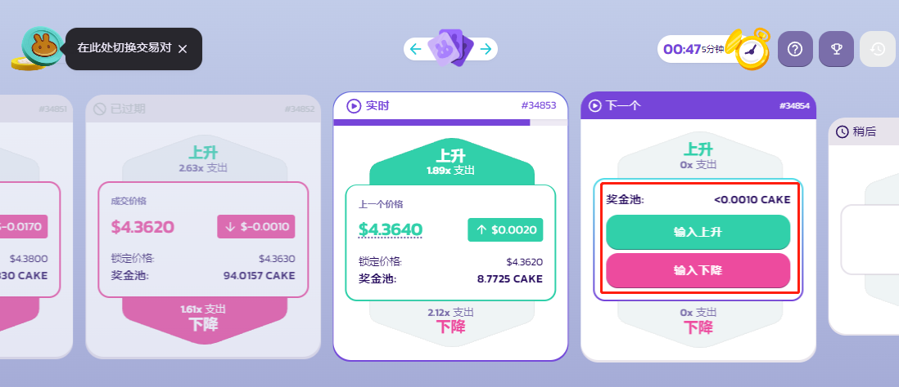<figcaption></figcaption></figure>

每轮都有不同的奖励乘数。随着 “奖池” 的增加，乘数会随着时间的推移而变化，具体取决于参与用户的预测情况奖池显示在按钮上方。

<figure>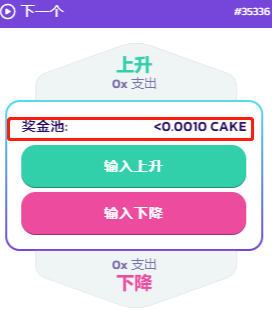<figcaption></figcaption></figure>

本例中，我们将选择**选择上升**。&#x20;

2\. 将打开一个新窗口。在窗口中，您将看到 “**提交**” 选项卡以提交 BNB 或 CAKE 以进行预测。在该字段中输入您希望在本轮预测中提交的代币数量。您也可以使用兔子滑块或单击百分比按钮。如果您正在玩 CAKE/USD 预测市场，在第一场预测中，您必须点击 “**启用**” 来启用智能合约。

<figure>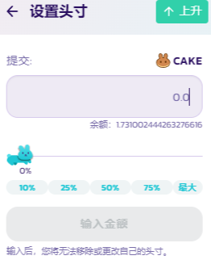<figcaption></figcaption></figure>

3\. 一旦您决定了提交的金额，点击**确认**并在您的钱包中确认您的操作。

<figure>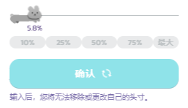<figcaption></figcaption></figure>

您的链上操作在等待确认期间，确认按钮将变灰。这个步骤需要一点时间，这是为什么在之前的步骤中提示您查看回合计时器，为的是保留足够的上链时间。

4\. 交易确认后，会显示 “已投入 上升”。

<figure>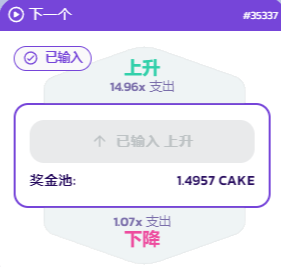<figcaption></figcaption></figure>

现在不需要做其他事情，只需要等待预测回合开始即可。

## 当您参与的回合开始后

每轮预测的进行中回合会持续 5 分钟。在这 5 分钟期间，您可以随时查看价格的更新变化。

<figure>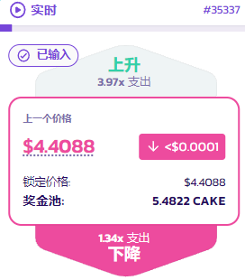<figcaption></figcaption></figure>

请注意，在进行中预测回合（live）中，您一但参与并完成预测，您做出的预测选择将锁定且无法修改，包括预测方向跟金额。

## 当您参与的回合结束后

预测进行中回合过去 5 分钟后，您参与的回合将结束。您不需要做任何事情来结束回合，一切都是自动的。

### 查看结果

1. 5 分钟后，“进行中” 栏位将转变为 “正在计算”。只需要一点时间即可计算出结果。

<figure>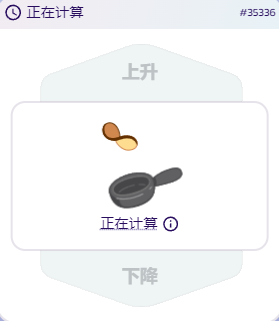<figcaption></figcaption></figure>

2\. 稍等片刻后，完成的回合将向左移动并显示 “已过期”。回合的结果将显示为绿色的上升或红色的下降。

<figure>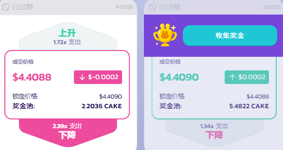<figcaption></figcaption></figure>

3\. 如果您由于太忙而错过了结果，您可以通过点击紫色兔子上**向左的箭头**来向前滚动几回合以查看。

<figure><figcaption></figcaption></figure>

### 查看结果

如果您想查看您参与的比几个回合更早的回合的结果，您需要按照以下步骤查找结果。

1. 单击回合计时器旁边的**逆时钟**图标。

<figure><figcaption></figcaption></figure>

2\. “历史记录” 面板将打开。默认情况下，您应该在列表顶部看到您参与的最近的一轮。单击回合选项卡中的任意位置以查看更多信息。

<figure>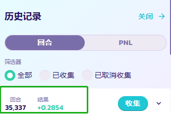<figcaption></figcaption></figure>

<figure>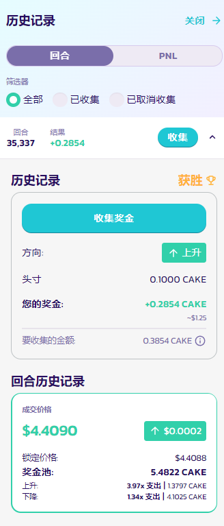<figcaption></figcaption></figure>

## 收集奖金

1. 如果您赢得了参与的回合，一个带着金奖杯并显示**收集奖金**的按钮将出现。单击按钮。

<figure><figcaption></figcaption></figure>

2\. 将出现一个新窗口，显示您可以通过点击**确认**按钮收集的奖金金额。单击按钮并在钱包中确认操作。

<figure><figcaption></figcaption></figure>

现在您可以在您的钱包中看到赢得的代币。

## 从之前的回合中收集奖金

有时候您可能会暂时离开 PancakeSwap 的预测页面，或者可能会忘记从之前的回合中收集奖金。但您仍然随时可以从中收集您之前回合赢得的奖金。

1. 点击回合计时器旁边的**逆时钟**图标，查看您之前参与回合的更多信息。

<figure><figcaption></figcaption></figure>

2\. “历史记录” 面板将打开。您可以点击 “**未收集**” 查看您尚未收集奖金的回合（如果您想查看更多详细信息，请点击小箭头以展开）。点击**收集**按钮。

<figure>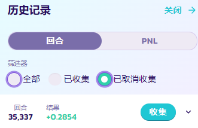<figcaption></figcaption></figure>

3\. 将弹出一个新窗口，显示您可以通过点击**确认**按钮来收集的奖金金额。 单击**确认**按钮并在钱包中确认操作。

<figure><figcaption></figcaption></figure>

现在您可以在您的钱包中看到赢得的代币。

## 查看历史盈亏数据&#x20;

如果您想了解您在预测中的整体表现如何，您可以随时查看 PNL（盈亏）数据。

1. 在 “预测” 页面上，单击回合计时器旁边的**逆时钟**图标。“历史记录”面板将打开。

<figure><figcaption></figcaption></figure>

2\. 在历史数据面板中，点击 **PNL** 选项。

<figure>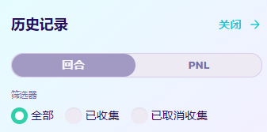<figcaption></figcaption></figure>

该选项卡中可以看到您在 “预测” 中的历史表现统计数据，包括您的最终结果、平均回报、最佳回合和其他信息。

<figure><figcaption></figcaption></figure>

3\. 您可以单击 PNL 选项卡底部的**查看收回和赢得**按钮以在 BscScan 浏览器上查看这些交易。

<figure><figcaption></figcaption></figure>

以上就是关于如何使用预测功能的全部内容。祝您做出正确的预测！
