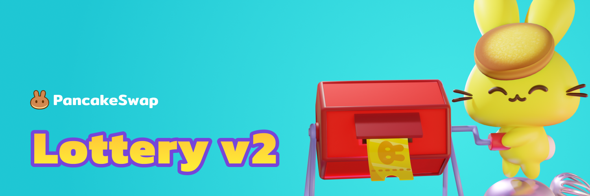

# 🎟 Loteria v2

Jogar na Loteria PancakeSwap dá a você a chance de ganhar grandes prêmios em CAKE! É fácil, justo e você pode entrar quantas vezes quiser, desde que tenha CAKE para comprar o bilhete.

[Veja o Smart Contract](https://bscscan.com/address/0x5aF6D33DE2ccEC94efb1bDF8f92Bd58085432d2c)

## **Especificações:**

* Preço de 1 bilhete da Loteira: \~$5 USD em CAKE.
* Limite de entrada de usuário individual na loteria: Não há limite geral, mas apenas 100 bilhetes podem ser comprados por vez.
* Pagar por um bilhete dará aos usuários uma combinação aleatória de 6 dígitos com cada dígito entre 0-9, por exemplo. “1-9-3-2-0-4”. Os números devem corresponder da esquerda para direita para ganhar prêmios — quanto mais números corresponderem, maior será o prêmio total que você compartilhará.
* Lottery usa a implementação de VRF da Chainlink para aleatoriedade verdadeira e segura.

## Custos do Bilhete e Desconto na compra no atacado

Os preços dos bilhetes de loteria são definidos no início da nova rodada de loteria e têm como meta $5 USD (podem variar um pouco com flutuações repentinas de preços).&#x20;

A compra de vários bilhetes de loteria de uma só vez oferece um desconto de atacado na sua compra. Você pode comprar até 100 ingressos em uma compra, com o desconto começando pequeno em 2 ingressos e aumentando até 4,95% em 100 ingressos..

 (1).png>)

## **Como ganhar**

Os números devem corresponder, **em ordem a partir do lado esquerdo do seu bilhete**, com os números vencedores sorteados no final de uma rodada de loteria.

* Acertar até mesmo o primeiro número lhe dará um pequeno prêmio.
* Acerte mais números para ganhar uma parte de um prêmio maior.

## **Qualificação para o ‌**Prêmio

‌‌Há um total de seis bolas de loteria, de 0 a 9, em cada bilhete. Para ganhar, seus números precisam corresponder aos números sorteados na mesma ordem das bolas de loteria, começando da esquerda do bilhete. Por exemplo:&#x20;

Números sorteados

.png>)

Os números do seu bilhete

 (1) (1).png>)

No exemplo acima, Bilhete A, cinco dos números do bilhete correspondem aos mesmos números sorteados, exatamente na mesma ordem: todos, exceto o quarto.&#x20;

No entanto, como o quarto dígito não corresponde ao número sorteado, apenas os três primeiros dígitos contam como correspondência na ordem. Isso ganharia um prêmio por ter acertado os 3 primeiros, "Match first 3".

.png>)

Exemplo de Bilhete B. Aqui está um azarado. Mesmo que os últimos cinco dígitos correspondam, o primeiro dígito não corresponde, então este bilhete não ganha nada.&#x20;

Você só compartilhará os prêmios da faixa de prêmios mais alta para a qual é elegível. Um bilhete que corresponda aos três primeiros números só será elegível para prêmios de ter acertado 3, e não para os prêmios de um ou dois.&#x20;

**Lembre-se: Os dígitos devem corresponder em ordem, começando da esquerda para a direita.**

## Divisão dos prêmios por faixas de prêmios

‌‌Depois que uma rodada é sorteada e os bilhetes com números correspondentes são determinados, os prêmios são concedidos. O valor ganho por cada bilhete dependerá de quantos outros bilhetes ganharam na mesma faixa de prêmios. ‌

Por exemplo, se você tiver o único bilhete que acertou três números em ordem e a parte predeterminada do prêmio total para sua faixa foi de 2.000 CAKE, você receberá o 2.000 CAKE todos. ‌

Se, no entanto, você e três outras pessoas acertarem três números em ordem, os 2000 CAKE será dividido entre os quatro bilhetes vencedores, o que significa que você receberá 500 CAKE.&#x20;

Veja as [Perguntas Frequentes sobre a Loteria](lottery-faq.md) para ver os prêmios em cada faixa.
