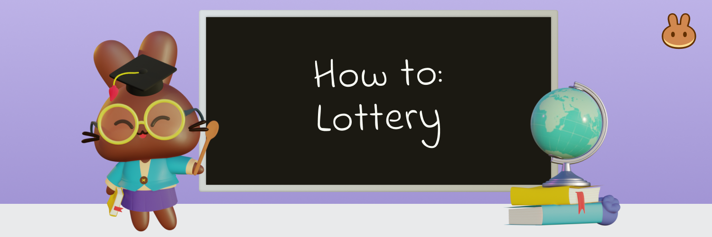

# Como Jogar a Loteria v2

A Loteria da PancakeSwap não é apenas uma boa maneira de empilhar mais CAKE, também é muito divertida! Este guia irá orientá-lo sobre como se envolver na loteria.


A Loteria mudou um pouco desde sua primeira aparição. Loteria v2 permite que você ganhe com mais frequência, tenha algum controle sobre seus bilhetes e tem mais potencial para grandes jackpots de CAKE para dar água na boca. Saiba mais sobre a [Loteria da PancakeSwap v2 aqui](https://docs.pancakeswap.finance/products/lottery).


## Decidindo se você gostaria de entrar na rodada

‌Nem todas as rodadas de loteria são iguais. Quando um jackpot da loteria não é ganho, a premiação da próxima rodada aumentará; quanto mais tempo se passou desde que alguém ganhou o jackpot, maior será o prêmio da Loteria. ‌

Quanto mais tempo uma rodada estiver aberta, mais pessoas poderão comprar um bilhete. Cada bilhete vendido aumenta ainda mais a premiação. Veja como verificar a premiação da rodada atual e o tempo restante.

‌1. Visite a[ Página da Loteria da PancakeSwap](https://pancakeswap.finance/lottery) e observe o topo da página. Você verá a pool do prêmio da rodada atual sendo mostrado em valores em doláres (estimado).

 (1).png>)

Essa é a quantidade a ser compartilhada entre todos os vencedores.

‌2. Um pouco mais abaixo na página você encontrará o tempo restante antes do sorteio da atual rodada.

.png>)

Lembre-se, muita coisa pode mudar no tempo que resta. Muito bilhetes mais podem ser vendidos. Cada bilhete vendido aumenta a premiação e diminui as chances de um bilhete individual ganhar. ‌

Se você não tiver certeza, pode sempre esperar até mais tarde na rodada para decidir com mais informações. Só não espere muito para não ficar de fora!

## Comprando bilhetes da Loteria

‌Comprar bilhetes é fácil.

Você só precisa de um pouco de CAKE: cada bilhete custa aproximadamente $5 USD (o preço exato do CAKE é definido no início da rodada).&#x20;

Você pode optar por randomizar seus números de bilhete de loteria ou escolher manualmente seus números de bilhete. Escolha entre as guias de números aleatórios e números manuais abaixo para obter um guia para cada método.



**Números de Bilhetes Aleatórios**

1\. Na[ Página da Loteria da PancakeSwap](https://pancakeswap.finance/lottery), clique no botão **Buy Tickets (Comprar Bilhetes)** no topo da página (há outro mais baixo na página também).

.png>)

Há um tempo entre as rodadas em que não é possível comprar bilhetes. Basta verificar novamente após a contagem regressiva, se for o caso.

.png>)

2\. Uma janela se abrirá permitindo que você escolha quantos bilhetes comprar. Digite quantos bilhetes você gostaria de comprar no campo. Você também pode usar os botões predefinidos abaixo.

.png>)

3\. Antes de continuar, vale a pena considerar os descontos de compra no atacado. Quanto mais bilhetes você comprar, maior será o desconto.&#x20;

O desconto começa com 2 ingressos e vai até 100 ingressos, onde você economizará quase 5% na compra (4,95%).&#x20;

4\. Quando estiver satisfeito com o número de bilhetes que deseja comprar, clique em Confirmar e confirme sua ação em sua carteira.

.png>)



**Númereos de Bilhetes manualmente**

1\. Na[ Página da Loteria da PancakeSwap](https://pancakeswap.finance/lottery), clique no botão **Buy Tickets (Comprar Bilhetes)** no topo da página (há outro mais baixo na página também)..

.png>)

Há um tempo entre as rodadas em que não é possível comprar bilhetes. Basta verificar novamente após a contagem regressiva, se for o caso.

.png>)

2\. Uma janela se abrirá permitindo que você escolha quantos bilhetes comprar. Digite quantos bilhetes você gostaria de comprar no campo. Você também pode usar os botões predefinidos abaixo.

.png>)

3\. Antes de continuar, vale a pena considerar os descontos de compra no atacado. Quanto mais bilhetes você comprar, maior será o desconto.&#x20;

O desconto começa com 2 ingressos e vai até 100 ingressos, onde você economizará quase 5% na compra.&#x20;

1. Para personalizar os números em seus bilhetes, clique no botão **Visualizar/Editar Números**.

.png>)

5\. Uma nova janela se abrirá mostrando seus bilhetes. Clique em um número em qualquer bilhete para alterar o número nessa posição.

Você pode randomizar seus números novamente clicando em Randomizar ou voltar se mudar de ideia clicando em Voltar.

Você receberá um aviso se criar bilhetes duplicados. É possível que seus bilhetes duplicados ganhem. Nesse caso, seus bilhetes serão divididos na premiação de sua chave.

.png>)

6\. Quando estiver satisfeito com seus números, clique no botão **Confirmar e comprar**.

.png>)

Confirme a ação em sua carteira..



## Vendo seus bilhetes depois de compar

Você pode ver seus bilhetes depois de comprá-los antes que os números da rodada sejam sorteados.

1\. Clique em **View Your Tickets(Veja seus bilhetes)** na área "Next Draw" da página da loteria.

.png>)

2\. Uma janela será aberta mostrando todos os seus bilhetes e seus números. Também lhe dará a opção de comprar mais bilhetes, se desejar.

.png>)

## Quando a rodada termina e os números vencedores são sorteados

‌‌Quando a rodada terminar e os números vencedores estiverem disponíveis, você pode verificar seus bilhetes para ver se ganhou.

### ‌Veja seus bilheres premiados

‌Você pode ver seus bilhetes premiados da mesma forma que os viu depois de comprá-los. ‌

1\. Clique em **View Your Tickets(Ver seus bilhetes)** na área "Rodadas concluídas" da página da Loteria.

2\. Uma janela será aberta mostrando os números vencedores e todos os seus bilhetes e seus números.\\
