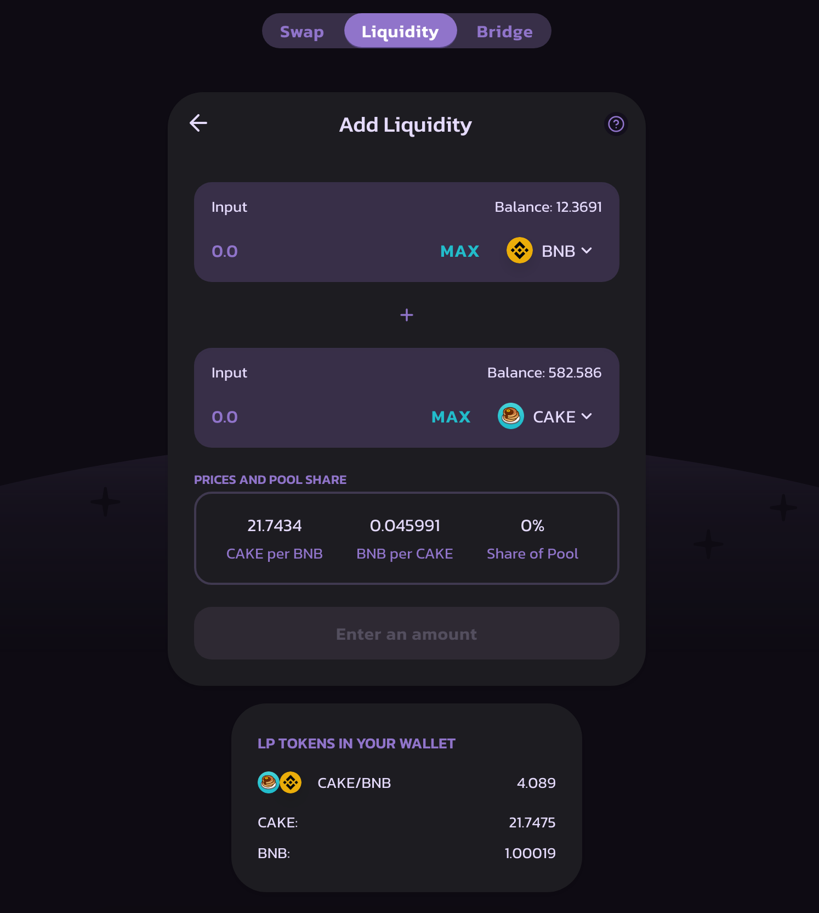

# Pools de Liquidez

Ao adicionar seu token a uma Pool de Liquidez, você receberá tokens de Fornecedor de Liquidez (LP token) e ganhará com as taxas.

## LP Tokens

Por exemplo, se você depositou **CAKE** e **BNB** em uma Pool de Liquidez, receberá tokens LP CAKE-BNB .&#x20;

O número de tokens LP que você recebe representa sua parte na Pool de Liquidez CAKE-BNB.&#x20;

Você também pode resgatar seus fundos a qualquer momento removendo sua liquidez.

## Fornecedores de Liquidez ganham taxas das negociações

Fornecer liquidez oferece uma recompensa na forma de taxas de negociação quando as pessoas usam a pool de liquidez.&#x20;

Sempre que alguém negocia na PancakeSwap, o trader paga uma taxa de 0,25%, dos quais **0,17%** são adicionados na Pool de Liquidez do par de swap que foi negociada.&#x20;

Por exemplo:&#x20;

* Existem 10 tokens LP representando 10 tokens CAKE e 10 tokens BNB.&#x20;
* 1 token LP = 1 CAKE + 1 BNB&#x20;
* Alguém faz swap de 10 CAKE por 10 BNB.&#x20;
* Outra pessoa faz swap de 10 BNB por 10 CAKE.&#x20;
* A pool de liquidez CAKE/BNB agora tem 10.017 CAKE e 10.017 BNB.&#x20;
* Cada token LP agora vale 1,00017 CAKE + 1,00017 BNB.&#x20;

Para tornar ainda mais valioso ser um fornecedor de liquidez, você também pode colocar seus tokens LP para trabalhar, gerando novos rendimentos nos [Farms de CAKE](https://pancakeswap.finance/farms), enquanto ainda ganha sua recompensa de taxa de negociação de 0,17%.

## Impermanent Loss (Perda Impermanente)

Fornecer liquidez não é isento de riscos, pois você pode estar exposto a perdas impermanentes.

\
[“](https://blog.bancor.network/beginners-guide-to-getting-rekt-by-impermanent-loss-7c9510cb2f22)[Simplificando, a perda impermanente é a diferença entre holdar tokens em um AMM e holdar os tokens na sua carteira.” - Nate Hindman](https://blog.bancor.network/beginners-guide-to-getting-rekt-by-impermanent-loss-7c9510cb2f22)
