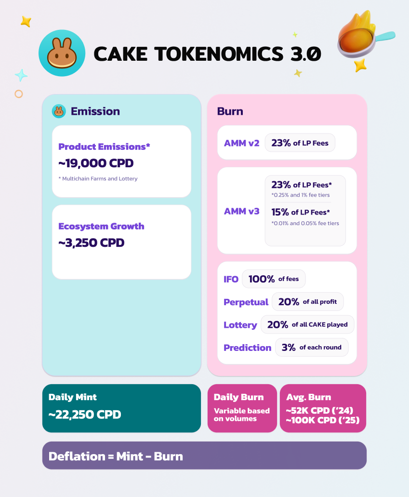

# 🍰 CAKE Tokenomics

<figure><figcaption></figcaption></figure>

## CAKE Tokenomics 3.0 Overview 

Our goal at PancakeSwap is to build a decentralized ecosystem that prioritizes flexibility and sustainability of the CAKE community, liquidity providers, and PancakeSwap supporters.

**PancakeSwap’s target is an annual deflation rate of at least \~4% per year and a total CAKE supply reduction of \~20% by 2030.** To achieve this, PancakeSwap implements a buy-back-and-burn strategy, ultimately leading to a deflationary CAKE token.

**Burns are driven by every product in the PancakeSwap ecosystem**, specifically a large share of fees from:

* [Spot liquidity pools](https://docs.pancakeswap.finance/earn/pancakeswap-pools#earning-trading-fees) (15-23% of trading fees)
* Perpetual trading (20% of all profits)
* IFOs (100% of all fees)
* Prediction and Lottery products (3% of each round)

**Emissions are carefully managed to ensure liquidity is directed to the most productive pools and products.** PancakeSwap’s focus is on scaling volume growth by optimizing liquidity incentives and boosting revenue per CAKE spent. Every decision revolves around the goal of creating real revenue and contributing to long-term success for the entire community. Products that receive CAKE emissions include:

* Multichain farms
* Lottery
* Ecosystem Growth

## How to Confirm CAKE Supply for yourself 

To confirm that the circulating CAKE supply shown on the PancakeSwap homepage is correct:

1. Head to the CAKE token contract on BscScan and [see how much CAKE is held by the Burn Address.](https://bscscan.com/token/0x0e09fabb73bd3ade0a17ecc321fd13a19e81ce82#balances) That's the total amount of CAKE that's been burned (removed from circulation FOREVER, and impossible to ever retrieve).
2. Then, subtract this burned amount from the "Total Supply" that BscScan shows.
3. This gives you the actual CAKE supply.

Note: CAKE locked forever in the legacy CAKE pool is also considered burned as it is irretrievable. This [Dune dashboard](https://dune.com/pancakeswap/PancakeSwap-CAKE-Tokenomics) accounts for this.

## Does CAKE have a hard cap? 

Yes, CAKE now has a hard cap set at 450M.

A proposal for the latest cap adjustment was put forward on December 28, 2023. This proposal aimed to further decrease the cap from 750M to 450M. It was subsequently presented to our community for voting and was successfully passed.

For more details on the voting proposal, please follow this link: [https://pancakeswap.finance/voting/proposal/0x3e014aab40f6551da9f76da0e62e44e9ece55c4997f220057bf3e42dc8307c2f](https://pancakeswap.finance/voting/proposal/0x3e014aab40f6551da9f76da0e62e44e9ece55c4997f220057bf3e42dc8307c2f)

## How is CAKE supply reduced?

The Chefs aim to make deflation higher than emission by building deflationary mechanisms into PancakeSwap's products. The goal is for more CAKE to leave circulation than the amount of CAKE that's produced. Check the [CAKE Burn Dashboard](https://dune.com/pancakeswap/PancakeSwap-CAKE-Tokenomics) for details on present and upcoming deflationary mechanisms.
