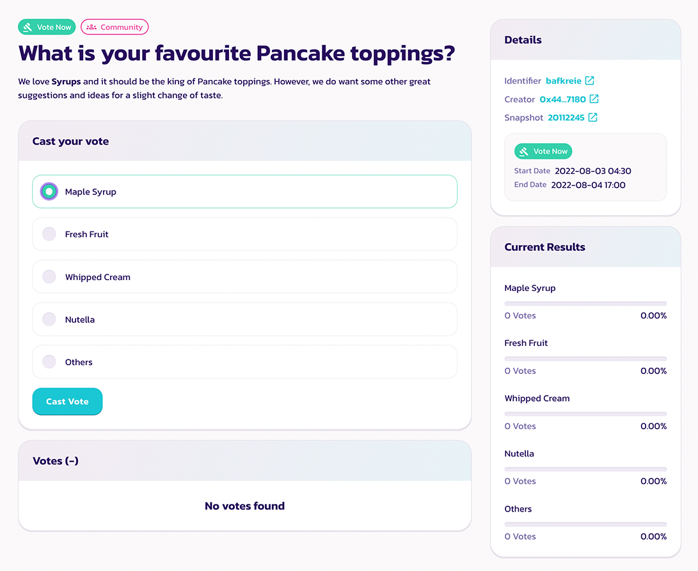
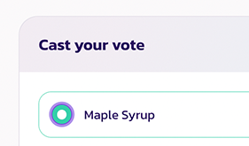
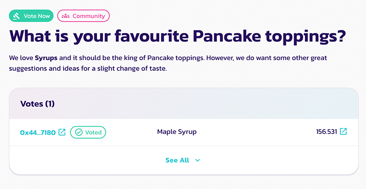
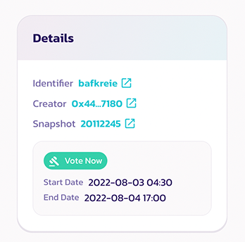
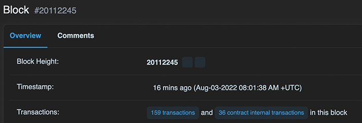

# 如何投票

参与治理投票非常简单，而且完全**免费**。你甚至无需支付 gas 费！进一步了解如何投票，关注下一个提案并投出你的一票。

### 如何投票

#### 导航至投票提案

每当我们发布新提案时，都会附上投票页面的链接。因此，请务必关注[我们的社交渠道](../../../welcome-to-pancakeswap/contact-us/social-accounts.md)以获取新闻和更新。

或者，你也可以访问 [PancakeSwap 的原生投票门户](https://voting.pancakeswap.finance/?_gl=1*pc8o0h*_ga*MTUzNDEzNDQxMy4xNjAwNzkzNDM4*_ga_334KNG3DMQ*MTYwNDMwMTk4Ni42MC4xLjE2MDQzMDM3MDIuMA..#/)，以列表形式浏览提案。如果你没有看到该提案，它可能位于"即将开始"标签页中。

#### 阅读并选择要投票的选项

在提案页面上，你会找到：

* 提案的内容
* 投票选项
* 提案的详细信息，例如快照区块和投票窗口
* 最新的投票结果
* 投票列表

仔细阅读提案，并点击你想投票的选项。

#### 确认并投出你的一票

确认所有详情并点击"Confirm Vote"，然后在你的钱包中确认以签署消息。&#x20;

完成，你已成功投出你的一票。

### 如何查看详情



在投出你的一票之前，你会看到一个"Confirm Vote"窗口。

<figure><figcaption></figcaption></figure>

在此窗口中，你将能够查看以下项目：

* 你选择的选项
* 你的投票权

你的投票权等于你在快照区块时的 CAKE 余额。&#x20;



#### 查看快照区块

投票权是根据在快照区块拍摄的快照计算的。因此，在提案发布后购买或存入更多 CAKE 不会提高你在该特定提案中的投票权。

如果你想知道快照区块的确切时间，只需点击区块编号，然后在 BscScan 页面上查找时间戳。



