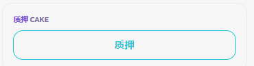

# What is an Approval Transaction?

**The first time you swap or add liquidity, you have to approve the token you are swapping. This gives the PancakeSwap smart contract permission to swap that token from your wallet.**

The approval transaction allows PancakeSwap permission to swap the token from your wallet. You have to complete an approval transaction for every token you want to swap using PancakeSwap.

Here is a guide on how to complete an approval transaction:

1.  Enter your swap details.&#x20;

    <figure><figcaption></figcaption></figure>
2.  Select “Confirm swap” after reviewing swap details.&#x20;

    <figure><figcaption></figcaption></figure>
3. In your wallet app or wallet extension, approve the spending for the token you are swapping.

Allow the token to be used for swapping in your wallet.

_Your wallet may require you to enter the number of tokens you want to approve. Please enter a number that is greater than or equal to the number of tokens you are swapping._ &#x20;

<figure><figcaption></figcaption></figure>

4.  After the approval, another transaction will appear which asks you to confirm the swap.&#x20;

    <figure><figcaption></figcaption></figure>
5.  Once the swap is confirmed, the transaction is submitted to the blockchain (pending).&#x20;

    <figure><figcaption></figcaption></figure>
6. You will see “Success” and a green checkmark on the screen when the transaction is successfully completed.&#x20;

<figure><figcaption></figcaption></figure>

The token approval lasts for a certain period of time, the token will have to be approved again later with a signature request. An approval signature does not require a network fee.
