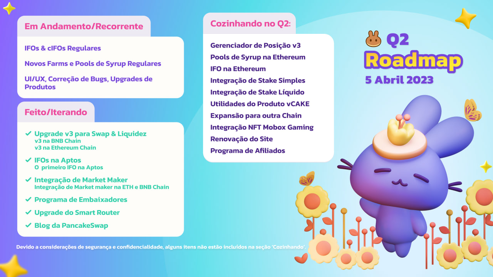

# Roadmap

_Atualizado em 5 de Abril de 2023_

### Finalmente, isso é um roadmap e não uma lista de tarefas.

Cripto se move rápido, e nós nos movemos rápido também.&#x20;

Pivotar é um modo de vida.&#x20;

Isso significa que não nos comprometemos publicamente com cronogramas específicos, para que possamos organizar nossas prioridades de desenvolvimento com base nas mudanças do mercado e nos recursos do desenvolvedor.

<figure><figcaption></figcaption></figure>


Devido a considerações de segurança e confidencialidade, alguns itens não estão incluídos na seção "Cozinhando no".


### Em andamento/Recorrente

* IFOs e cIFOs Regularmente
* Novos Farms e Pools de Syrup Regularmente&#x20;
* UI/UX, Correções de Bugs, Upgrades de Produtos&#x20;

### Planos de 2023&#x20;

* v3 - Swap e Upgrade de Liquidez
* Expansão Multichain&#x20;
* Afiliados e Programa de Embaixador
* Utilidades de NFT/Upgrades da Plataforma
* Integrações de Fiat
* Mais produtos de Defi por vir!

### Cozinhando no Q2

* Gerenciador de Posição v3
* Pools de Syrup na Ethereum
* IFO na Ethereum
* Integração de Stake Simples
* Integração de Stake Líquido
* Expansão para outr chain
* Utilidades do produto vCAKE
* Integração NFT Mobox Gaming&#x20;
* Loja de Merchandise
* Renovação do Site
* Programa de Afiliados

### Backlogs

* Gameficação de NFT\
  Potenciais colaborações com outros projetos top na BNB Chain
* Mercado de NFT \
  Fase 3 - Plataforma Aberta de NFT\
  Outras melhorias e upgrades

### Feito

#### Trade

* Stablecoin Swap - mais pares adicionados
* Zap - Fornecer liquidez em um clique
* Perpetual Trading
* Ordens Limite
* Gráficos & outros recurso de trade no site
* Migração para a Exchange V2 (exchange, liquidez, farms)
* Bridge da PancakeSwap
* Scaneamento de riscos dos tokens
* Multichain Swap e Liquidez
* Implantação na Aptos Chain
* Bridge da PancakeSwap na Aptos
* v3 - Swap e Upgrade de Liquidez
* Integração de Market Maker&#x20;

#### Ganhe

* Stake de CAKE&#x20;
  * Stake de termo fixo
  * Side Pool de CAKE - Stake Flexível de CAKE do lado do stake bloqueado
* Benefícios do Stake de Prazo Fixo&#x20;
  * iCAKE, Benefícios do IFO&#x20;
  * vCAKE, poder de votação ponderado
  * bCAKE, booster de yield farm
  * Eventos com projetos bem conhecidos
* Farms
* Farms Crosschain
* Pools de Syrup
* Pools de Syrup Boost de Farms
* Pool de Syrup com reinvestimento automático CAKE-CAKE&#x20;
* Calculadora de APR/APY v3
* Função Coletar tudo
* Farma na Aptos
* Pools de Syrup na Aptos

#### Vença

* Loteria v2
* Previsão v0.2\
  Atualment com BNB e CAKE\
  com Gráfico de Preços da Chainlink e Chainlink Keepers
* Batalha de Equipe (Competição de Trade como Serviço)
* Pottery\
  Loteria por staking\
  Novo grupo de Pottery todo mês

#### NFT Ecosystem

* Fase 1 e 2 do Mercado de NFT(Compra e Venda de coleções de NFT listadas)
* Perfil de usuário customizável
* Distribuição de NFTs
* Coleção de NFT generativas Pancake Squad

#### Upgrades do Site / CAKE / Other Products

* Navegação Mobile-first & revisão do site
* Analíticos: site de info
* Pool de IFO de CAKE & IFO 3.0
* IFO
  * Vendas Privada com Utilidade do NFT&#x20;
  * cIFO, Vendas Privadas com utilidade de ponto dos perfis da PancakeSwap
  * Vesting de tokens
  * Integração com iCAKE
* Mini-Programa da PCS no App da Binance&#x20;
* Primeiro IFO na Aptos
* Programa de Embaixador
* Blog da PancakeSwap
