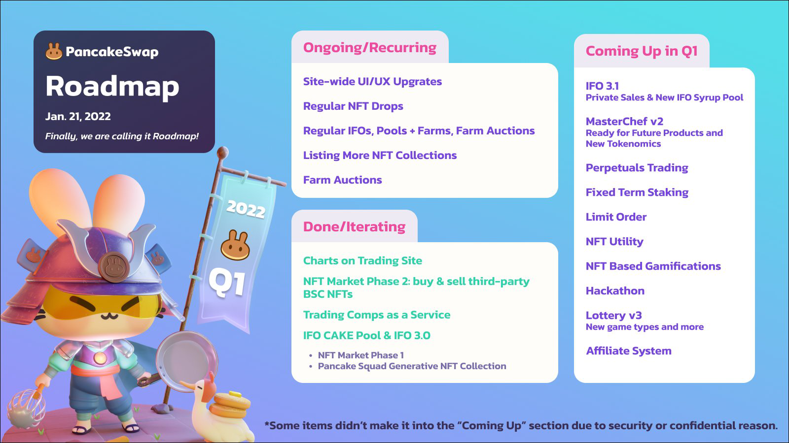

# Roadmap

_Updated Jan. 21, 2022_

### Finally, it's a roadmap not a to-do list.

Crypto moves fast, and we move fast too.

Pivoting is a way of life.

That means that we don’t publicly commit to specific timelines, so we can organize our development priorities based on market changes and developer resources.


Some items didn't make it into the "Coming Up" section due to security or confidential reason.


### Ongoing/Recurring

* Site-wide UI/UX Upgrates
* Regular NFT Drops
* Regular IFOs, Pools + Farms, Farm Auctions
* Listing More NFT Collections

### Coming Up in Q1

* IFO 3.1: Private Sales & New IFO Syrup Pool
* MasterChef v2: Ready for Future Products and New Tokenomics
* Perpetuals Trading
* Limit Order
* Fixed-term Staking
* NFT Utility
* NFT-based Gamification
* Hackathon
* Lottery v3: New game types and more
* Affiliate System

### Backlogs

* Overview pages for Earn, Win
  * Personal dashboard
  * Portfolio
* NFT Market Phase 3 - open NFT platform

### Done

#### Trade

* Charts & other trading features on-site
* Migration to Exchange V2 (exchange, liquidity, farms)
* Major performance upgrades
* Team Battle 1 & 2(Trading Comps as a Service)

#### Earn

* CAKE Staking
* Core Pools, Farms
* Community Pools: Host BSC community project Pools, support with 0.1-0.2x CAKE farms
* Auto-compounding CAKE-CAKE Syrup Pool
* Syrup Pool Boosts
* APR/APY Calculator v2
* Harvest all function

#### Win

* Lottery v2
* Prediction v0.2

#### NFT Ecosystem

* NFT Market Phase 1 & 2(buy & sell whitelisted NFT collections)
* Customizable User Profile
* NFT drops
* Pancake Squad generative NFT collection

#### Site Upgrades / CAKE / Other Products

* Mobile-first navigation & site overhaul
* Analytics: Info site
* Voting v2
* IFO CAKE Pool & IFO 3.0

