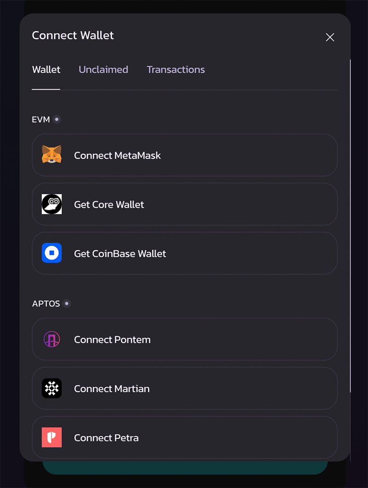

# CAKE 跨链指南

<figure><figcaption></figcaption></figure>

随着我们在 Aptos 上的多链扩展和部署。CAKE 现在是一个多链代币，同时存在于 BNB 智能链和 Aptos上。&#x20;

Aptos 上的 CAKE 等同于 BNB 智能链上的 CAKE，可以始终以 1:1 的比例在两条链之间跨链。&#x20;

请注意，从始至终都只有一个 CAKE 代币 。不同链之间也不存在不同版本的 CAKE。根据我们的 v2 版代币经济学白皮书，所有区块链上的 CAKE 最大总供应量将被限制在 7.5 亿。

## 将 BNB智能链上的 CAKE 跨链到 Aptos 上

1 - 确保您的钱包同时支持 BNB 智能链和 Aptos 主网。或者您的电脑浏览器中同时安装了支持这两个链的钱包插件。

然后打开 [PancakeSwap Aptos 跨链桥](https://bridge.pancakeswap.finance/aptos)。

2 - 首先，我们需要连接我们的 BNB 智能链钱包。

点击 "Connect 连接"，在 "EVM "部分选择您喜欢的钱包。然后在您的钱包弹出窗口确认并批准。(截至目前，只支持MetaMask。之后将会逐步支持更多的钱包。)

<figure><figcaption></figcaption></figure>

3 - 然后，我们需要连接我们的 Aptos 钱包。在钱包连接模式中，在 "Aptos "部分选择您喜欢的钱包。然后在您的钱包弹出窗口中确认并批准。

<figure><figcaption></figcaption></figure>

4 - 点击上面 Token 符号选择栏中的 "v"，选择 "CAKE"。

<figure><figcaption></figcaption></figure>

5 - 输入您想要跨链到 Aptos 的 CAKE 数量。

<figure><figcaption></figcaption></figure>

6 - 如果您的 Aptos 钱包是新创建的，并且没有任何 APT（Aptos 代币）余额。我们建议将 "gas on destination "选项保持在默认状态。跨链桥将向您的钱包中存入少量 APT，不仅是为了帮助你开启您的Aptos 链上之旅，而且你还需要 APT 作为 gas 来注册和领取您跨链的 CAKE。

改变这个选项可能会导致跨链失败。

<figure><figcaption>
.
</figcaption></figure>

7 - 通过点击 "Transfer (转移)" 来发起跨链交易，在钱包弹出的窗口中批准此交易。

请注意，根据您的 BNB 智能链钱包和 Aptos 钱包的实际情况。您可能需要批准多个从钱包中弹出的确认。例如，如果您是第一次将 CAKE 跨链到 Aptos，您将需要：

* 批准 CAKE 在跨链合约上的输出（来自您的 BNB 智能链钱包）。&#x20;
* 注册 CAKE（来自您的 Aptos 钱包）&#x20;

了解更多细节，请查看[此处细分](cake-kua-lian-zhi-nan.md#shou-ci-jiang-cake-kua-lian-dao-aptos-lian-xu-yao-zhu-yi-de)。

8 - 现在只需要放松等待。CAKE 的跨链应该只需要几分钟时间。一旦跨链完成，CAKE 将被存入您的Aptos 钱包。你可以通过进度条追踪进度。

<figure><figcaption></figcaption></figure>

## 首次将 CAKE 跨链到 Aptos 链需要注意的

将 CAKE 跨链至 Aptos 后，Aptos 钱包需要进行注册和领取的链上操作。这样做是为了加强对用户的安全性，也是 Aptos 独有的。&#x20;

### 如果您的钱包里已经有 APT（Aptos 代币）&#x20;

在这种情况下，如果尚未注册 CAKE，您将会被提示需要在您的 Aptos 钱包上注册。并且您将不需要提交额外的领取 CAKE 的链上交易。&#x20;

### 如果您的钱包中没有 APT（Aptos 代币）&#x20;

您只需要跨链完成后领取您的 CAKE。您将在 Aptos 钱包上收到 APT 代币（作为 gas 费），以支付领取其资产的费用。这个 APT 是由你的发送端钱包支付的，并通过转移到接收端钱包。&#x20;

记住，以上注册和领取要求只适用于你与代币第一次交互时。同一代币的后续转移将不再需要这些链上交易。

## 将 Aptos 链上的 CAKE 跨链到 BNB 智能链

1 - 确保您的钱包同时支持 BNB 智能链和 Aptos 主网。或者您的电脑浏览器中同时安装了支持这两个链钱包插件。

然后打开 [PancakeSwap Aptos 跨链桥](https://bridge.pancakeswap.finance/aptos)。

2 - 首先，我们需要连接我们的 BNB 智能链钱包。

点击 "Connect 连接"，在 "EVM "部分选择您喜欢的钱包。然后在您的钱包弹出窗口确认并批准。(截至目前，只支持MetaMask。之后将会逐步支持更多的钱包。)

<figure><figcaption></figcaption></figure>

3 - 然后，我们需要连接我们的 Aptos 钱包。在钱包连接模式中，在 "Aptos "部分选择您喜欢的钱包。然后在您的钱包弹出窗口中确认并批准。

<figure><figcaption></figcaption></figure>

4 - 点击上面 Token 符号选择栏中的 "v"，选择 "CAKE"。然后点击中间的双向箭头按钮来转换跨链方向。

确保 Aptos 链在上方。

<figure><figcaption></figcaption></figure>

5 - 输入您想要跨链到 BNB 智能链的 CAKE 数量。

<figure><figcaption></figcaption></figure>

6 - 如果您的 BNB 智能链钱包是新创建的，并且没有任何 BNB（gas代币）余额。我们建议将 "gas on destination "选项保持在默认状态。跨链桥将把少量的BNB存入您的钱包。它将帮助你开启您在 BNB 智能链上的旅程，探索生动的 PancakeSwap 生态系统。

7 - 点击 "Transfer 转移"，批准您的钱包中弹出的交易。

8 - 现在只需要放松等待。CAKE 的跨链应该只需要几分钟时间。一旦跨链完成，CAKE 将被存入您的 BNB 智能链钱包。您可以通过进度条追踪进度。
