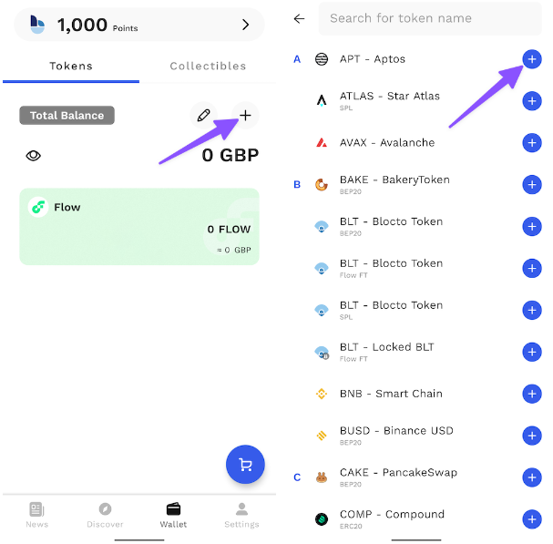
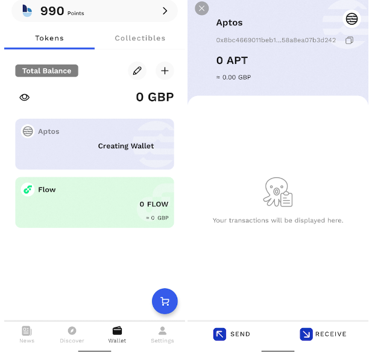

# 创建钱包

<figure><figcaption></figcaption></figure>

要开始您在 Aptos 上的 PancakeSwap 之旅，您首先需要设置一个支持 Aptos 链的钱包。钱包在电脑和智能手机设备上都可以使用。请选择最适合您需求的钱包。


**在设置钱包时，请务必注意**：

* ✅ **从可信的官方渠道下载并安装最新版本的钱包应用。**
* ✅ **仔细阅读并遵循设置指南进行操作。**
* ✅ **妥善备份用于恢复钱包的助记词或私钥**
* ❌ **在任何情况下都不要：向任何人透露您的助记词或私钥！**
* ❌ **在任何情况下都不要：在任何网站上输入您的助记词或私钥！**


## 我应该使用手机端钱包还是电脑端钱包？


在撰写本文时，支持 Aptos 的手机端钱包数量有限。大厨们后续将在此教程中添加更多可用的钱包。&#x20;

在更多手机端钱包出来之前，我们建议您先试用电脑端钱包。


手机端钱包和电脑端钱包有不同的优势和劣势。请根据您的实际需求考来决定使用哪种类型的钱包。

|                | 手机端 | 电脑端 |
| -------------- | --- | --- |
| 随时随地使用         | ✅   | ➖   |
| 简单易用           | ✅   | ➖   |
| 更加安全           | ➖   | ✅   |
| 对无障碍使用者更友好     | ➖   | ✅   |
| 不易损坏/丢失/遭窃     | ➖   | ✅   |
| 不易受网络连接/电力供应影响 | ✅   | ➖   |

## 桌面/网络浏览器钱包&#x20;

桌面钱包可在您的家用电脑或笔记本电脑上使用。您计算机上的钱包可以作为独立应用程序运行，也可以作为 Chrome 和 Firefox 等流行浏览器的网络浏览器插件运行。&#x20;

### 我应该选择哪个桌面钱包？&#x20;

下表概述了 Aptos 上与能使用 PancakeSwap 的目前最流行的桌面钱包。

|            | Petra | Martian | Pontem | Fewcha | Blocto |
| ---------- | ----- | ------- | ------ | ------ | ------ |
| 支持 Aptos 链 | ✅     | ✅       | ✅      | ✅      | ✅      |
| 硬件钱包兼容     | ➖     | ➖       | ➖      | ➖      | ➖      |
| 代码开源（可审计）  | ✅     | ❓       | ✅      | ❓      | ❓      |

❓ - 代表截至发教程时，我们不确定此信息的状态&#x20;

您可以在下面找到有关每个钱包的更详细信息，以及下载链接和安装指南。



<figure><figcaption></figcaption></figure>

Petra 钱包是一个扩展程序，可让您在浏览器中探索 Aptos。

亮点：

* 由 Aptos Labs 构建&#x20;
* 便于使用&#x20;
* 支持多个帐户&#x20;
* 内置 NFT 支持&#x20;
* 支持 Aptos 测试网和支持一键领取的测试网 APT 水龙头&#x20;

注意：

* 仅支持电脑端&#x20;
* 仅支持 Aptos 链

[下载 Petra 钱包](https://petra.app/)

[Pertra 钱包设置指南](https://petra.app/docs/use)



<figure><figcaption></figcaption></figure>

Martian 是一款 Aptos 链上的钱包，可让您存储、发送、接收代币以及管理和铸造 NFT。它的手机端版本即将推出。&#x20;

亮点：

* 手机端即将推出&#x20;
* 便于使用&#x20;
* 支持多个帐户
* 内置 NFT 支持&#x20;
* 支持 Aptos 测试网&#x20;

[下载 Martian 钱包](https://martianwallet.xyz/)



<figure><figcaption></figcaption></figure>

Pontem Wallet 是一款 Aptos 链上钱包，可让您存储、发送、接收代币并连接到 Aptos 生态系统中的 dApp。&#x20;

亮点：

* 手机端即将推出&#x20;
* 便于使用&#x20;
* 支持多个帐户&#x20;
* 内置 NFT 支持&#x20;
* 支持 Aptos 测试网&#x20;

[下载 Pontem 钱包](https://pontem.network/pontem-wallet)



<figure><figcaption></figcaption></figure>


目前，Fewcha 钱包在导入私钥方面有一些问题。建议暂时尝试其他钱包。


Fewcha 钱包是一款 Aptos 链上钱包，可让您存储、发送、接收代币并连接到 Aptos 生态系统中的 dApp。&#x20;

亮点：

* 手机版即将推出
* 便于使用
* 支持多个帐户
* 内置 NFT 支持&#x20;
* 支持 Aptos 测试网

[下载 Fewcha 钱包](https://fewcha.app/)



<figure><figcaption></figcaption></figure>

Blocto 提供了一个对用户友好的解决方案和一个多合一的集合便于您使用 Dapps 和管理您的资产。&#x20;

亮点：&#x20;

* 安装后立即可以使用，同时支持 BNB 链和 Aptos 链以及其他主要加密网络
* 在电脑上使用不需要安装应用程序或扩展程序
* 支持电脑端和移动端
* 通过电子邮件登录&#x20;
* 智能合约钱包无需管理自己的私钥，还提供账户恢复等高级功能&#x20;
* 包含了智能合约钱包的初始设置的gas 费用&#x20;

注意：

* 需要有电子邮件地址才能使用&#x20;
* 托管型钱包
* 如果你想导出你的私钥并管理它或在其他钱包中使用它，这有点复杂，请查看以下链接，[教程链接](https://portto.zendesk.com/hc/en-us/articles/4411564072217-Can-I-export-my-private-key-from-Blocto-and-use-it-in-Metamask-Phantom-Trust-Wallet-)。

### Blocto 钱包设置指南&#x20;

1 - 在钱包连接窗口中选择“Blocto”后，您应该会看到一个登录窗口。输入 您的电子邮件地址，然后单击“注册”。 如果您之前已经设置了 Blocto 帐户，请输入电子邮件地址并单击“登录”。

<figure><figcaption></figcaption></figure>

2 - 然后输入通过电子邮件收到的一次性密码。

<figure><figcaption></figcaption></figure>

3 - 单击“创建 Aptos 钱包”。 然后点击“确认”进行连接。

<figure><figcaption></figcaption></figure>

 

<figure><figcaption></figcaption></figure>

4 - 好了！请注意，您需要为您的 Aptos 地址充值 APT 后才能开始在 Aptos 上使用 PancakeSwap。如果您想在其他设备上访问同一个帐户，只需使用相同的电子邮件地址登录即可。



## **手机/移动设备钱包**

手机/移动设备钱包应用允许您随时随地操作您的加密货币。钱包应用在安卓和 iOS 设备上均可使用。

### 我应该选择哪个手机钱包？ 

下表概述了 Aptos 上与能使用 PancakeSwap 的目前最流行的手机钱包。

|             | SafePal      | Trust Wallet | Blocto |
| ----------- | ------------ | ------------ | ------ |
| 支持 Aptos 链  | ✅            | ✅            | ✅      |
| 内置 DApp 浏览器 | ✅            | ✅            | ✅      |
| 硬件钱包兼容      | ✅（仅限SafePal） | ➖            | ➖      |
| 合约开源（可审计）   | ➖            | ✅            | ➖      |

您可以在下面找到有关每个钱包的更详细信息，以及下载链接和安装指南。



<figure><figcaption>
SafePal 有软件和硬件钱包两种形式。该钱包 App 安装便捷，设置步骤简单，安装后可立即支持 Aptos、BEP2（BNB 信标链）、BEP20（BNB 智能链）。 
</figcaption></figure>

**优点：**

* 在几个加密货币网络之间轻松切换
* 内置谷歌认证器
* 丰富的语言支持
* 设置步骤简单快捷
* 可同时使用软件和硬件钱包（协同使用）
* 支持币安智能链和以太坊上的 NFT 收藏品展示及管理&#x20;

**缺点：**

* 代码非完全开源&#x20;
* 不支持通知消息提醒
* 初始设置及钱包创建时，并不强制用户使用强安全性的设置

​[**下载 SafePal**](https://safepal.io/download) **（自动检测您的设备）**\
[**SafePal 钱包 Aptos 链设置教程**](https://safepalsupport.zendesk.com/hc/en-us/articles/10061372532891-How-to-add-send-Aptos-mainnet-coin-APT-with-SafePal-Software-Wallet)



<figure><figcaption></figcaption></figure>

Trust Wallet 是在移动设备上颇受欢迎的钱包应用。它支持 DApps，NFT 收藏品（支持 Opensea.io），以及钱包内直接质押。

**优点：**

* 开源代码可审计
* 得到币安加密货币交易所的支持
* 在几个加密货币网络之间轻松切换
* 默认包含 Aptos 网络

**缺点：**

* 有限的 DApps 支持
* 交易通知可能会延迟

[**下载 Trust Wallet**](https://trustwallet.com/) **（自动检测您的设备）**

[**Trust Wallet Aptos链设置指南**](https://community.trustwallet.com/t/trust-wallet-adds-native-support-for-aptos-apt/575701)



<figure><figcaption></figcaption></figure>

Blocto 提供了一个对用户友好的解决方案和一个多合一的集合便于您使用 Dapps 和管理您的资产。&#x20;

亮点：&#x20;

* 安装后立即可以使用，同时支持 BNB 链和 Aptos 链以及其他主要加密网络
* 在电脑上使用不需要安装应用程序或扩展程序
* 支持电脑端和移动端
* 通过电子邮件登录&#x20;
* 智能合约钱包无需管理自己的私钥，还提供账户恢复等高级功能&#x20;
* 包含了智能合约钱包的初始设置的gas 费用&#x20;

注意：

* 需要有电子邮件地址才能使用&#x20;
* 托管型钱包
* 如果你想导出你的私钥并管理它或在其他钱包中使用它，这有点复杂，请查看以下链接，[教程链接](https://portto.zendesk.com/hc/en-us/articles/4411564072217-Can-I-export-my-private-key-from-Blocto-and-use-it-in-Metamask-Phantom-Trust-Wallet-)。

[**下载 Blocto 钱包**](https://portto.com/download)

### **Blocto 钱包设置指南**

1 - 通过输入您的电子邮件地址进行设置。然后输入通过电子邮件收到的一次性密码。

<figure><figcaption></figcaption></figure>

2 - 单击 **"+”** 按钮，然后选择 “APT - Aptos”

<figure><figcaption></figcaption></figure>

3 - 好了！ 您现在可以将 APT 存入 Aptos 钱包，然后前往「发现」页面开始在 Aptos 上使用 PancakeSwap！

<figure><figcaption></figcaption></figure>




**在任何情况下，您都不应该将您的私钥或恢复短语（“种子短语”）提供给他人。这样别人可以完全地拥有您的代币资产的操作权限！**&#x20;

**真正的 PancakeSwap 网站和工作人员绝不会要求您输入助记词**。

