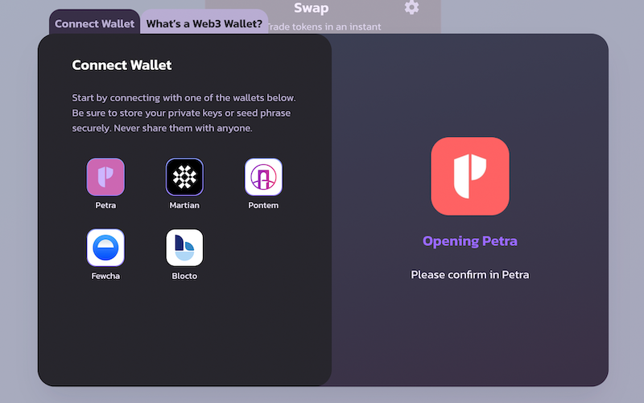
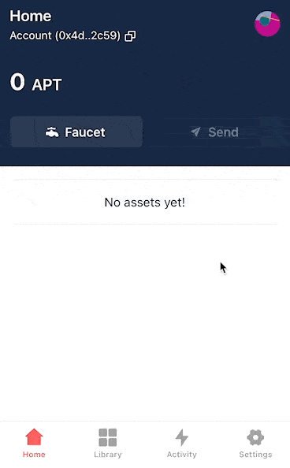
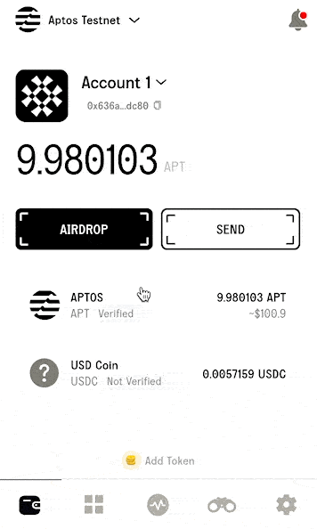
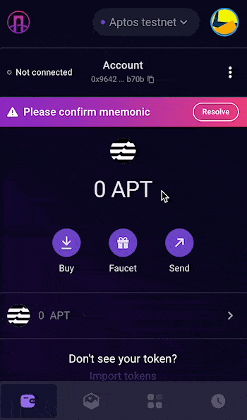
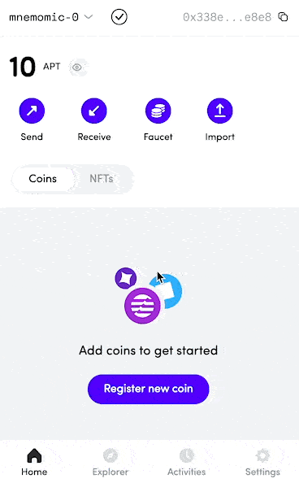

# 连接钱包

<figure><figcaption></figcaption></figure>

## 连接您的钱包

<figure><figcaption></figcaption></figure>

1. 点击右上角的“**连接钱包**”。
2. 对于大多数浏览器扩展钱包，只需选择它们对应的图标，然后按照弹出窗口中的说明进行操作。
3. 对于 Blocto 钱包，请使用您的电子邮件地址注册或登录。要了解更多信息，请查看[此处](chuang-jian-qian-bao.md)。


**请记住 - 在任何情况下，您都绝不应该向他人提供您的私钥或助记词。**


## 连接到 Aptos 主网&#x20;

Aptos 有多个网络，包括多个开发网和测试网。但要在 Aptos 链上使用 PancakeSwap，请确保您的钱包已连接到 **Aptos 主网**。&#x20;

请参照下面步骤：



<figure><figcaption></figcaption></figure>



<figure><figcaption></figcaption></figure>



<figure><figcaption></figcaption></figure>



<figure><figcaption></figcaption></figure>


