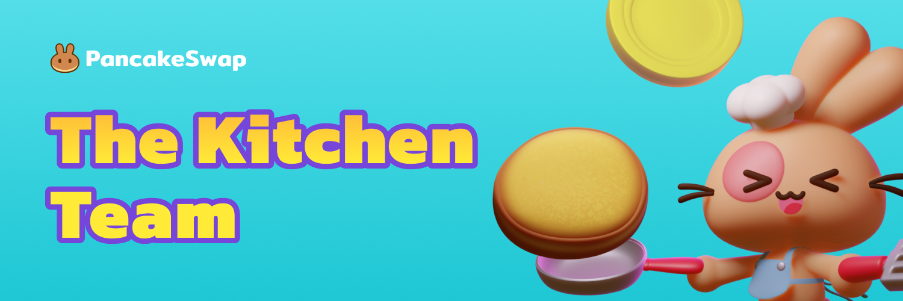

# The Kitchen Team

You can jump to the kitchen interviews article by clicking chef's name.

### The Chefs

🐰 [Chef Snowball](https://medium.com/pancakeswap/kitchen-interviews-chef-snowball-the-big-fluffy-boss-guiding-the-fellow-bunnies-afa8dfeca887) - Head Chef

🐰 Chef Cadbury - Project Manager

🐰 Chef Bun - Project Manager ([Twitter](http://twitter.com/chef\_bun\_pcs))

🐰 Chef Taro - Business Dev

🐰 Chef Misty - Business Dev

🐰 Chef Pepper - Business Dev

🐰 Chef Icy - Business Dev, 80% Bunny 20% Robot

🐰 Chef Lime - Ops/Data analytics Dev

🐕 [Chef Cheems](https://medium.com/pancakeswap/kitchen-interview-chef-cheems-the-lottery-obsessed-doggie-1a083fb5d172) - Dev and Lottery Lead ([Twitter](https://twitter.com/CheemsChef))

🐰 Chef Jojo - Frontend Dev ([Twitter](https://twitter.com/0xchefjojo))

🐰 Chef Philip - Frontend Dev

🐰 Chef Momota - Frontend Dev

🐰 Chef Yogi- Frontend Dev

🐰 Chef Pickle - Solidity Dev

🐕 Chef Snoopy - Solidity Dev

🐰 Chef Cupcake - Solidity Dev

🐰 Chef Huan - Solidity Dev

🐰 Chef Rabbid - Solidity Dev

🐰 [Chef Cecy](https://medium.com/pancakeswap/kitchen-interviews-chef-cecy-the-magical-3d-artist-making-fluffy-bunnies-e1eda53742f3) - 3D Artist ([Twitter](https://twitter.com/Cecymeade))

🐰 Chef Yuna - UI/UX designer ([Twitter](https://twitter.com/chefyuna))

🐰 Chef Salade - UI/UX designer

🐰 [Chef Fran](https://medium.com/pancakeswap/kitchen-interview-chef-fran-spanish-community-manager-and-a-lovely-mate-368c72102093) - Spanish Community Manager ([Twitter](https://twitter.com/ChefFranPS))

🦆 [Chef Nina](https://medium.com/pancakeswap/kitchen-interviews-chef-nina-the-duck-d385ae875b50) - Duck ([Twitter](https://twitter.com/\_ninahaus\_EN))
