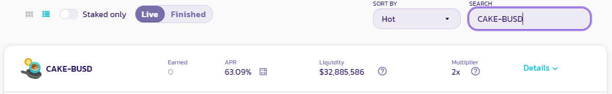

# Tokenomics de CAKE

## **Tasa de Emisión** 


El 11 de agosto de 2022, los Chefs implementaron algunas actualizaciones para poder exprimir al máximo las ventajas del MasterChef v2. Eliminaron la necesidad de quemar por separado 45,000 CAKE perteneciente a las inyecciones de lotería. Esa tarea es ahora manejada directamente por el MasterChef v2 en las quemas semanales de CAKE. Gracias a esto, la emisión efectiva es aún menor.


Además de lo anterior, también se emite una cantidad dinámica de CAKE a la[ Dev Address](https://bscscan.com/address/0xceba60280fb0ecd9a5a26a1552b90944770a4a0e#tokentxns) a una tasa de 9.09%. Esto significa que, si se cosechan 100 CAKE, entonces 9.09 CAKE se emiten además y se envían a la Dev Address.


Sin embargo, todo el CAKE emitido a la Dev Address se quema en la quema semanal y nunca entra en circulación.

Como tal, no lo hemos incluido en la tasa de emisión anterior.


## **Distribución** 

## **Otros Mecanismos Deflacionarios** 


El proceso de quema es actualmente manual. [Ver las transacciones de quema aquí.](https://bscscan.com/token/0x0e09fabb73bd3ade0a17ecc321fd13a19e81ce82?a=0x000000000000000000000000000000000000dead)


En la actualidad, también se quema CAKE de las siguientes maneras:

* **0.0575%** de cada trade en PancakeSwap V2 a través de:
  * BNB Smart Chain
  * Ethereum
  * Aptos
* **0.016%\~0.06%** de cada trade hecho en PancakeSwap StableSwap
* **100%** de CAKE enviada a la Dev address
* **100%** de CAKE obtenida de performance fees en IFOs
* **100%** de CAKE gastado en creación de Perfiles y NFTs emitidos
* **100%** of CAKE obtenida en las Subastas de Farm
* **20%** de CAKE gastado en Tickets de Lotería
* **20%** de las ganancias de Perpetual Trading
* **8%** del premio acumulado en Pottery distribuido cada semana
* **3%** de cada ronda Predicción con BNB se utiliza para comprar CAKE y quemar
* **3%** de cada ronda de Predicción con CAKE
* **2%** de cada cosecha en el Pool de CAKE Flexible
* **2%** de cada venta del NFT Market es usada para comprar y quemar CAKE

## **¿Por qué es manual la quema?** 

Para comenzar a funcionar, PancakeSwap se lanzó como MVP (producto mínimo viable) con el contrato de MasterChef emitiendo 40 CAKE por bloque. Por esa razón, el primer equipo no agregó funciones adicionales, como la capacidad de personalizar la lógica de emisión de CAKE. Como migrar a un nuevo MasterChef requeriría mucho tiempo y esfuerzo, el equipo optó por reducir las emisiones de CAKE a través de un proceso de quema manual mediante la creación de dos pools en el MasterChef v1:

* Legacy Lottery Pool (PID - 137) - CAKE quemada de la Lotería
* Burn Pool (PID - 138) - CAKE quemada por bloque

Estos pools funcionan de manera similar a los Farms, donde los Chefs pueden ajustar el porcentaje de los 40 CAKE por bloque asignados después de cada voto de reducción de emisiones de CAKE.

**Sin embargo, en abril de 2022, PancakeSwap migro a nuevo contrato, al MasterChef v2.**

La proporción de la quema de CAKE por bloque es finalmente controlada por un contrato dedicado. Esto permite que la quema sea mucho más precisa.


Debido a que el MasterChef v2 cosecha ocasionalmente los 40 CAKE completos por bloque. El suministro mostrado en la página de inicio (o en algunos trackers de 3eros) podría aumentar repentinamente en varios millones de CAKE.

No te preocupes, **LAS EMISIONES AHORA ESTAN CONTROLADAS CUIDADOSAMENTE POR EL MASTERCHEF V2. LOS CAKE QUEMADOS NUNCA ENTRARAN EN CIRCULACION.**


## **¿Como confirmar el suministro de CAKE por ti mismo?** 

Para confirmar que el suministro de CAKE circulante mostrado en la página de inicio de PancakeSwap es correcto:

1. Diríjase al contrato del token CAKE en BscScan y vea [cuantos CAKE hay en la dirección de quema.](https://bscscan.com/token/0x0e09fabb73bd3ade0a17ecc321fd13a19e81ce82#balances) Ese es el total de CAKE que fueron quemados (removidos de la circulación PARA SIEMPRE y es imposible recuperar)
2. Luego, reste la cantidad quemada del “Total Supply” que BscScan muestra.
3. Eso le da el suministro total y actual de CAKE.

**Lea más sobre las mecánicas deflacionarias de CAKE en la página siguiente.**
