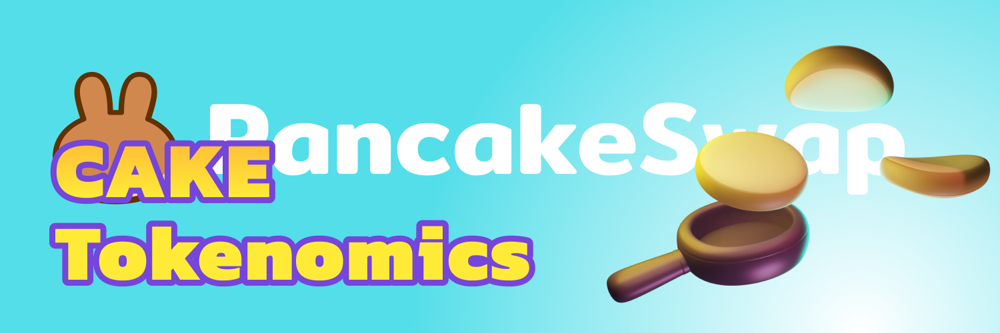

# CAKE

* **Ticker:** CAKE
* **Contract Address:** [https://bscscan.com/token/0x0e09fabb73bd3ade0a17ecc321fd13a19e81ce82](https://bscscan.com/token/0x0e09fabb73bd3ade0a17ecc321fd13a19e81ce82)
* **Chain:** BNB Smart Chain (BEP20)

## The basics

CAKE is the delicious token that powers the PancakeSwap ecosystem.

Earn CAKE from Farms and Syrup Pools, win it in the lottery, or [buy it on the exchange](../../produtos/pancakeswap-exchange/), then explore its use cases:

* Stake it in [Syrup Pools](../../produtos/syrup-pool/) to earn free tokens
* Use it in [Yield Farms](https://docs.pancakeswap.finance/products/yield-farming) to earn more CAKE
* Buy Lottery tickets in the [PancakeSwap Lottery](../../produtos/lottery/)
* Participate in [IFO Token Sales](broken-reference)
* Create your [Pancake Profile](../../produtos/nft-profile-system/) and mint NFTs
* [Vote on proposals](../../produtos/voting/) relating to the PancakeSwap ecosystem

But that's not all -- there's much more on the horizon for CAKE!

## In detail

Check below to discover the nuts and bolts of how CAKE works.


[Broken link](broken-reference)



[Broken link](broken-reference)


### \*\*\*\*
