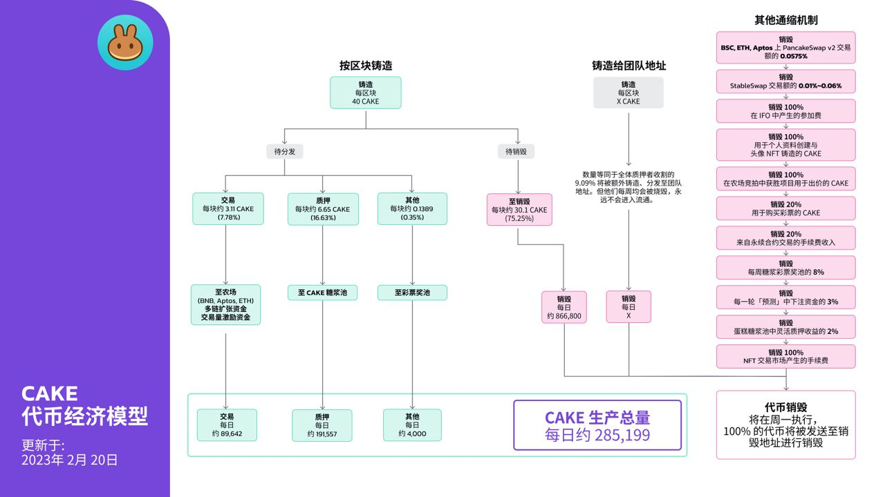

# CAKE 代币经济模型

<figure><figcaption></figcaption></figure>

## **铸造速度** 

### **按区块**

| **项目**   | **每区块铸造 (CAKE)** | **每天铸造 (CAKE)** |
| -------- | ---------------: | --------------: |
| 铸造       |               40 |       1,152,000 |
| 每周销毁     |           \~30.1 |       \~866,800 |
| **有效铸造** |      **\~9.9\*** | **\~285,199\*** |


**2022年8月11日，大厨们实施了一些配置升级，以充分利用主厨合约 v2 (MasterChef v2) 。过去彩票池注入遗留有每天 45000 CAKE 的销毁，这部分现在由主厨合约 v2 统一管理，并与每周例行性 CAKE 销毁一同打至销毁地址。因此现在的有效产出更低了。**


除此以外，还会以 9.09% 的比例，向[团队地址](https://bscscan.com/address/0xceba60280fb0ecd9a5a26a1552b90944770a4a0e#tokentxns)铸造动态数量的 CAKE。这意味着，如果收获了 100 个CAKE，那么就会有 9.09 个 CAKE 被铸造出来，然后发送到团队地址。


所有铸造给团队地址的 CAKE 都被每周销毁，并且永远不会进入流通。

因此，我们没有将其纳入上述铸造数据中。


## 分配 

| 分配至             | 每区块量（铸造量的 %） | 每区块量（CAKE 数量） |              每日数量 |
| --------------- | -----------: | ------------: | ----------------: |
| 交易类目            |      \~7.78% |        \~3.11 |          约 89,642 |
| 质押类目            |     \~16.63% |        \~6.65 |         约 191,557 |
| 其他类目            |      \~0.35% |      \~0.1389 |           约 4,000 |
| **每日 CAKE 铸造量** |              |               | **约** **285,199** |

## **其他通缩机制** 


销毁过程是手动进行的。[查看销毁的链上交易记录](https://bscscan.com/token/0x0e09fabb73bd3ade0a17ecc321fd13a19e81ce82?a=0x000000000000000000000000000000000000dead)


除了以上提及的，CAKE 亦拥有以下的销毁手段：

* PancakeSwap v2 的交易额的 **0.0575%**
  * BNB 智能链
  * ETH 链
  * Aptos 链
* PancakeSwap StableSwap 中的每笔交易额的 **0.016%\~0.06%**&#x20;
* **100%** 铸造到团队地址内的 CAKE
* **100%** 在 IFO 中募集得的 CAKE
* **100%** 用于个人资料创建与头像 NFT 铸造的 CAKE
* **100%** 在农场竞拍中获胜项目用于出价的 CAKE
* **20%** 用于购买彩票的 CAKE
* 永续合约的手续费收入中的 **20%**
* 每周分发的糖浆彩票奖池中的 **8%**
* 每一轮 BNB「预测」中下注资金的 **3%** 将用于回购 CAKE 及销毁
* 每一轮 CAKE「预测」中下注资金的 **3%**
* 销毁蛋糕糖浆池灵活质押中每笔被领取的收益中的 **2%**
* &#x20;**** NFT 交易市场每笔NFT销售的交易额的 **2%**用于购买 CAKE 进行销毁

## 为什么 CAKE 的销毁是手动的？

为了迅速落地，PancakeSwap 以 MVP（最小可行产品）的形式推出，MasterChef 合约每区块恒定铸造 40 CAKE。由于这个原因，早期的团队没有增加额外的功能，如更改 CAKE 铸币速度与逻辑的能力。一直以来，团队通过在 MasterChef v1 中创建两个池子来控制 CAKE 的产量，这是一个手动销毁过程：

* 遗留的彩票用池 (PID - 137) —— 用于彩票销毁
* 销毁池 (PID - 138) —— 用于每区块 CAKE 销毁

这些池子的工作方式与农场类似，在每次 CAKE 减产投票后，大厨们可以通过它们，调整原本为每块 40 CAKE 的产速以及比例。

**然而，在 2022 年 4 月，PancakeSwap 迁移到一个新的 MasterChef v2 合约**。每个区块的 CAKE 销毁比例，现由一个专门的合约控制。这使得销毁数目更加准确！


由于 MasterChef v2 偶尔会在每个区块中收获整整 40 个CAKE。主页上显示的供应量（或一些第三方网站）可能会突然增加几百万CAKE。

**无需担心，产出现在由 Masterchef v2 合约严格控制，这部分 CAKE 永远不会进入流通！**


## 如何亲自确定 CAKE 的流通总量？

若想亲自校验首页上显示的 CAKE 总量是否正确，只需要：

1. 前往 BscScan 上 CAKE 的代币页面，查看 [有多少 CAKE 在销毁 (Burn) 地址中](https://bscscan.com/token/0x0e09fabb73bd3ade0a17ecc321fd13a19e81ce82#balances)。这个数量表示有多少 CAKE 被销毁（从流通总量中移除，无法取回）
2. 然后，查看总量 (Total Supply) 并减去该数量。
3. 最后的数字即为 CAKE 流通总量。

**在下一页查看更多关于 CAKE 的防通胀机制的讯息**
