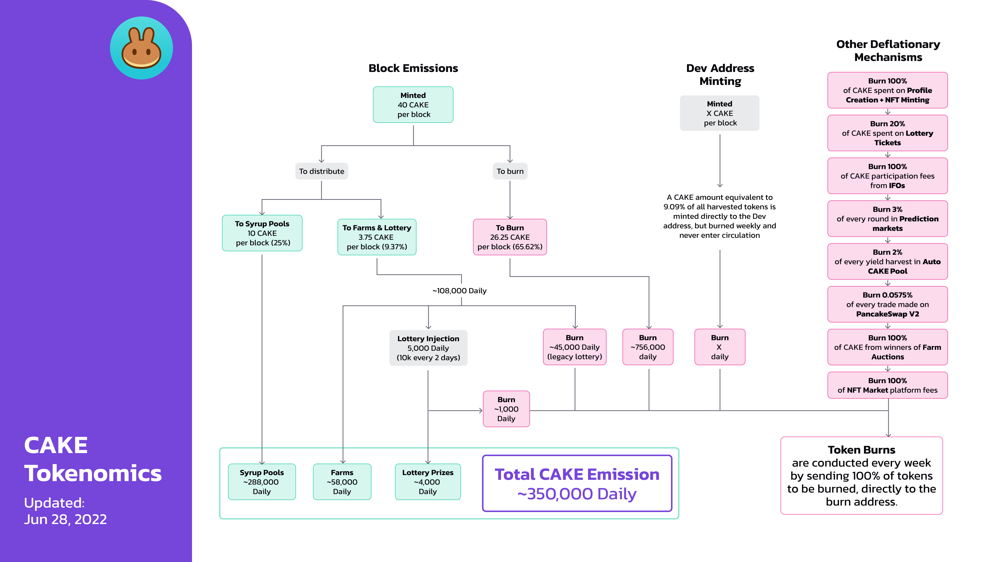

# CAKE Tokenomics

## **Emission rate** 

### **Per block**

| **Metric**             | **Emission/block (CAKE)** | **Emission/day (CAKE)** |
| ---------------------- | ------------------------: | ----------------------: |
| Emission               |                        40 |               1,152,000 |
| Burned Weekly          |                    -26.25 |                -756,000 |
| **Effective Emission** |              **<13.75\*** |           **350,000\*** |

\*Effective Emission is in fact slightly below this amount: an additional 45,000 CAKE per day is diverted from the amount allocated to the lottery, and burned.

In addition to the above, a dynamic amount of CAKE is also [minted to the Dev address](https://bscscan.com/address/0xceba60280fb0ecd9a5a26a1552b90944770a4a0e#tokentxns) at a rate of 9.09%. This means that if 100 CAKE are harvested, then 9.09 CAKE is minted in addition and sent to the Dev Address.


All CAKE minted to the Dev address is burned in the weekly burn and never enters circulation.&#x20;

As such, we haven't included it in the above emission rate.


## Distribution 

| Distributed to                | Reward/block (% of emission) | Reward/block (total CAKE) |           Reward/day |
| ----------------------------- | ---------------------------: | ------------------------: | -------------------: |
| Farms and Lottery             |                        9.37% |                      3.75 |     108,000 (approx) |
| of which diverted and burned  |                              |                           |              -46,000 |
| Syrup Pools                   |                          25% |                        10 |     288,000 (approx) |
| **Total Daily CAKE Emission** |                              |                           | **350,000 (approx)** |

## **Other Deflationary Mechanics** 


The burning process is currently manual. [View burn transactions here](https://bscscan.com/token/0x0e09fabb73bd3ade0a17ecc321fd13a19e81ce82?a=0x000000000000000000000000000000000000dead).


As well as the above, CAKE is also burned in the following ways:

* **0.0575%** of every trade made on PancakeSwap V2
* **100%** of CAKE sent to the Dev address
* **100%** of CAKE performance fees from IFOs
* **100%** of CAKE spent on Profile Creation and NFT minting
* **100%** of CAKE bid during Farm Auctions
* **20%** of CAKE spent on lottery tickets
* **20%** of all profits from Perpetual Trading
* **45,000** CAKE per day (historically assigned to the lottery)
* **3%** of every BNB Prediction markets round is used to buy CAKE for burning
* **3%** of every CAKE Prediction markets round
* **2%** of every yield harvest from all the flexible staking positions in CAKE pool
* **2%** of every NFT sale on the NFT Market is used to buy CAKE for burning

## Why is the CAKE burn manual?

To hit the ground running, PancakeSwap launched as an MVP (minimum viable product) with the MasterChef contract emitting 40 CAKE per block. For that reason, the early team didn't add additional functions such as the ability to customize the CAKE minting logic. The team has been controlling CAKE emissions through a manual burn process by creating two pools in MasterChef v1:

* Legacy Lottery Pool (PID - 137) - burned CAKE from the lottery
* Burn Pool (PID - 138) - burned CAKE per block

These pools work similarly to the farms, where the Chefs can adjust the percentage of the 40 CAKE per block allocated to it after each CAKE emission reduction vote.

However, in April 2022, PancakeSwap migrated to a new MasterChef v2 contract. The ratio of the CAKE burn per block is finally controlled by a dedicated contract. This allows the burn to be much more accurate.


On the day of the burn, the supply shown on the homepage might suddenly jump by several million CAKE.&#x20;

Don't worry - **THIS CAKE NEVER ACTUALLY ENTERS CIRCULATION:**


This apparent jump is just because of how all the CAKE that's allocated for the burn is stored during the week.&#x20;

The CAKE allocated to burn are harvested before completing the weekly token burns, and this makes the Total Supply shown on the site jump by \~6M. This is because pending CAKE sometimes doesn't get registered in the Total Supply until it's harvested on the burn day. Once the token burn transaction is completed, the \~6M is shown in the Burned to Date.&#x20;

## How to Confirm CAKE Supply for yourself

To confirm that the circulating CAKE supply shown on the PancakeSwap homepage is correct,&#x20;

1. Head to the CAKE token contract on BscScan and [see how much CAKE is held by the Burn Address.](https://bscscan.com/token/0x0e09fabb73bd3ade0a17ecc321fd13a19e81ce82#balances) That's the total amount of CAKE that's been burned (removed from circulation FOREVER, and impossible to ever retrieve).
2. Then, subtract this burned amount from the "Total Supply" that BscScan shows.
3. This gives you the actual CAKE supply.

#### **Read more about CAKE's deflationary mechanics on the next page.** 
