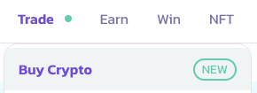
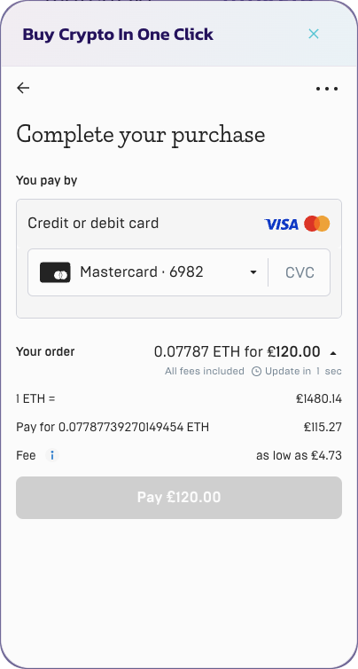

# 💳 Buy Crypto

PancakeSwap 推出了使用信用卡、借记卡或银行转账购买你喜爱代币的功能。将法币入金（on-ramp）服务集成到我们的平台，旨在为用户提供一种无缝、便捷的方式，使用法币购买加密货币。通过我们的入金报价界面，用户可以在不同的服务商之间进行选择，获得 Web3 中的最佳费率。

### 用户的好处

入金集成与报价系统为我们的用户带来了若干关键好处：

1. 轻松购买加密货币：用户现在可以使用自己偏好的法币，直接在我们的平台上便捷地购买加密货币，无需在不同平台之间进行多次交易。
2. 支持多种货币和地区：我们的尊贵合作伙伴（包括 Mercuryo）支持多种法币，确保来自不同地区的用户都能积极参与不断扩展的加密货币市场。
3. 多种支付方式：我们支持多种支付方式，例如信用卡/借记卡和银行转账，为用户以符合自身偏好的方式完成交易提供极大的灵活性和便利性。
4. 安全合规：我们值得信赖的合作伙伴遵循严格的安全标准，并遵守所有适用的法规，优先保护用户数据，确保交易在安全的环境中进行。
5. 透明的费用结构：我们保持透明的费用结构，没有任何隐藏费用。用户在完成购买之前，可以完全了解将被收取的确切金额，确保交易过程公平且知情。

### 结构与费用

入金服务可在 **BNB、Ethereum、Arbitrum、Base、Linea 和 zkSync Era** 链上使用。下表列出了可用的主流加密货币和稳定币：

<table><thead><tr><th width="145">服务商</th><th>费用^</th><th>支持的法币</th><th>支持的代币**</th></tr></thead><tbody><tr><td>Mercuryo</td><td>借记卡/信用卡 3.95%，银行转账/SEPA（欧盟）3.95%</td><td>USD, EUR, GBP, HKD, CAD, AUD, BRL, JPY, KRW, VND</td><td>
BTC: BTC  ERC-20: ETH, USDT, DAI

BEP-20: BNB  ARB: ETH, USDC
</td></tr><tr><td>Moonpay</td><td>
借记卡/信用卡 2.75%

SEPA（欧盟）、FPS（英国）1.25%

PIX（巴西）2.95%
</td><td>USD, EUR, GBP, HKD, CAD, AUD, BRL, JPY, KRW, TWD, IDR, VND</td><td>
ERC-20: ETH, USDT, USDC, DAI 

BEP-20: BNB（非美国）  ARB: ETH, USDC.e
</td></tr><tr><td>Transak***</td><td>借记卡/信用卡/Apple Pay/Google Pay 3.5%-5.5%，SEPA（欧盟）、FPS（英国）、Cash App（USD）0.99%</td><td>USD, EUR, GBP, HKD, CAD, AUD, BRL, JPY, KRW, VND</td><td>
ERC-20: ETH, USDT, USDC, DAI, WBTC 

BEP-20: BNB（非美国）, USDC  ARB: ETH, ARB, USDC.e, USDC  Base: USDC, ETH  Linea: USDC, ETH  Polygon ZkEVM, ZkSync Era: ETH
</td></tr><tr><td>Topper</td><td>借记卡/信用卡/Apple Pay/Google Pay、Pix（巴西）2.49%</td><td>USD, EUR, GBP, HKD, CAD, AUD, BRL, JPY</td><td>BTC: BTC  ERC-20: ETH, USDT, USDC, DAI, WBTC  BEP-20: BNB, CAKE, USDT  ARB: ETH, USDC</td></tr></tbody></table>

^费用受最低消费额和最高消费额限制——根据代币的不同，最低额很可能高于 30 USD，最高额低于 10,000 USD。PancakeSwap 将就所提供的服务额外收取 1%。

\*卡支付最低 $3.99 或等值的当地货币

\*\*请注意，特定加密货币的可用性可能因用户所在地区而异

\*\*\*Base、Arbitrum、Linea 不支持 USD 法币入金。请使用其他货币（EU、GBP）进行入金。各地区的信用卡/借记卡费用可在[此处](https://transak.notion.site/On-Ramp-Payment-Methods-Fees-Other-Details-b0761634feed4b338a69f4f186d906a5)查看

请注意，报价系统将完全透明地提供包含费用的汇率，以推荐最佳选项。

### 我该如何购买加密货币？

1. 点击 PancakeSwap 平台上的 "Buy Crypto" 按钮。

<figure><figcaption></figcaption></figure>

2. 从弹出菜单中选择你想要的法币和代币对。

<figure><figcaption></figcaption></figure>

3. 点击 "Get Quote"

<figure><figcaption></figcaption></figure>

4. 选择推荐的报价。&#x20;

<figure><figcaption></figcaption></figure>

 

<figure><figcaption></figcaption></figure>

5. 继续按照入金服务商的屏幕提示步骤操作。

<figure><figcaption></figcaption></figure>

 

<figure><figcaption></figcaption></figure>

6. 你的加密货币应在几分钟内到达你的钱包。

### 我需要提供身份证明吗？

通过我们的服务商购买加密货币时，需要提供不同级别的证据，以向我们的入金合作伙伴证明身份。这些级别将取决于所需的支付方式和支付金额。用户必须遵守服务商的要求才能使用购买加密货币产品。要了解更多信息，请访问我们的合作伙伴文档。**PancakeSwap 不收集和存储任何财务或个人数据。**

### 我所在的地区可以购买加密货币吗？

购买加密货币功能根据服务商的可用性在特定地区提供。请访问我们的合作伙伴文档以获取更多信息。

### 我可以在哪里了解更多？

你可以在此处访问我们的合作伙伴文档：

* [Mercuryo](https://help.mercuryo.io/en/articles/6122838-on-and-off-ramps)
* [MoonPay](https://support.moonpay.com/hc/en-gb/sections/360003486437-Buying-Cryptocurrency-)
* [Transak](https://support.transak.com/en/collections/3985810-customer-help-center)

### **接下来是什么？**

厨房认为，入门体验对于 DeFi 领域的普及至关重要。我们将继续通过集成更多合作伙伴来改善购买加密货币的体验，同时为我们的用户探索出金（off-ramp）解决方案。&#x20;
