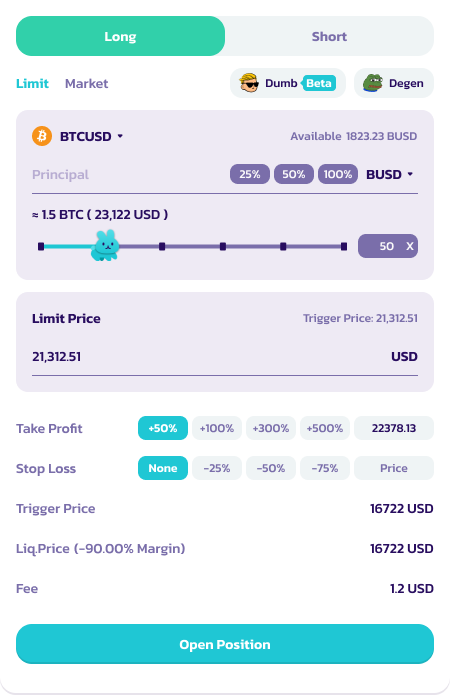
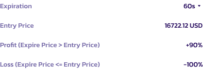
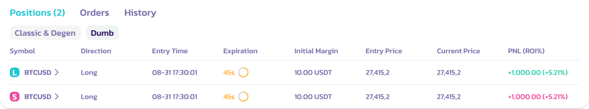

# Dumb Mode 指南

### 如何在 Dumb Mode 中下单

要在 PancakeSwap 上的 Dumb Mode 中下单，请按照以下步骤操作：

1. 选择市场：前往 BSC 上的 [**Pancakeswap 永续合约**](https://perp.pancakeswap.finance/en/futures/v2/BTCUSD?theme=light\&chain=bsc)。从可用市场中选择，例如 BTCUSD、ETHUSD 等。

<figure><figcaption></figcaption></figure>

2. 点击 **Dumb (Beta) 图标。** 仓位界面将切换为 Dumb 模式。

<figure><figcaption></figcaption></figure>

2. 选择仓位：选择做多或做空标的资产\*
   1. 对于做多仓位：如果到期价格高于入场价格，用户将赢得交易并获得盈利。&#x20;
   2. 对于做空仓位：如果到期价格低于入场价格，用户将赢得交易并获得盈利。
   3. 否则，用户将损失全部抵押品。
   4. 有关仓位的更多详细信息，请参阅注释
3.  设置保证金和金额：选择你的保证金资产（USDC、USDT、CAKE 等）并指定抵押品金额。

    <figure><figcaption></figcaption></figure>
4. 选择时长：决定你交易的到期时间 - 60 秒、5 分钟或 10 分钟。

<figure><figcaption></figcaption></figure>

5. 下单：查看 ROI，确认详情，然后点击 **开仓** 进行交易\*

<figure><figcaption></figcaption></figure>

5. 监控交易：交易下单后，通过"仓位"标签监控其进展直至完成。**用户无法在到期前平仓**

<figure><figcaption></figcaption></figure>

7. 结算：在交易结束时，如果成功，你的 ROI 将在扣除 6% 费用后入账。如果交易不成功，损失将为 100%。

<figure><figcaption></figcaption></figure>

### 关于仓位的额外注释

* 请注意，到期计时器并非在你点击"开仓"按钮时开始；相反，60 秒/所选时长的倒计时是从交易在区块链上确认的那一刻开始的
* 你看到显示的价格仅作为参考。最终入场价格将由交易在区块链上确认的确切时刻的价格点决定。这将在"仓位"标签中更新

### 使用 Dumb Mode 的提示

* 了解风险：注意所涉及的高风险，尤其是亏损时的 -100% ROI。
* 管理你的抵押品：只投入你能承受损失的金额。
* 保持信息灵通：及时了解你所交易资产的市场趋势。
