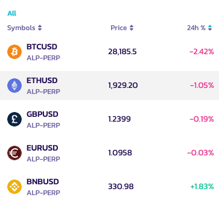
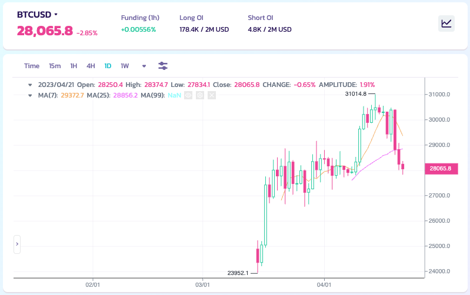
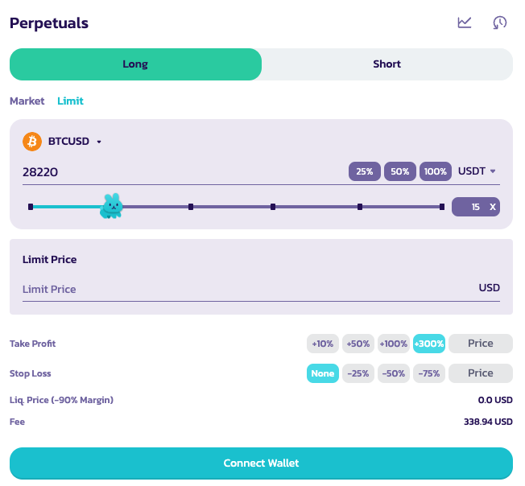
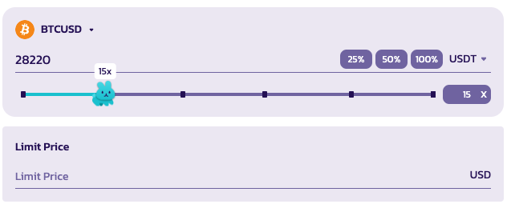
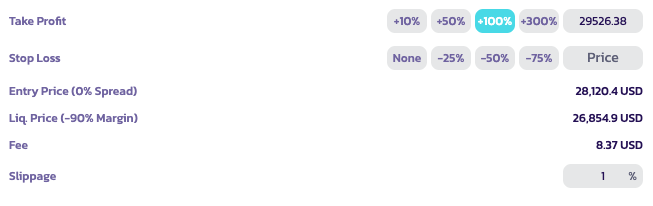
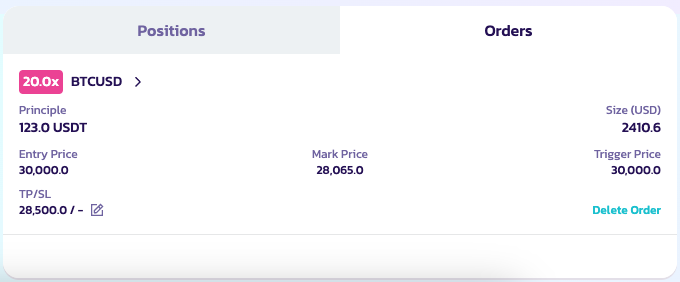

# 我该如何使用它？

.png>)

使用此功能其实非常简单（难的是交易得好）。我们只需要遵循一系列步骤，让我们的体验更加完整。如需更多信息，请访问 [V2 术语表](perpetuals-glossary.md)。

### 进入永续合约交易页面&#x20;

你可以从[网站](https://pancakeswap.finance)的 Trade → Perpetual 板块进入，或通过此[链接  ](https://perp.pancakeswap.finance/en/futures/BTCUSDT)进入

### 选择要交易的交易对&#x20;

你可以点击页面顶部交易对旁边的箭头来选择可交易的交易对。

<figure><figcaption></figcaption></figure>

更多可交易的交易对即将推出！

<figure><figcaption></figcaption></figure>

### 分析图表并决定你的交易策略

交易时间到了！让我们认真起来。你可以用你自己的方式，借助所有可用的工具来分析图表

<figure><figcaption></figcaption></figure>

**你知道怎么做，还是想提升你的分析能力？**

这里有一份指南，帮助你开启图表分析的世界：

* [如何在 Binance 网站上使用 TradingView](https://www.binance.com/en/support/faq/8419126024404348a1c6e4039fbed3fe)
* [蜡烛图](https://academy.binance.com/en/articles/a-beginners-guide-to-candlestick-charts)
* [趋势线详解](https://academy.binance.com/en/articles/trend-lines-explained)

### 建立你的仓位&#x20;

然后，在右上角你会看到用于下单建仓的面板。

<figure><figcaption></figcaption></figure>

在这里你必须设置几个参数，例如：

_顺序不分先后_

1. 做多或做空&#x20;

<figure><figcaption></figcaption></figure>

选择你想要采用的交易仓位

&#x20; 2\. 杠杆倍数

<figure><figcaption></figcaption></figure>

移动小兔子来选择合适的杠杆仓位。你也可以在左侧的框中手动输入仓位。

免责声明：请记住，高杠杆水平承担着非常高的风险，请明智使用。

&#x20;   3\. 订单类型

<figure><figcaption></figcaption></figure>

&#x20;  4\. 设置订单规模并为你的订单设定价格（用于限价单）

你还可以选择参考货币来查看你的仓位。

5. 止盈/止损与滑点

<figure><figcaption></figcaption></figure>

用户可以在开仓时设置止盈或止损价格。

* 止盈：一旦用户达到设定的 P\&L 百分比收益，其仓位将被平仓。
* 止损：一旦用户达到设定的 P\&L 百分比亏损，其仓位将被平仓。
* 滑点：用于在市价单开仓前，价格朝交易方向移动过快时自动取消该订单。例如，如果你希望以当前价格市价做多，但在你的交易开仓前价格上涨了 1%，它将自动取消。

注意：你可以将鼠标悬停在每个选项上以获取更多信息。请参阅 [永续合约 V2 术语表](perpetuals-glossary.md)，获取深入指南。

### 提交你的订单

当所有参数都已设置好后，你可以点击开仓来提交订单

### 查看你的仓位

订单提交后，它将出现在"未成交订单"中，直到成交为止。

### 生效！

成交后，你的仓位将生效。你可以在仓位面板中看到它。你也可以查看、编辑或平仓。

祝你交易顺利！
