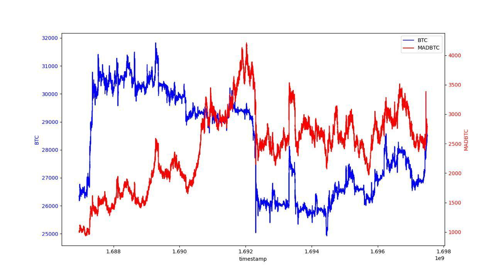

# MADBTCUSD 常见问题解答

### MADBTCUSD 指数是如何计算的？

MADBTCUSD 基于以下公式计算：

**MADBTCUSD 指数**

$$
\begin{align*}
\text{drift} &= \left( \frac{\text{btcCurrentPrice} - 1}{\text{btcLastSecondPrice}} \right) \times 5 \\
\\
\sigma &= \frac{\text{expectedvol}}{\sqrt{3600 \times 24 \times 365}} \\
\\
norm &= \text{norminv}(\text{Random}, 0, 1) \\
\\
S_{n+1} &= S_{n} \times e^{\left[\left(\text{drift} - \frac{\sigma^2}{2}\right) \times \text{dt} + \sigma \times \sqrt{\text{dt}} \times norm\right]}
\end{align*}
$$


其中：

* 初始 Sn=1000 &#x20;
* dt=1
* expected vol：100%（expected vol 是 MADBTC 的预期时间波动率）
* "**Random number**（随机数）"基于当前 **BTC 价格以 8 位小数精度** 计算

**随机数的计算：**

```python
import hashlib
from decimal import Decimal

# Assume the current price of Bitcoin is 48923.56789101
bitcoin_price = Decimal("48923.56789101")

# Calculate the SHA-256 hash of the Bitcoin price
price_hash = hashlib.sha256(str(bitcoin_price).encode('utf-8')).hexdigest()

# Extract the first 8 hexadecimal numbers from the hash
hash_substring = price_hash[:8]

# Converts a hexadecimal string to an integer
hash_integer = int(hash_substring, 16)

# Divide the integer by 4294967296 (the decimal number corresponding to the hexadecimal number FFFFFFFF) to get a num
random_number = hash_integer / 4294967296
# Print the random number
print(random_number)
```

如果确定的随机数为 0，将重新计算

### 我在哪里可以交叉验证 BTC 和 MADBTCUSD 的历史价格？

BTC 和 MADBTCUSD 价格源可在此处找到：

[BTCUSD](https://www.apollox.finance/bapi/futures/v1/public/future/apx/V2MarkPriceKline?symbol=BTCUSD\&limit=1800)

[MADBTCUSD](https://www.apollox.finance/bapi/futures/v1/public/future/apx/V2MarkPriceKline?symbol=MADBTCUSD\&limit=1800)

### BTC 和 MADBTC 的历史回测数据

为了交叉验证 BTC 和 MADBTC 的历史价格，我们在下方提供了一个回测图表。&#x20;

<figure><figcaption></figcaption></figure>
