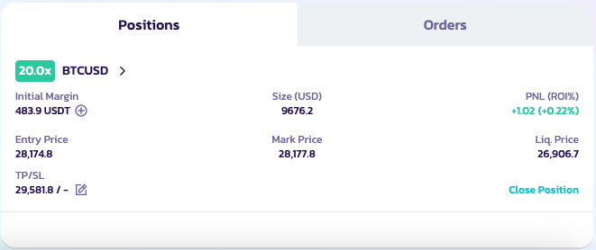

# 永续合约 V2 术语表

**在这里你将找到期货交易中所有相关术语的定义**

### **永续合约交易**

&#x20;永续合约（Perpetuals）、永续掉期（perpetual swaps）或 perps 是一种没有到期日的特殊期货合约。

### **杠杆**

杠杆是一种交易机制。交易者可以利用它来增加对市场的敞口，使他们能够支付少于全额投资的资金。简而言之，你借入资金来撬动你的投资。

### 订单

**做多：** 开立做多订单。在这种订单中，你购买一项资产，并等待价格上涨时卖出。"买入"和"做多"可以互换使用。

**做空：** 开立做空订单。在这种订单中，你借入一项资产，将其卖出，并希望在价格下跌时回购。"卖出"和"做空"可以互换使用。

**限价单：** 限价单是以特定价格或更优价格买入或卖出。限价单不保证能够成交。

**市价单：** 市价单是以当前最优可用价格买入或卖出的订单。

#### 仓位管理

用户可以点击交易页面底部的"仓位"来查看其已开仓位的详细信息，例如开仓价格。他们可以查看开仓价格、仓位数量、最新价格和强制清算价格等详细信息。

<figure><figcaption></figcaption></figure>

**仓位模式**

PancakeSwap 将为每个 v2 交易对使用逐仓杠杆模式。各交易对独立运作：&#x20;

* 每个交易对都是一个独立的逐仓仓位，用户可以开设多个逐仓仓位
* 每个仓位（交易对）独立运行。如果用户需要补充保证金，即使他们在其他独立仓位中有可用资产，也需要手动操作（ApolloX 未来将支持自动补充）
* 每个逐仓交易仓位都有自己的风险率和清算价格，并将单独结算。
* 清算风险对每个交易对是隔离的。如果一个仓位被清算，不会影响其他仓位。

**平仓**

用户可以通过点击"平仓"来关闭他们的仓位。

#### 费用与滑点

请访问 [Aster 的页面](https://docs.asterdex.com/product/asterex-simple/fees-and-slippage)，了解更多关于费用的信息。
