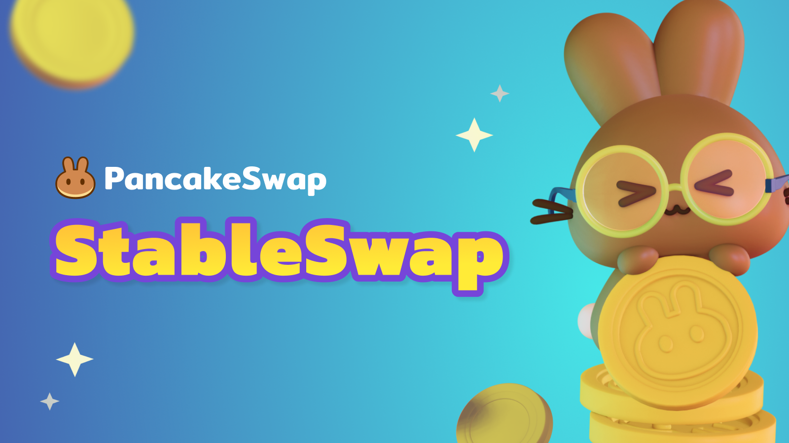

# 🏦 Stableswap

<figure><figcaption></figcaption></figure>

StableSwap on PancakeSwap is a feature to trade stable pairs with a lower slippage based on an invariant curve slippage function. It is designed to swap specific assets that are priced closely – such as USD stablecoins (e.g. HAY, BUSD and USDT) or liquid staking tokens (e.g. stkBNB and BNBx).

PancakeSwap currently offers two StableSwap models: [**Infinity StableSwap**](infinity-stableswap.md) and [**Classic StableSwap**](classic-stableswap.md). Infinity StableSwap is built on PancakeSwap’s latest Infinity architecture, offering improved flexibility, efficiency, and future extensibility. Classic StableSwap refers to the original StableSwap implementation, which continues to support existing pools and liquidity.

