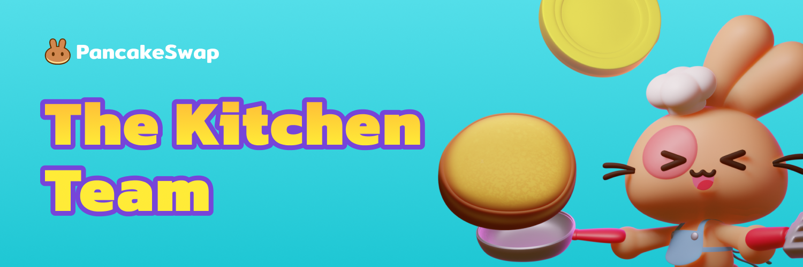

# 厨房团队

点击大厨的名字即可跳转到对应的厨房访谈文章。

### 大厨们

🐰 Chef Kids - 主厨（[Twitter](https://x.com/Headchef_pcs)）

🐰 Chef Miso - 产品

🐰 Chef Maroon - BD 负责人（[Twitter](https://x.com/ChefMaroon)）

🐰 Chef Doxie - 商务拓展（[Twitter](https://x.com/ChefDoxie)）

🐰 Chef Madeline - 商务拓展

🐰 Chef Leo - 商务拓展

🐰 Chef Mustard - 运营（[Twitter](https://twitter.com/chef_mustard)）

🐰 Chef Pau - 运营

🐰 Chef Cyrus - 数据

🐰 Chef Jackson - 开发负责人（[Twitter](https://x.com/0xchefjackson)）

🐰 Chef Ryan - 前端开发负责人

🐰 Chef Eric - 前端开发

🐰 Chef Jerry - 前端开发

🐰 Chef Philip - 前端开发

🐰 Chef Penguin - 前端开发

🐰 Chef Taco - 后端开发负责人

🐰 Chef Sanji - 后端开发

🐰 Chef Curry - 后端开发

🐰 Chef Kiwi - 后端开发

🐰 Chef Bob - 后端开发

🐰 Chef Toast - 后端开发

🐕 Chef Snoopy - 智能合约开发负责人

🐰 Chef Omelette - 智能合约开发

🐰 Chef Shiba - 智能合约开发

🐰 Chef Carb - 智能合约开发

🐰 Chef Ramen - 智能合约开发

🐰 Chef Ruby - QA

🐰 Chef Liam - QA

🐰 Chef Rei - 安全

🐰 Chef Salade - 设计负责人

🐰 [Chef Cecy](https://medium.com/pancakeswap/kitchen-interviews-chef-cecy-the-magical-3d-artist-making-fluffy-bunnies-e1eda53742f3) - 3D 美术师（[Twitter](https://twitter.com/Cecymeade)）

🐰 Chef Waffles - 设计师

🐰 Chef Noodles - 品牌 / 动效设计师

🐰 Chef Cola - HR

🐰 Chef Cocoa - 市场营销负责人（[Twitter](https://x.com/chef_cocoa_pcs)）

🐰 Chef Pixie - 产品营销经理（[Twitter](https://x.com/chefpixiee)）

🐰 Chef Marcus - 社交媒体（[Twitter](https://x.com/ChefMarcusPCS)）

🐰 Chef Boba - 社区（[Twitter](https://x.com/chefboba_pcs)）

🐰 Chef Croissant - 活动与公关
