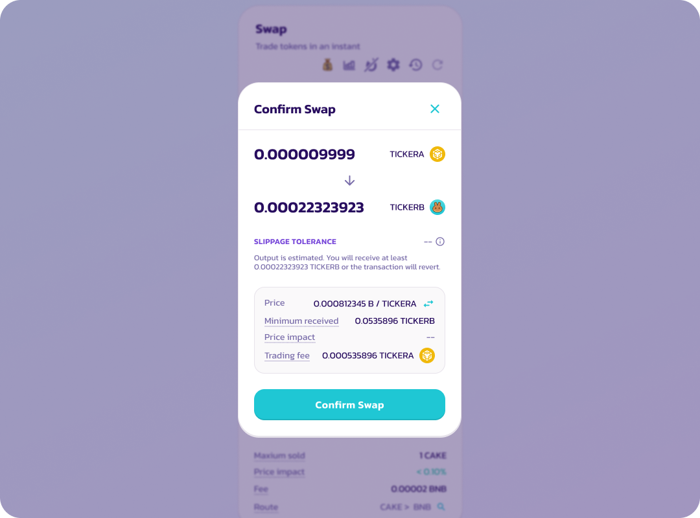
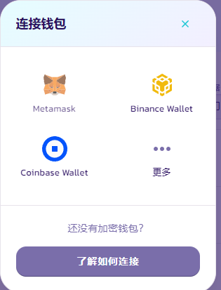
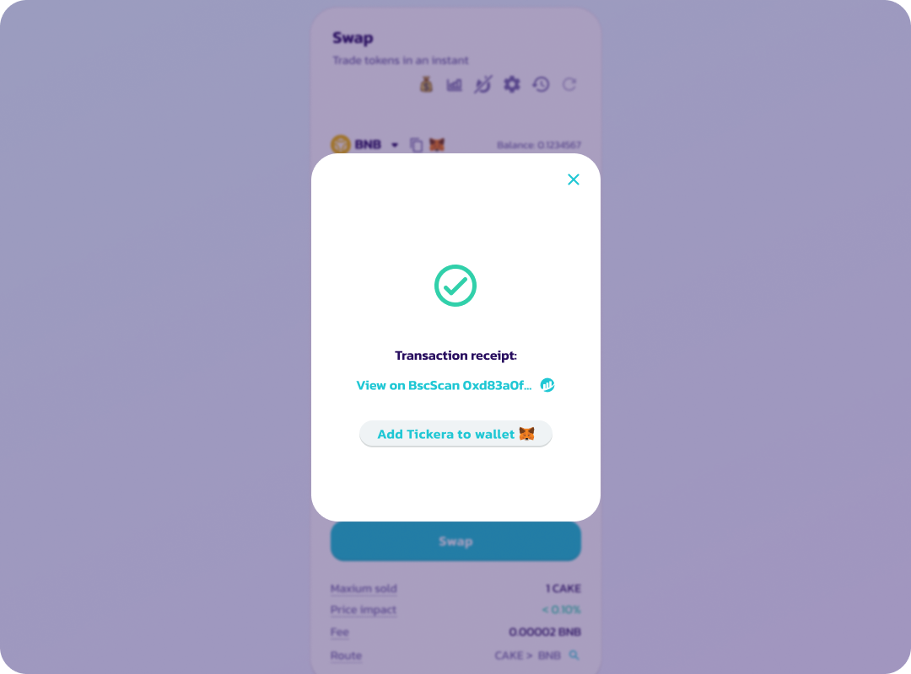

# Что такое транзакция одобрения?

**При первом обмене или добавлении Ликвидности тебе нужно одобрить токен, который ты обмениваешь. Это даёт смарт-контракту PancakeSwap разрешение на обмен этого токена из твоего кошелька.**

Транзакция одобрения предоставляет PancakeSwap разрешение на обмен токена из твоего кошелька. Тебе нужно выполнить транзакцию одобрения для каждого токена, который ты хочешь обменять с помощью PancakeSwap.

Вот руководство по выполнению транзакции одобрения:

1.  Введи детали обмена.&#x20;

    <figure><figcaption></figcaption></figure>
2.  Выбери «Confirm swap» после проверки деталей обмена.&#x20;

    <figure><figcaption></figcaption></figure>
3. В приложении кошелька или расширении кошелька одобри расходование обмениваемого токена.

Разреши использование токена для обмена в своём кошельке.

_Твой кошелёк может попросить ввести количество токенов, которые ты хочешь одобрить. Пожалуйста, введи число, равное или превышающее количество обмениваемых токенов._&#x20;

<figure><figcaption></figcaption></figure>

4.  После одобрения появится ещё одна транзакция, запрашивающая подтверждение обмена.&#x20;

    <figure><figcaption></figcaption></figure>
5.  После подтверждения обмена транзакция отправляется в блокчейн (ожидание).&#x20;

    <figure><figcaption></figcaption></figure>
6. На экране появится надпись «Success» и зелёная галочка после успешного завершения транзакции.&#x20;

<figure><figcaption></figcaption></figure>

Одобрение токена действует в течение определённого периода времени; позже токен придётся одобрить снова с помощью запроса подписи. Подпись одобрения не требует комиссии за сеть.
